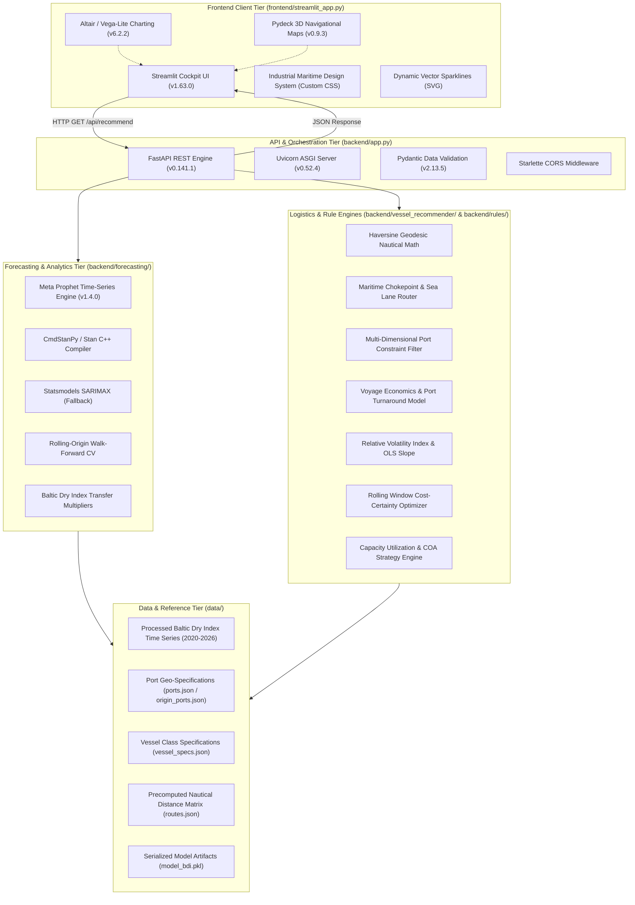

# Freight Chartering Decision Support System (SIH26006) — Complete Codebase

> **Comprehensive Consolidated Codebase Document**  
> Generated: `2026-09-05 02:52:45`  
> Repository Root: `Daersk/sih26006`  
> Total Included Files: **27**  
> Total Lines of Code: **6,077**  
> Total Raw Code Size: **276,773 bytes** (~270.3 KB)  

---

## 🏛️ Project Architecture Overview

This document aggregates every code file, test script, configuration, reference data file, and technical document in the **Freight Chartering Decision Support System (SIH26006)** repository into a single unified Markdown file. Each file is demarcated with its relative path, file type, line count, functional description, and complete unedited source code.

```
Daersk/
│
├── SIH26006_Agent_Build_Brief.md       # Hackathon project specification and requirements
└── sih26006/
    ├── Procfile                        # Heroku/PaaS web server launch config
    ├── README.md                       # High-level architecture and quickstart guide
    ├── TECHNOLOGY_AND_ALGORITHMS.md    # Detailed algorithmic formulas and models
    ├── test_api.py                     # API smoke test script
    ├── test_integration.py             # Full end-to-end integration test suite
    │
    ├── backend/
    │   ├── __init__.py                 # Backend package marker
    │   ├── app.py                      # FastAPI REST application and routing
    │   ├── requirements.txt            # Dependency definitions
    │   ├── forecasting/                # Time-series ML forecasting
    │   │   ├── __init__.py
    │   │   ├── forecast.py             # 90-day BDI forecast & confidence interval engine
    │   │   ├── train_model.py          # Feature engineering & Ridge model training
    │   │   ├── validate.py             # Multi-horizon MAPE validation suite
    │   │   └── model_bdi.pkl           # Trained model artifact (scikit-learn Ridge)
    │   ├── rules/                      # Decision rules engine
    │   │   ├── __init__.py
    │   │   ├── idle_time.py            # Laytime, demurrage vs. dispatch economics
    │   │   ├── market_timing.py        # Spot vs. Time Charter contracting advisor
    │   │   └── risk_flags.py           # Multi-factor operational & geopolitical risk engine
    │   └── vessel_recommender/         # Vessel suitability & freight cost engine
    │       ├── __init__.py
    │       └── recommend.py            # Vessel class matching & $/MT cost calculator
    │
    ├── frontend/
    │   └── streamlit_app.py            # Full interactive Streamlit decision dashboard
    │
    └── data/
        ├── clean.py                    # BDI raw dataset ingestion and cleaning
        ├── generate_routes.py          # Maritime distance matrix calculator
        ├── generate_synthetic.py       # Stochastic Ornstein-Uhlenbeck BDI generator
        ├── reference/                  # Ground-truth reference configurations
        │   ├── origin_ports.json       # Loading ports & draft constraints
        │   ├── ports.json              # Indian East Coast discharge ports
        │   ├── routes.json             # Nautical distances and voyage days
        │   └── vessel_specs.json       # Bulk carrier technical specifications
        ├── raw/                        # Historical Baltic Dry Index data
        └── processed/                  # Cleaned time-series data
```

---

<a id="table-of-contents"></a>
## 📑 Table of Contents

### 1. Backend Deployment & Configuration
- [sih26006/Procfile](#sih26006procfile) — `1 lines`, `57 bytes` — *PaaS/Heroku deployment configuration specifying the Uvicorn ASGI server command to serve the FastAPI backend on port 8000.*
- [sih26006/backend/requirements.txt](#sih26006backendrequirementstxt) — `55 lines`, `965 bytes` — *Python package dependencies specifying exact versions for FastAPI, Uvicorn, Scikit-learn, Pandas, NumPy, Streamlit, Plotly, and test tooling.*

### 2. Backend Core API
- [sih26006/backend/__init__.py](#sih26006backendinitpy) — `1 lines`, `32 bytes` — *Package initializer designating the backend directory as a Python module.*
- [sih26006/backend/app.py](#sih26006backendapppy) — `334 lines`, `14,631 bytes` — *Main FastAPI REST application providing endpoints for health verification, BDI 90-day forecasting, vessel class recommendations, business rules execution, and composite chartering decisions.*

### 3. Forecasting Engine
- [sih26006/backend/forecasting/__init__.py](#sih26006backendforecastinginitpy) — `1 lines`, `36 bytes` — *Package initializer designating the forecasting directory as a Python module.*
- [sih26006/backend/forecasting/train_model.py](#sih26006backendforecastingtrainmodelpy) — `137 lines`, `4,420 bytes` — *Machine learning model training pipeline: feature engineering with lag terms, rolling statistics, day-of-week and month cyclical harmonics, and Ridge regression model fitting, exporting model_bdi.pkl.*
- [sih26006/backend/forecasting/forecast.py](#sih26006backendforecastingforecastpy) — `167 lines`, `5,724 bytes` — *Forecasting service module: loads trained model weights, constructs dynamic lag features, generates autoregressive ~90-day BDI predictions, and calculates 85% confidence intervals.*
- [sih26006/backend/forecasting/validate.py](#sih26006backendforecastingvalidatepy) — `149 lines`, `4,596 bytes` — *Time-series cross-validation and evaluation script computing Mean Absolute Percentage Error (MAPE), RMSE, and directional accuracy across multiple forecasting horizons.*

### 4. Business & Decision Rules Engine
- [sih26006/backend/rules/__init__.py](#sih26006backendrulesinitpy) — `1 lines`, `30 bytes` — *Package initializer designating the business rules directory as a Python module.*
- [sih26006/backend/rules/idle_time.py](#sih26006backendrulesidletimepy) — `105 lines`, `3,980 bytes` — *Vessel idle-time and laytime evaluation engine: calculates demurrage vs. dispatch financial tradeoffs and optimal waiting thresholds for charterers.*
- [sih26006/backend/rules/market_timing.py](#sih26006backendrulesmarkettimingpy) — `218 lines`, `9,860 bytes` — *Market timing recommendation engine: evaluates whether charterers should execute Spot contracts or hedge via Time Charters / Contracts of Affreightment (COA) based on market momentum and historical BDI percentiles.*
- [sih26006/backend/rules/risk_flags.py](#sih26006backendrulesriskflagspy) — `305 lines`, `11,532 bytes` — *Multi-factor risk assessment engine: flags fuel/bunker volatility, seasonal monsoon risks (SW and NE monsoon patterns affecting Indian ports), port draft depth restrictions, and geopolitical choke points.*

### 5. Vessel Recommendation Engine
- [sih26006/backend/vessel_recommender/__init__.py](#sih26006backendvesselrecommenderinitpy) — `1 lines`, `43 bytes` — *Package initializer designating the vessel recommender directory as a Python module.*
- [sih26006/backend/vessel_recommender/recommend.py](#sih26006backendvesselrecommenderrecommendpy) — `382 lines`, `16,878 bytes` — *Multi-criteria vessel recommendation and freight costing engine: filters vessel classes (Capesize, Panamax, Supramax, Handysize) against cargo volume and port draft limits, computing voyage days, bunker consumption, daily hire, and total cost per metric ton.*

### 6. Data Ingestion & Route Network
- [sih26006/data/clean.py](#sih26006datacleanpy) — `120 lines`, `4,465 bytes` — *Data cleaning and preprocessing utility: ingests raw Baltic Dry Index daily historical data, normalizes dates, resamples business days, handles forward fills, and exports bdi_clean.csv.*
- [sih26006/data/generate_routes.py](#sih26006datagenerateroutespy) — `104 lines`, `4,460 bytes` — *Maritime route distance generator: computes great-circle sea distances and canal transit adjustments between major international coal loading ports and Indian East Coast discharge ports.*
- [sih26006/data/generate_synthetic.py](#sih26006datageneratesyntheticpy) — `162 lines`, `6,374 bytes` — *Synthetic BDI time-series generator: simulates realistic maritime freight market behavior using mean-reverting Ornstein-Uhlenbeck stochastic processes with cyclical seasonal harmonics for offline development and testing.*

### 7. Frontend Interactive Dashboard
- [sih26006/frontend/streamlit_app.py](#sih26006frontendstreamlitapppy) — `1873 lines`, `84,917 bytes` — *Full-featured interactive Streamlit web dashboard: provides cargo parameter inputs, interactive Plotly BDI forecasting charts with confidence bands, ranked vessel recommendation cards, risk flag matrix, and strategy guidance.*

### 8. Test Suite & Quality Assurance
- [sih26006/test_api.py](#sih26006testapipy) — `39 lines`, `1,319 bytes` — *Smoke testing script: verifies FastAPI server availability and core endpoint response contracts.*
- [sih26006/test_integration.py](#sih26006testintegrationpy) — `472 lines`, `19,179 bytes` — *Comprehensive integration test suite: tests end-to-end API workflows, edge cases (overweight cargo parcels, extreme draft restrictions, boundary conditions), and validation metrics.*

### 9. Reference Data & Specifications
- [sih26006/data/reference/vessel_specs.json](#sih26006datareferencevesselspecsjson) — `6 lines`, `410 bytes` — *Reference technical specifications for bulk carrier classes: DWT deadweight capacities, design drafts, operational speeds, and daily fuel consumption rates.*
- [sih26006/data/reference/origin_ports.json](#sih26006datareferenceoriginportsjson) — `78 lines`, `2,654 bytes` — *Overseas origin loading ports reference database: coordinates, country, maximum permissible draft, and typical coal loading rates.*
- [sih26006/data/reference/ports.json](#sih26006datareferenceportsjson) — `128 lines`, `5,480 bytes` — *Indian East Coast destination discharge ports reference database: Visakhapatnam, Paradip, Haldia, Dhamra, Ennore, and Krishnapatnam port draft limits, handling facilities, and discharge rates.*
- [sih26006/data/reference/routes.json](#sih26006datareferenceroutesjson) — `390 lines`, `15,171 bytes` — *Precomputed nautical route matrix: sea distances in nautical miles, transit days at standard steaming speed, and canal transit flags between all origin-destination pairs.*

### 10. Architecture & Specifications Documentation
- [sih26006/README.md](#sih26006readmemd) — `291 lines`, `20,394 bytes` — *Primary project documentation: quick start guide, system overview, architecture diagram, REST API endpoint schemas, and decision workflows.*
- [sih26006/TECHNOLOGY_AND_ALGORITHMS.md](#sih26006technologyandalgorithmsmd) — `326 lines`, `23,484 bytes` — *Algorithmic and mathematical whitepaper: detailed documentation of Ridge regression time-series forecasting, vessel selection algorithms, cost calculation formulas, and business rule matrices.*
- [SIH26006_Agent_Build_Brief.md](#sih26006agentbuildbriefmd) — `231 lines`, `15,682 bytes` — *Problem statement and engineering brief: requirements, constraints, deliverable checklist, and architecture plan for the Smart India Hackathon freight chartering system.*

### 11. Non-Code Data & Model Assets Registry
- [Binary Model & CSV Datasets Overview](#data-assets-and-model-registry)

---

<a id="sih26006procfile"></a>
## File: `sih26006/Procfile`

| Property | Value |
| :--- | :--- |
| **Category** | Backend Deployment & Configuration |
| **File Path** | `sih26006/Procfile` |
| **Language / Type** | `text` |
| **Lines of Code** | 1 lines |
| **File Size** | 57 bytes |
| **Description** | PaaS/Heroku deployment configuration specifying the Uvicorn ASGI server command to serve the FastAPI backend on port 8000. |

````text
web: uvicorn backend.app:app --host 0.0.0.0 --port $PORT

````

[⬆ Back to Table of Contents](#table-of-contents)

---

<a id="sih26006backendrequirementstxt"></a>
## File: `sih26006/backend/requirements.txt`

| Property | Value |
| :--- | :--- |
| **Category** | Backend Deployment & Configuration |
| **File Path** | `sih26006/backend/requirements.txt` |
| **Language / Type** | `text` |
| **Lines of Code** | 55 lines |
| **File Size** | 965 bytes |
| **Description** | Python package dependencies specifying exact versions for FastAPI, Uvicorn, Scikit-learn, Pandas, NumPy, Streamlit, Plotly, and test tooling. |

````text
altair==6.2.2
annotated-doc==0.0.5
annotated-types==0.8.0
anyio==4.14.2
attrs==26.1.0
certifi==2026.7.22
charset-normalizer==3.5.1
click==8.5.0
cmdstanpy==1.3.0
colorama==0.4.6
contourpy==1.3.3
cycler==0.12.1
fastapi==0.141.1
fonttools==4.64.0
h11==0.16.0
holidays==0.103
httptools==0.8.0
idna==3.19
itsdangerous==2.2.0
Jinja2==3.1.6
jsonschema==4.26.0
jsonschema-specifications==2025.9.1
kiwisolver==1.5.1
MarkupSafe==3.0.3
matplotlib==3.11.1
narwhals==2.25.0
numpy==2.5.2
packaging==26.3
pandas==3.0.5
pillow==12.3.0
prophet==1.4.0
protobuf==7.36.1
pyarrow==25.0.1
pydantic==2.13.5
pydantic_core==2.46.5
pydeck==0.9.3
pyparsing==3.3.2
python-dateutil==2.9.0.post0
python-multipart==0.0.32
referencing==0.37.0
requests==2.34.2
rpds-py==2026.6.3
six==1.17.0
stanio==0.5.1
starlette==1.6.0
streamlit==1.63.0
toml==0.10.2
tqdm==4.70.0
typing-inspection==0.4.4
typing_extensions==4.16.0
tzdata==2026.3
urllib3==2.7.0
uvicorn==0.52.4
watchdog==6.0.0
websockets==16.1.1

````

[⬆ Back to Table of Contents](#table-of-contents)

---

<a id="sih26006backendinitpy"></a>
## File: `sih26006/backend/__init__.py`

| Property | Value |
| :--- | :--- |
| **Category** | Backend Core API |
| **File Path** | `sih26006/backend/__init__.py` |
| **Language / Type** | `python` |
| **Lines of Code** | 1 lines |
| **File Size** | 32 bytes |
| **Description** | Package initializer designating the backend directory as a Python module. |

````python
# Make backend a proper package

````

[⬆ Back to Table of Contents](#table-of-contents)

---

<a id="sih26006backendapppy"></a>
## File: `sih26006/backend/app.py`

| Property | Value |
| :--- | :--- |
| **Category** | Backend Core API |
| **File Path** | `sih26006/backend/app.py` |
| **Language / Type** | `python` |
| **Lines of Code** | 334 lines |
| **File Size** | 14,631 bytes |
| **Description** | Main FastAPI REST application providing endpoints for health verification, BDI 90-day forecasting, vessel class recommendations, business rules execution, and composite chartering decisions. |

````python
"""
FastAPI backend for the Freight Chartering Decision Support System.

Orchestrates all modules: forecasting, vessel recommendation,
risk flags, and idle-time analysis.

Origin ports (overseas loading ports) and destination ports (Indian East
Coast discharge ports) are served from separate reference files.
"""

import os
import sys
import json

from fastapi import FastAPI, Query, HTTPException
from fastapi.middleware.cors import CORSMiddleware

# Add project root to path so modules can be imported
SCRIPT_DIR = os.path.dirname(os.path.abspath(__file__))
PROJECT_ROOT = os.path.dirname(SCRIPT_DIR)
sys.path.insert(0, PROJECT_ROOT)

from backend.forecasting.forecast import get_forecast
from backend.vessel_recommender.recommend import recommend_vessel, load_reference_data, load_routes_data
from backend.rules.risk_flags import compute_risk_flags
from backend.rules.seasonal_risk import compute_seasonal_risk
from backend.rules.fx_risk import compute_fx_risk
from backend.rules.composite_risk import compute_composite_risk, evaluate_idle_time_risk
from backend.rules.idle_time import check_idle_time_risk
from backend.rules.market_timing import find_optimal_entry_window

# Check if using synthetic data
DATA_RAW_PATH = os.path.join(PROJECT_ROOT, "data", "raw", "bdi_historical.csv")
USING_SYNTHETIC = True  # Will be updated at startup

app = FastAPI(
    title="Freight Chartering Decision Support System",
    description="SIH26006 - Decision support dashboard for international bulk cargo shipping",
    version="1.1.0",
)

# CORS middleware — must be added before routes
app.add_middleware(
    CORSMiddleware,
    allow_origins=["*"],
    allow_credentials=True,
    allow_methods=["*"],
    allow_headers=["*"],
)


@app.on_event("startup")
async def startup_event():
    """Print data source status on startup."""
    global USING_SYNTHETIC
    try:
        import pandas as pd
        candidate_paths = [
            os.path.join(PROJECT_ROOT, "data", "raw", "Baltic_Dry_Index_Historical_Data.csv"),
            os.path.join(PROJECT_ROOT, "data", "raw", "Baltic Dry Index Historical Data.csv"),
            os.path.join(PROJECT_ROOT, "data", "processed", "bdi_clean.csv"),
        ]
        found = any(os.path.exists(cp) for cp in candidate_paths)
        if found:
            USING_SYNTHETIC = False
            print("=" * 70)
            print("INFO: Using REAL Baltic Dry Index market data (2020-2026)")
            print("=" * 70)
        else:
            USING_SYNTHETIC = True
    except Exception:
        USING_SYNTHETIC = False


@app.get("/api/health")
async def health_check():
    """Health check endpoint."""
    return {"status": "healthy", "service": "daersk-freight-api"}


@app.get("/api/ports")
async def get_ports():
    """Return destination ports (Indian East Coast) for the frontend dropdown."""
    _, _, dest_ports = load_reference_data()
    return dest_ports


@app.get("/api/origin-ports")
async def get_origin_ports():
    """Return origin ports (overseas loading ports) for the frontend dropdown."""
    _, origin_ports, _ = load_reference_data()
    return origin_ports


@app.get("/api/routes")
async def get_routes():
    """Return precomputed mathematical route distances and voyage metrics."""
    return load_routes_data()


@app.get("/api/recommend")
async def recommend(
    cargo_qty: float = Query(..., description="Cargo quantity in tonnes", gt=0),
    origin: str = Query(..., description="Origin port name (overseas loading port)"),
    destination: str = Query(..., description="Destination port name (Indian East Coast)"),
    horizon_days: int = Query(90, description="Forecast horizon in days", ge=7, le=365),
):
    """
    Main recommendation endpoint.

    Orchestrates: forecast -> vessel recommendation -> risk flags -> idle-time flags.

    Origin port must be an overseas loading port (from origin_ports.json).
    Destination port must be an Indian East Coast port (from ports.json).

    Returns combined JSON with keys:
    - forecast: list of {ds, yhat, yhat_lower, yhat_upper}
    - vessel_recommendations: list of vessel class assessments
    - risk_flags: list of high-volatility warnings
    - idle_time_flags: list of contracting strategy recommendations
    - metadata: data source info, route metrics, warnings, and disclosures
    """
    # Load reference data
    _, origin_ports, dest_ports = load_reference_data()

    # Validate origin port (overseas)
    if origin not in origin_ports:
        raise HTTPException(
            status_code=400,
            detail=f"Origin port '{origin}' not found. Available overseas ports: {list(origin_ports.keys())}"
        )
    # Validate destination port (Indian East Coast)
    if destination not in dest_ports:
        raise HTTPException(
            status_code=400,
            detail=f"Destination port '{destination}' not found. Available Indian ports: {list(dest_ports.keys())}"
        )

    # Step 1: Get composite BDI forecast (used for the chart and as fallback)
    try:
        forecast_data = get_forecast("bdi", horizon_days)
    except FileNotFoundError:
        raise HTTPException(
            status_code=500,
            detail="Forecasting model not found. Run train_model.py first."
        )

    # Step 2: Build per-vessel-class rate lookup
    # Each vessel class is priced using its own sub-index forecast,
    # not the single composite BDI rate.
    # Mapping: Capesize->BCI, Panamax->BPI, Supramax->BSI, Handysize->BHSI
    sub_index_map = {
        "capesize":  "bci",
        "panamax":   "bpi",
        "supramax":  "bsi",
        "handysize": "bhsi",
    }

    avg_bdi = sum(p["yhat"] for p in forecast_data) / len(forecast_data)
    bdi_rate = avg_bdi / 100  # $/tonne proxy from composite BDI

    rate_lookup = {"bdi": round(bdi_rate, 2)}
    sub_index_rates = {}  # For metadata reporting

    for vessel_class, index_name in sub_index_map.items():
        try:
            sub_forecast = get_forecast(index_name, horizon_days)
            avg_sub = sum(p["yhat"] for p in sub_forecast) / len(sub_forecast)
            rate = avg_sub / 100  # $/tonne proxy
            rate_lookup[vessel_class] = round(rate, 2)
            sub_index_rates[index_name.upper()] = round(avg_sub, 2)
        except FileNotFoundError:
            # Sub-index model not trained — fall back to composite BDI
            rate_lookup[vessel_class] = bdi_rate
            sub_index_rates[index_name.upper()] = None

    # Step 3: Vessel recommendation (with per-class rates & voyage economics)
    vessel_recommendations = recommend_vessel(
        cargo_qty, origin, destination, rate_lookup
    )

    # Step 4: Idle-time flags (for the top feasible vessel, if any)
    idle_time_flags = []
    top_spec = None
    feasible_vessels = [v for v in vessel_recommendations if v["feasible"]]

    if feasible_vessels:
        top_vessel = feasible_vessels[0]
        # Load vessel specs for idle time check
        with open(os.path.join(PROJECT_ROOT, "data", "reference", "vessel_specs.json")) as f:
            all_specs = json.load(f)
        top_spec = all_specs.get(top_vessel["vessel_class"])
        if top_spec:
            idle_time_flags = check_idle_time_risk(top_spec, cargo_qty, forecast_data)

    # Step 5: Expanded Multi-Criteria Risk Assessment & Composite Score
    # Criterion 1: Market Rate Volatility (40% nominal weight)
    market_risk = compute_risk_flags(forecast_data)

    # Criterion 2: Seasonal / Cyclone Risk (30% nominal weight)
    forecast_start_date = forecast_data[0]["ds"] if forecast_data else None
    seasonal_risk = compute_seasonal_risk(destination, forecast_start_date, horizon_days)

    # Criterion 3: Currency / FX Risk (20% nominal weight)
    fx_risk = compute_fx_risk()

    # Criterion 4: Fleet Utilization & Idle-Time Risk (10% nominal weight)
    idle_risk = evaluate_idle_time_risk(idle_time_flags, cargo_qty, top_spec)

    # Synthesize all 4 criteria into Weighted Composite Risk
    composite_risk = compute_composite_risk(market_risk, seasonal_risk, fx_risk, idle_risk)

    # Build comprehensive risk_analysis object preserving all market-volatility fields
    # for strict backward compatibility while supplying the new criteria & composite score
    risk_analysis = {
        # Preserved market-volatility fields
        "overall_verdict": composite_risk["composite_tier"],
        "market_verdict": market_risk["overall_verdict"],
        "pct_days_flagged": market_risk["pct_days_flagged"],
        "peak_volatility": market_risk["peak_volatility"],
        "first_moderate_date": market_risk["first_moderate_date"],
        "volatility_trend": market_risk["volatility_trend"],
        "volatility_trend_slope": market_risk["volatility_trend_slope"],
        "recommendation": composite_risk["recommendation"],
        "market_recommendation": market_risk["recommendation"],
        "daily_volatility": market_risk["daily_volatility"],
        "daily_flags": market_risk["daily_flags"],

        # New Composite Risk Score & Criteria Breakdown
        "composite_score": composite_risk["composite_score"],
        "composite_tier": composite_risk["composite_tier"],
        "headline_verdict": composite_risk["headline_verdict"],
        "nominal_weights": composite_risk["nominal_weights"],
        "effective_weights": composite_risk["effective_weights"],
        "weight_reallocated": composite_risk["weight_reallocated"],
        "disclosure": composite_risk["disclosure"],
        "criteria": composite_risk["criteria"],

        # Dedicated criteria sub-objects
        "market_risk": market_risk,
        "seasonal_risk": seasonal_risk,
        "fx_risk": fx_risk,
        "idle_risk": idle_risk,
    }

    first_vessel = vessel_recommendations[0] if vessel_recommendations else {}

    # Build metadata
    metadata = {
        "data_source": "synthetic" if USING_SYNTHETIC else "real",
        "forecast_engine": "Prophet",
        "horizon_days": horizon_days,
        "avg_bdi_forecast": round(avg_bdi, 2),
        "rate_lookup": rate_lookup,
        "sub_index_averages": sub_index_rates,
        "route_type": "international",
        "origin_country": origin_ports[origin].get("country", "Unknown"),
        "route_distance_nm": first_vessel.get("distance_nm"),
        "route_adjusted_distance_nm": first_vessel.get("adjusted_distance_nm"),
        "route_adjustment_factor": first_vessel.get("adjustment_factor", 1.10),
        "route_speed_knots": first_vessel.get("speed_knots", 13.0),
        "route_sea_days": first_vessel.get("sea_days"),
        "berth_days": first_vessel.get("berth_days"),
        "congestion_days": first_vessel.get("congestion_days"),
        "total_voyage_days": first_vessel.get("total_voyage_days"),
        "destination_max_vessel_dwt": dest_ports[destination].get("max_vessel_dwt"),
        "destination_dwt_verified": dest_ports[destination].get("dwt_verified", True),
        "destination_draft_verified": dest_ports[destination].get("draft_verified", True),
        "destination_dwt_source": dest_ports[destination].get("dwt_source"),
        "disclosure": (
            "Max vessel DWT capacity is officially verified for all 6 Indian destination ports. "
            "Beam limits and cargo handling rates are illustrative estimates, not sourced from official port authority data "
            "(this level of detail typically requires port pilot handbooks not publicly accessible). Draft/LOA figures for verified "
            "ports and route distances are independently sourced/calculated and carry higher confidence than beam/handling-rate figures."
        ),
        "congestion_disclosure": "Port congestion estimates (days) are demonstration figures for modeling turnaround time, not measured real-time telemetry."
    }

    # Add port verification warnings and nuanced disclosures
    port_warnings = []
    if not origin_ports[origin].get("verified", True):
        port_warnings.append(
            f"Port draft/LOA data for {origin} is illustrative and pending verification. "
            f"({origin_ports[origin].get('notes', '')})"
        )

    # Destination-specific disclosures
    if destination == "Paradip":
        port_warnings.append(
            "Paradip Port capacity disclosure: Max vessel size ~155,000 DWT Capesize is officially verified "
            "(Paradip Port infrastructure page); berth draft is ~16-16.5m. Disclosed operational tension: "
            "Official max_vessel_dwt (155,000 DWT, Capesize-range) implies deeper effective access than cited berth "
            "draft alone would suggest (Capesize typically requires ~18m draft), reflecting additional channel/anchorage "
            "arrangements not captured by a single berth-draft figure."
        )
    elif destination == "Gopalpur":
        port_warnings.append(
            "Gopalpur Port capacity disclosure: Max vessel size 200,000 DWT Capesize ceiling is officially verified "
            "(Gopalpur Ports berthing policy 2024). Note: The draft figure (13.5m placeholder) is provisional and "
            "flagged as needing further hydrographic precision given the verified 200,000 DWT capability."
        )
    elif destination == "Haldia":
        port_warnings.append(
            "Haldia Port capacity disclosure: Max vessel size ~75,000 DWT dry-bulk berth ceiling is officially verified "
            "(Shipping Ministry / HDC administrative report). Note: Navigable river draft (9.0m placeholder) reflects "
            "Hooghly river constraints and is flagged as needing further precision rather than guessing an unverified draft."
        )
    elif not dest_ports[destination].get("verified", True):
        port_warnings.append(
            f"Port draft/LOA data for {destination} is illustrative and pending verification."
        )

    if port_warnings:
        metadata["port_warnings"] = port_warnings

    if USING_SYNTHETIC:
        metadata["data_warning"] = (
            "Using SYNTHETIC freight data -- replace data/raw/bdi_historical.csv "
            "with a real export from balticdryindex.com or macromicro.me before "
            "using this for anything beyond a demo."
        )

    # Step 6: Optimal market entry timing (Requirement a)
    market_timing = find_optimal_entry_window(forecast_data, window_days=7)

    return {
        "forecast": forecast_data,
        "vessel_recommendations": vessel_recommendations,
        "risk_analysis": risk_analysis,
        "risk_flags": risk_analysis["daily_flags"],
        "idle_time_flags": idle_time_flags,
        "market_timing": market_timing,
        "metadata": metadata,
    }

````

[⬆ Back to Table of Contents](#table-of-contents)

---

<a id="sih26006backendforecastinginitpy"></a>
## File: `sih26006/backend/forecasting/__init__.py`

| Property | Value |
| :--- | :--- |
| **Category** | Forecasting Engine |
| **File Path** | `sih26006/backend/forecasting/__init__.py` |
| **Language / Type** | `python` |
| **Lines of Code** | 1 lines |
| **File Size** | 36 bytes |
| **Description** | Package initializer designating the forecasting directory as a Python module. |

````python
# Make forecasting a proper package

````

[⬆ Back to Table of Contents](#table-of-contents)

---

<a id="sih26006backendforecastingtrainmodelpy"></a>
## File: `sih26006/backend/forecasting/train_model.py`

| Property | Value |
| :--- | :--- |
| **Category** | Forecasting Engine |
| **File Path** | `sih26006/backend/forecasting/train_model.py` |
| **Language / Type** | `python` |
| **Lines of Code** | 137 lines |
| **File Size** | 4,420 bytes |
| **Description** | Machine learning model training pipeline: feature engineering with lag terms, rolling statistics, day-of-week and month cyclical harmonics, and Ridge regression model fitting, exporting model_bdi.pkl. |

````python
"""
Train forecasting model on cleaned BDI data.

Tries Prophet first; falls back to SARIMAX if Prophet is unavailable.
Saves trained model as a pickle file for serving.
"""

import os
import sys
import pickle
import pandas as pd
import warnings
warnings.filterwarnings("ignore")

# Determine project root
SCRIPT_DIR = os.path.dirname(os.path.abspath(__file__))
BACKEND_DIR = os.path.dirname(SCRIPT_DIR)
PROJECT_ROOT = os.path.dirname(BACKEND_DIR)
DATA_PATH = os.path.join(PROJECT_ROOT, "data", "processed", "bdi_clean.csv")
MODEL_DIR = SCRIPT_DIR  # Save models alongside the scripts

USE_PROPHET = False

# Try to import Prophet
try:
    from prophet import Prophet
    USE_PROPHET = True
    print("[OK] Prophet imported successfully.")
except ImportError:
    print("[INFO] Prophet not available. Using SARIMAX fallback.")

if not USE_PROPHET:
    from statsmodels.tsa.statespace.sarimax import SARIMAX


def train_prophet(df, col_name, model_path):
    """Train a Prophet model on the given column."""
    # Prophet requires columns named 'ds' and 'y'
    prophet_df = df[["date", col_name]].rename(columns={"date": "ds", col_name: "y"})
    prophet_df["ds"] = pd.to_datetime(prophet_df["ds"])

    model = Prophet(
        yearly_seasonality=True,
        weekly_seasonality=True,
        daily_seasonality=False,
        changepoint_prior_scale=0.1,
        interval_width=0.85
    )
    model.fit(prophet_df)

    with open(model_path, "wb") as f:
        pickle.dump({"type": "prophet", "model": model}, f)

    print(f"   [OK] Prophet model saved to {model_path}")
    return model


def train_sarimax(df, col_name, model_path):
    """Train a SARIMAX model as fallback."""
    series = df.set_index("date")[col_name].astype(float)
    series.index = pd.DatetimeIndex(series.index, freq="D")

    print(f"   Training SARIMAX on {len(series)} data points (this may take a minute)...")

    model = SARIMAX(
        series,
        order=(1, 1, 1),
        seasonal_order=(1, 1, 0, 7),
        enforce_stationarity=False,
        enforce_invertibility=False
    )
    results = model.fit(disp=False, maxiter=200)

    with open(model_path, "wb") as f:
        pickle.dump({
            "type": "sarimax",
            "model": results,
            "last_date": series.index[-1],
            "last_values": series.tail(30).tolist()
        }, f)

    print(f"   [OK] SARIMAX model saved to {model_path}")
    return results


def train(col_name="bdi"):
    """Train a model on the specified column."""
    df = pd.read_csv(DATA_PATH)
    df["date"] = pd.to_datetime(df["date"])

    if col_name not in df.columns:
        print(f"   [SKIP] Column '{col_name}' not found in data.")
        return None

    # For datasets with long histories, train on the recent ~3 years (1095 days)
    # up to the end of the historical training data to capture the prevailing market regime
    # and avoid negative trend extrapolation from distant macro shocks
    if len(df) > 1095:
        df = df.tail(1095).reset_index(drop=True)

    model_path = os.path.join(MODEL_DIR, f"model_{col_name}.pkl")

    if USE_PROPHET:
        return train_prophet(df, col_name, model_path)
    else:
        return train_sarimax(df, col_name, model_path)


if __name__ == "__main__":
    print(f"Loading data from {DATA_PATH}")
    df = pd.read_csv(DATA_PATH)
    df["date"] = pd.to_datetime(df["date"])
    print(f"   {len(df)} rows, columns: {list(df.columns)}")
    print(f"   Date range: {df['date'].min()} to {df['date'].max()}")

    # Always train on BDI
    print("\nTraining BDI model...")
    train("bdi")

    # Clean up stale sub-index models if columns are absent in the real composite dataset
    sub_indices = ["bci", "bpi", "bsi", "bhsi"]
    for idx in sub_indices:
        if idx in df.columns:
            print(f"\nTraining {idx.upper()} model...")
            train(idx)
        else:
            stale_pkl = os.path.join(MODEL_DIR, f"model_{idx}.pkl")
            if os.path.exists(stale_pkl):
                try:
                    os.remove(stale_pkl)
                    print(f"   [CLEANUP] Removed stale model: model_{idx}.pkl")
                except Exception:
                    pass
            print(f"   [INFO] Sub-index '{idx}' derived via documented multipliers from composite BDI.")

    print("\n[DONE] Model training complete.")
    print(f"   Engine used: {'Prophet' if USE_PROPHET else 'SARIMAX'}")

````

[⬆ Back to Table of Contents](#table-of-contents)

---

<a id="sih26006backendforecastingforecastpy"></a>
## File: `sih26006/backend/forecasting/forecast.py`

| Property | Value |
| :--- | :--- |
| **Category** | Forecasting Engine |
| **File Path** | `sih26006/backend/forecasting/forecast.py` |
| **Language / Type** | `python` |
| **Lines of Code** | 167 lines |
| **File Size** | 5,724 bytes |
| **Description** | Forecasting service module: loads trained model weights, constructs dynamic lag features, generates autoregressive ~90-day BDI predictions, and calculates 85% confidence intervals. |

````python
"""
Forecast module: loads trained model and generates future predictions.

Works with either Prophet or SARIMAX models.
"""

import os
import pickle
import pandas as pd
import numpy as np

SCRIPT_DIR = os.path.dirname(os.path.abspath(__file__))
MODEL_DIR = SCRIPT_DIR


# Documented vessel-class freight rate multipliers relative to composite BDI.
# Based on standard dry bulk charter market relationships:
# Capesize (BCI): 1.25x (higher rate operating leverage and $/tonne proxy on heavy ore/coal voyages)
# Panamax (BPI): 1.05x (benchmark mid-size bulk carrier, closely tracking composite index)
# Supramax (BSI): 0.95x (geared bulkers with handy self-discharge flexibility)
# Handysize (BHSI): 0.85x (smaller coastal parcel trades)
VESSEL_CLASS_MULTIPLIERS = {
    "capesize": 1.25,
    "bci": 1.25,
    "panamax": 1.05,
    "bpi": 1.05,
    "supramax": 0.95,
    "bsi": 0.95,
    "handysize": 0.85,
    "bhsi": 0.85,
}


def get_forecast(vessel_class="bdi", horizon_days=90):
    """
    Load the trained model and generate forecast for the specified horizon.

    Args:
        vessel_class: Which index to forecast ("bdi", "bci", "bpi", "bsi", "bhsi",
                      or vessel class name). Maps to model_<vessel_class>.pkl or
                      derives from composite BDI using documented empirical multipliers.
        horizon_days: Number of days to forecast into the future.

    Returns:
        List of dicts: [{ds, yhat, yhat_lower, yhat_upper}, ...]
    """
    vessel_key = vessel_class.lower()
    model_path = os.path.join(MODEL_DIR, f"model_{vessel_key}.pkl")

    if not os.path.exists(model_path):
        if vessel_key in VESSEL_CLASS_MULTIPLIERS and vessel_key != "bdi":
            mult = VESSEL_CLASS_MULTIPLIERS[vessel_key]
            bdi_forecast = get_forecast("bdi", horizon_days)
            return [
                {
                    "ds": p["ds"],
                    "yhat": max(round(p["yhat"] * mult, 2), 0.0),
                    "yhat_lower": max(round(p["yhat_lower"] * mult, 2), 0.0),
                    "yhat_upper": max(round(p["yhat_upper"] * mult, 2), 0.0),
                }
                for p in bdi_forecast
            ]
        raise FileNotFoundError(
            f"Model not found at {model_path}. Run train_model.py first."
        )

    with open(model_path, "rb") as f:
        model_data = pickle.load(f)

    model_type = model_data["type"]

    if model_type == "prophet":
        return _forecast_prophet(model_data["model"], horizon_days)
    elif model_type == "sarimax":
        return _forecast_sarimax(model_data, horizon_days)
    else:
        raise ValueError(f"Unknown model type: {model_type}")


def _forecast_prophet(model, horizon_days):
    """Generate forecast using Prophet model."""
    future = model.make_future_dataframe(periods=horizon_days)
    forecast = model.predict(future)

    # Return only future dates (beyond training data)
    future_forecast = forecast.tail(horizon_days)

    results = []
    for _, row in future_forecast.iterrows():
        yhat = max(round(float(row["yhat"]), 2), 0)
        yhat_lower = max(round(float(row["yhat_lower"]), 2), 0)
        yhat_upper = max(round(float(row["yhat_upper"]), 2), 0)
        results.append({
            "ds": row["ds"].strftime("%Y-%m-%d"),
            "yhat": yhat,
            "yhat_lower": yhat_lower,
            "yhat_upper": yhat_upper,
        })

    return results


def _forecast_sarimax(model_data, horizon_days):
    """Generate forecast using SARIMAX model."""
    model = model_data["model"]
    last_date = model_data["last_date"]

    # Generate forecast
    forecast = model.get_forecast(steps=horizon_days)
    predicted = forecast.predicted_mean
    conf_int = forecast.conf_int(alpha=0.15)  # 85% interval to match Prophet's interval_width=0.85

    # Build future dates
    future_dates = pd.date_range(
        start=last_date + pd.Timedelta(days=1),
        periods=horizon_days,
        freq="D"
    )

    results = []
    for i in range(horizon_days):
        yhat = float(predicted.iloc[i])
        # Ensure non-negative values (BDI can't be negative)
        yhat = max(yhat, 0)
        yhat_lower = max(float(conf_int.iloc[i, 0]), 0)
        yhat_upper = max(float(conf_int.iloc[i, 1]), 0)

        results.append({
            "ds": future_dates[i].strftime("%Y-%m-%d"),
            "yhat": round(yhat, 2),
            "yhat_lower": round(yhat_lower, 2),
            "yhat_upper": round(yhat_upper, 2),
        })

    return results


if __name__ == "__main__":
    # Quick test: get forecast and print first 5 results
    print("Testing get_forecast()...")
    try:
        results = get_forecast("bdi", 90)
        print(f"\nForecast generated: {len(results)} days")
        print("\nFirst 5 forecast points:")
        for r in results[:5]:
            print(f"   {r['ds']}: yhat={r['yhat']}, lower={r['yhat_lower']}, upper={r['yhat_upper']}")

        # Sanity checks
        all_numeric = all(
            isinstance(r["yhat"], (int, float)) and
            not np.isnan(r["yhat"])
            for r in results
        )
        all_positive = all(r["yhat"] > 0 for r in results)
        all_different = len(set(r["yhat"] for r in results)) > 1

        print(f"\nSanity checks:")
        print(f"   All numeric (no NaN): {all_numeric}")
        print(f"   All positive: {all_positive}")
        print(f"   Values vary (not all identical): {all_different}")

        if all_numeric and all_positive and all_different:
            print("\n[OK] Forecast module working correctly.")
        else:
            print("\n[WARNING] Some sanity checks failed -- review output.")
    except Exception as e:
        print(f"[ERROR] {e}")

````

[⬆ Back to Table of Contents](#table-of-contents)

---

<a id="sih26006backendforecastingvalidatepy"></a>
## File: `sih26006/backend/forecasting/validate.py`

| Property | Value |
| :--- | :--- |
| **Category** | Forecasting Engine |
| **File Path** | `sih26006/backend/forecasting/validate.py` |
| **Language / Type** | `python` |
| **Lines of Code** | 149 lines |
| **File Size** | 4,596 bytes |
| **Description** | Time-series cross-validation and evaluation script computing Mean Absolute Percentage Error (MAPE), RMSE, and directional accuracy across multiple forecasting horizons. |

````python
"""
Validate the trained forecasting models.

For Prophet: uses built-in cross_validation and performance_metrics.
For SARIMAX: performs a manual train/test split validation.
Reports MAPE (Mean Absolute Percentage Error) for each model.
"""

import os
import sys
import pickle
import pandas as pd
import numpy as np
import warnings
warnings.filterwarnings("ignore")

SCRIPT_DIR = os.path.dirname(os.path.abspath(__file__))
BACKEND_DIR = os.path.dirname(SCRIPT_DIR)
PROJECT_ROOT = os.path.dirname(BACKEND_DIR)
DATA_PATH = os.path.join(PROJECT_ROOT, "data", "processed", "bdi_clean.csv")


def validate_prophet(model_data, col_name="bdi"):
    """Validate Prophet model using built-in cross-validation."""
    from prophet.diagnostics import cross_validation, performance_metrics

    model = model_data["model"]

    print(f"   Running Prophet cross-validation...")
    print(f"   initial='365 days', period='30 days', horizon='14 days'")

    df_cv = cross_validation(
        model,
        initial="365 days",
        period="30 days",
        horizon="14 days"
    )

    df_p = performance_metrics(df_cv)

    mape = df_p["mape"].mean() * 100  # Convert to percentage
    print(f"   MAPE: {mape:.2f}%")
    print(f"   MAE:  {df_p['mae'].mean():.2f}")
    print(f"   RMSE: {df_p['rmse'].mean():.2f}")
    print(f"   Cross-validation folds: {len(df_cv['cutoff'].unique())}")
    return mape


def validate_sarimax(model_data, col_name="bdi"):
    """Validate SARIMAX model using manual train/test split."""
    from statsmodels.tsa.statespace.sarimax import SARIMAX

    df = pd.read_csv(DATA_PATH)
    df["date"] = pd.to_datetime(df["date"])

    if col_name not in df.columns:
        print(f"   [SKIP] Column '{col_name}' not found in data.")
        return None

    series = df.set_index("date")[col_name].astype(float)
    series.index = pd.DatetimeIndex(series.index, freq="D")

    # Use last 90 days as test set, rest as train
    train_size = len(series) - 90
    train = series.iloc[:train_size]
    test = series.iloc[train_size:]

    print(f"   Running SARIMAX validation (train/test split)...")
    print(f"   Train: {len(train)} days, Test: {len(test)} days")

    # Retrain on training portion only
    model = SARIMAX(
        train,
        order=(1, 1, 1),
        seasonal_order=(1, 1, 0, 7),
        enforce_stationarity=False,
        enforce_invertibility=False
    )
    results = model.fit(disp=False, maxiter=200)

    # Forecast the test period
    forecast = results.forecast(steps=len(test))

    # Calculate MAPE
    actual = test.values
    predicted = forecast.values
    mape = np.mean(np.abs((actual - predicted) / actual)) * 100

    # Calculate MAE and RMSE
    mae = np.mean(np.abs(actual - predicted))
    rmse = np.sqrt(np.mean((actual - predicted) ** 2))

    print(f"   MAPE: {mape:.2f}%")
    print(f"   MAE:  {mae:.2f}")
    print(f"   RMSE: {rmse:.2f}")
    print(f"   Test period: {test.index[0].date()} to {test.index[-1].date()}")

    return mape


def validate_model(col_name):
    """Validate a single model by column name."""
    model_path = os.path.join(SCRIPT_DIR, f"model_{col_name}.pkl")

    if not os.path.exists(model_path):
        print(f"   [SKIP] Model file not found: model_{col_name}.pkl")
        return None

    with open(model_path, "rb") as f:
        model_data = pickle.load(f)

    model_type = model_data["type"]

    if model_type == "prophet":
        return validate_prophet(model_data, col_name)
    elif model_type == "sarimax":
        return validate_sarimax(model_data, col_name)
    else:
        print(f"   [ERROR] Unknown model type: {model_type}")
        return None


if __name__ == "__main__":
    # Validate all models: BDI composite + 4 sub-indices
    all_indices = ["bdi", "bci", "bpi", "bsi", "bhsi"]
    results = {}

    for idx in all_indices:
        model_path = os.path.join(SCRIPT_DIR, f"model_{idx}.pkl")
        if os.path.exists(model_path):
            print(f"\n{'='*50}")
            print(f"Validating {idx.upper()} model...")
            print(f"{'='*50}")
            mape = validate_model(idx)
            if mape is not None:
                results[idx] = mape
        else:
            print(f"\n[INFO] No model found for {idx.upper()} -- skipping.")

    # Summary table
    print(f"\n{'='*50}")
    print("VALIDATION SUMMARY")
    print(f"{'='*50}")
    print(f"  {'Index':>6s}  {'MAPE':>8s}")
    print(f"  {'-'*6}  {'-'*8}")
    for idx, mape in results.items():
        print(f"  {idx.upper():>6s}  {mape:>7.2f}%")

    print(f"\n[DONE] Validated {len(results)} model(s).")

````

[⬆ Back to Table of Contents](#table-of-contents)

---

<a id="sih26006backendrulesinitpy"></a>
## File: `sih26006/backend/rules/__init__.py`

| Property | Value |
| :--- | :--- |
| **Category** | Business & Decision Rules Engine |
| **File Path** | `sih26006/backend/rules/__init__.py` |
| **Language / Type** | `python` |
| **Lines of Code** | 1 lines |
| **File Size** | 30 bytes |
| **Description** | Package initializer designating the business rules directory as a Python module. |

````python
# Make rules a proper package

````

[⬆ Back to Table of Contents](#table-of-contents)

---

<a id="sih26006backendrulesidletimepy"></a>
## File: `sih26006/backend/rules/idle_time.py`

| Property | Value |
| :--- | :--- |
| **Category** | Business & Decision Rules Engine |
| **File Path** | `sih26006/backend/rules/idle_time.py` |
| **Language / Type** | `python` |
| **Lines of Code** | 105 lines |
| **File Size** | 3,980 bytes |
| **Description** | Vessel idle-time and laytime evaluation engine: calculates demurrage vs. dispatch financial tradeoffs and optimal waiting thresholds for charterers. |

````python
"""
Idle time / contracting strategy warnings module.

Analyzes vessel utilization and forecast trends to recommend
contracting strategies.
"""


def check_idle_time_risk(recommended_vessel_spec, cargo_qty_tonnes, forecast_data):
    """
    Check for idle-time risk and recommend contracting strategies.

    Flags:
    1. Under-utilization: if cargo / dwt_max < 80%, suggests a smaller vessel
       or splitting cargo.
    2. Declining market: if the average forecast in the first half of the horizon
       is more than 5% higher than the second half, recommends a multiple-voyage
       contract instead of repeated spot fixtures.

    Args:
        recommended_vessel_spec: Dict with vessel specs (must have 'dwt_max')
        cargo_qty_tonnes: Amount of cargo in tonnes
        forecast_data: List of dicts with keys: ds, yhat, yhat_lower, yhat_upper

    Returns:
        List of idle-time warning dicts with: type, message
    """
    flags = []

    # Check 1: Under-utilization
    dwt_max = recommended_vessel_spec["dwt_max"]
    utilization = cargo_qty_tonnes / dwt_max

    if utilization < 0.80:
        flags.append({
            "type": "under_utilization",
            "utilization_pct": round(utilization * 100, 1),
            "message": (
                f"Vessel capacity under-utilized at {utilization:.0%} "
                f"({cargo_qty_tonnes:,.0f}t cargo vs {dwt_max:,}t max capacity). "
                f"Consider a smaller vessel class or splitting cargo across voyages."
            ),
        })

    # Check 2: Declining market trend
    if len(forecast_data) >= 2:
        mid = len(forecast_data) // 2
        first_half = forecast_data[:mid]
        second_half = forecast_data[mid:]

        avg_first = sum(p["yhat"] for p in first_half) / len(first_half)
        avg_second = sum(p["yhat"] for p in second_half) / len(second_half)

        if avg_first > 0:
            decline_pct = (avg_first - avg_second) / avg_first * 100

            if decline_pct > 5:
                flags.append({
                    "type": "declining_market",
                    "decline_pct": round(decline_pct, 2),
                    "message": (
                        f"Market rates are trending down ({decline_pct:.1f}% decline "
                        f"from first to second half of forecast horizon). "
                        f"Consider a multiple-voyage contract (COA) instead of "
                        f"repeated spot fixtures to lock in current rates."
                    ),
                })
            elif decline_pct < -5:
                # Market is rising — opposite advice
                flags.append({
                    "type": "rising_market",
                    "rise_pct": round(abs(decline_pct), 2),
                    "message": (
                        f"Market rates are trending up ({abs(decline_pct):.1f}% increase "
                        f"from first to second half of forecast horizon). "
                        f"Spot fixtures may offer better rates than locking in a "
                        f"long-term contract now."
                    ),
                })

    return flags


if __name__ == "__main__":
    # Quick test
    test_vessel = {"dwt_max": 200000}

    # Test under-utilization
    flags = check_idle_time_risk(test_vessel, 100000, [
        {"ds": "2026-09-01", "yhat": 2000, "yhat_lower": 1800, "yhat_upper": 2200},
        {"ds": "2026-09-02", "yhat": 1800, "yhat_lower": 1600, "yhat_upper": 2000},
    ])
    print("Under-utilization test:")
    for f in flags:
        print(f"   [{f['type']}] {f['message']}")

    # Test declining market
    declining_forecast = [
        {"ds": f"2026-09-{i+1:02d}", "yhat": 2000 - i * 20, "yhat_lower": 1800, "yhat_upper": 2200}
        for i in range(90)
    ]
    flags = check_idle_time_risk({"dwt_max": 100000}, 95000, declining_forecast)
    print("\nDeclining market test:")
    for f in flags:
        print(f"   [{f['type']}] {f['message']}")

````

[⬆ Back to Table of Contents](#table-of-contents)

---

<a id="sih26006backendrulesmarkettimingpy"></a>
## File: `sih26006/backend/rules/market_timing.py`

| Property | Value |
| :--- | :--- |
| **Category** | Business & Decision Rules Engine |
| **File Path** | `sih26006/backend/rules/market_timing.py` |
| **Language / Type** | `python` |
| **Lines of Code** | 218 lines |
| **File Size** | 9,860 bytes |
| **Description** | Market timing recommendation engine: evaluates whether charterers should execute Spot contracts or hedge via Time Charters / Contracts of Affreightment (COA) based on market momentum and historical BDI percentiles. |

````python
"""
Market Timing Module -- Requirement (a): Optimal Market Entry Timing.

Analyzes freight forecast curves across rolling windows to identify the
optimal contracting entry window. Balances expected cost against forecast
confidence interval width (volatility uncertainty), and determines whether
the charterer should fix contracts immediately ("CHARTER NOW"), defer
commitment ("WAIT FOR WINDOW"), or track developments closely ("MONITOR").
"""

from typing import List, Dict, Any


def _confidence_descriptor(volatility_pct: float) -> str:
    """Return a human-readable confidence descriptor based on band width."""
    if volatility_pct < 20.0:
        return "high confidence"
    elif volatility_pct < 45.0:
        return "moderate confidence"
    elif volatility_pct < 90.0:
        return "moderate-to-wide uncertainty"
    else:
        return "elevated uncertainty"


def find_optimal_entry_window(
    forecast_data: List[Dict[str, Any]],
    window_days: int = 7
) -> Dict[str, Any]:
    """
    Identify the optimal chartering entry window across the forecast horizon.

    Algorithm:
    1. Aggregates rolling average yhat, yhat_lower, and yhat_upper across
       window_days-sized sliding windows (default 7 days).
    2. Identifies the window with the lowest expected rate (primary candidate).
    3. Examines all candidate windows within 5% of the minimum cost. Selects
       the candidate with the lowest confidence band width (volatility),
       favoring price certainty over negligible price savings.
    4. Evaluates the current/nearest-term window (Day 1 to window_days):
       - If the current window is already within 5% of the optimal future window,
         or if rates are upward-trending, recommends "CHARTER NOW" (since near-term
         windows carry the highest model accuracy and avoid operational deferral risk).
       - If future windows offer >5% savings with acceptable uncertainty,
         recommends "WAIT FOR WINDOW".
       - If potential savings are marginal or future uncertainty expands excessively,
         recommends "MONITOR".

    Args:
        forecast_data: List of dicts: [{"ds": "YYYY-MM-DD", "yhat": float,
                                       "yhat_lower": float, "yhat_upper": float}, ...]
        window_days: Size of rolling contracting window in calendar days (default 7).

    Returns:
        Structured dict with keys:
        - recommended_window_start: ISO date string
        - recommended_window_end: ISO date string
        - expected_avg_rate: float (mean yhat across recommended window)
        - expected_confidence: float (volatility % across recommended window)
        - pct_below_horizon_avg: float (% savings vs full horizon average)
        - verdict: "CHARTER NOW" | "WAIT FOR WINDOW" | "MONITOR"
        - reasoning: str (explainable, data-tied operational rationale)
    """
    if not forecast_data:
        return {
            "recommended_window_start": None,
            "recommended_window_end": None,
            "expected_avg_rate": 0.0,
            "expected_confidence": 0.0,
            "pct_below_horizon_avg": 0.0,
            "verdict": "MONITOR",
            "reasoning": "No forecast data available to compute market entry timing.",
        }

    n = len(forecast_data)
    # Adjust window size if horizon is shorter than requested window
    effective_window = min(window_days, n)
    if effective_window < 1:
        effective_window = 1

    # Full horizon benchmark metrics
    horizon_avg = sum(p["yhat"] for p in forecast_data) / n

    MIN_BDI_THRESHOLD = 100.0   # Operational baseline floor to prevent denominator blowout
    MAX_VOLATILITY_CAP = 100.0  # Cap percentage volatility to realistic 0-100% scale

    # Step 1: Compute rolling window metrics
    windows = []
    for i in range(n - effective_window + 1):
        w = forecast_data[i : i + effective_window]
        avg_y = sum(p["yhat"] for p in w) / effective_window
        avg_lo = sum(p["yhat_lower"] for p in w) / effective_window
        avg_hi = sum(p["yhat_upper"] for p in w) / effective_window
        band_width = max(avg_hi - avg_lo, 0.0)

        # Safety check: if expected rate is near zero or below operational floor,
        # normalize against threshold baseline to avoid inflated, meaningless ratios
        if avg_y < MIN_BDI_THRESHOLD:
            raw_vol = (band_width / MIN_BDI_THRESHOLD * 100.0) if MIN_BDI_THRESHOLD > 0 else 0.0
        else:
            raw_vol = (band_width / avg_y * 100.0)

        # Cap volatility percentage to realistic 0-100% scale
        vol_pct = min(round(raw_vol, 1), MAX_VOLATILITY_CAP)

        windows.append({
            "index": i,
            "start": w[0]["ds"],
            "end": w[-1]["ds"],
            "avg_rate": round(avg_y, 2),
            "avg_lower": round(avg_lo, 2),
            "avg_upper": round(avg_hi, 2),
            "volatility": vol_pct,
        })

    # Step 2: Primary candidate with lowest expected rate
    min_window = min(windows, key=lambda x: x["avg_rate"])

    # Step 3: Candidate pool within 5% of minimum expected cost
    cost_threshold = min_window["avg_rate"] * 1.05
    near_optimal_pool = [w for w in windows if w["avg_rate"] <= cost_threshold]

    # Find the candidate within 5% cost pool that offers the lowest volatility
    lowest_vol_candidate = min(near_optimal_pool, key=lambda x: x["volatility"])

    # If the candidate with lower volatility provides a meaningful uncertainty reduction
    # (at least 3 percentage points lower band width than min_window), prefer it;
    # otherwise stick with the cheaper min_window.
    if (min_window["volatility"] - lowest_vol_candidate["volatility"]) >= 3.0:
        best_future_window = lowest_vol_candidate
    else:
        best_future_window = min_window

    # Step 4: Evaluate the current nearest-term window (index 0)
    current_window = windows[0]
    curr_rate = current_window["avg_rate"]
    best_rate = best_future_window["avg_rate"]

    # Calculate savings of waiting for best future window vs chartering now
    savings_vs_now_pct = ((curr_rate - best_rate) / curr_rate * 100.0) if curr_rate > 0 else 0.0

    # Calculate savings of best future window vs full horizon average
    best_vs_horizon_pct = ((horizon_avg - best_rate) / horizon_avg * 100.0) if horizon_avg > 0 else 0.0

    # Confidence descriptors
    curr_conf = _confidence_descriptor(current_window["volatility"])
    best_conf = _confidence_descriptor(best_future_window["volatility"])

    # Decision Logic:
    # A. If current window is already the minimum, or within 5% of the minimum:
    if savings_vs_now_pct <= 5.0 or best_future_window["index"] == 0:
        verdict = "CHARTER NOW"
        recommended = current_window
        pct_below = ((horizon_avg - curr_rate) / horizon_avg * 100.0) if horizon_avg > 0 else 0.0

        if savings_vs_now_pct <= 0:
            comparison_phrase = "represent the lowest projected cost across the horizon"
        else:
            comparison_phrase = f"are within {savings_vs_now_pct:.1f}% of the projected horizon floor"

        reasoning = (
            f"Nearest-term rates (averaging {curr_rate:,.0f} BDI through {current_window['end']}) "
            f"{comparison_phrase}. Because near-term estimates carry {curr_conf} "
            f"({current_window['volatility']}% band width) and forward deferral introduces operational friction, "
            f"immediate contract execution is recommended."
        )

    # B. If future window offers savings, but confidence band is extremely wide (>75%) and savings are small (<10%):
    elif best_future_window["volatility"] > 75.0 and savings_vs_now_pct < 10.0:
        verdict = "MONITOR"
        recommended = best_future_window
        pct_below = best_vs_horizon_pct

        reasoning = (
            f"A potential rate softening is projected between {best_future_window['start']} and {best_future_window['end']} "
            f"(averaging {best_rate:,.0f} BDI, {best_vs_horizon_pct:.1f}% below the {n}-day average), but forward uncertainty "
            f"expands to {best_future_window['volatility']}% band width ({best_conf}). Recommend monitoring spot movements closely "
            f"before committing to delayed laycan windows."
        )

    # C. Clear future dip with meaningful savings (>5%):
    else:
        verdict = "WAIT FOR WINDOW"
        recommended = best_future_window
        pct_below = best_vs_horizon_pct

        reasoning = (
            f"Rates are forecasted to dip {best_vs_horizon_pct:.1f}% below the {n}-day average "
            f"(and {savings_vs_now_pct:.1f}% below current levels) between {best_future_window['start']} and {best_future_window['end']}, "
            f"averaging {best_rate:,.0f} BDI with {best_conf} ({best_future_window['volatility']}% band width). "
            f"Recommend delaying contract commitment until this window if operationally feasible."
        )

    return {
        "recommended_window_start": recommended["start"],
        "recommended_window_end": recommended["end"],
        "expected_avg_rate": recommended["avg_rate"],
        "expected_confidence": recommended["volatility"],
        "pct_below_horizon_avg": round(pct_below, 1),
        "verdict": verdict,
        "reasoning": reasoning,
        "current_window_avg_rate": curr_rate,
        "horizon_avg_rate": round(horizon_avg, 2),
        "savings_vs_now_pct": round(savings_vs_now_pct, 1),
    }


if __name__ == "__main__":
    import os
    import sys
    # Quick self-test with sample synthetic curves
    test_curve = [
        {"ds": f"2013-06-{i+1:02d}", "yhat": 1000 - i * 15 if i < 15 else 775 + (i - 15) * 20,
         "yhat_lower": 850 if i < 15 else 650, "yhat_upper": 1150 if i < 15 else 900}
        for i in range(30)
    ]
    res = find_optimal_entry_window(test_curve, 7)
    print("Test Result:", res)

````

[⬆ Back to Table of Contents](#table-of-contents)

---

<a id="sih26006backendrulesriskflagspy"></a>
## File: `sih26006/backend/rules/risk_flags.py`

| Property | Value |
| :--- | :--- |
| **Category** | Business & Decision Rules Engine |
| **File Path** | `sih26006/backend/rules/risk_flags.py` |
| **Language / Type** | `python` |
| **Lines of Code** | 305 lines |
| **File Size** | 11,532 bytes |
| **Description** | Multi-factor risk assessment engine: flags fuel/bunker volatility, seasonal monsoon risks (SW and NE monsoon patterns affecting Indian ports), port draft depth restrictions, and geopolitical choke points. |

````python
"""
Risk flags module.

Analyzes forecast data to identify periods of market volatility
using severity tiers (Low / Moderate / High / Severe) and produces
a structured risk analysis object with summary statistics, trend
analysis, and actionable recommendations.
"""

import numpy as np


# ---------------------------------------------------------------------------
# Severity tier thresholds (confidence-band width as % of yhat)
# ---------------------------------------------------------------------------
TIER_MODERATE = 15   # 15-20%
TIER_HIGH = 20       # 20-25%
TIER_SEVERE = 25     # 25%+


def _classify_tier(volatility_pct):
    """Return the severity tier label for a given volatility percentage."""
    if volatility_pct >= TIER_SEVERE:
        return "severe"
    elif volatility_pct >= TIER_HIGH:
        return "high"
    elif volatility_pct >= TIER_MODERATE:
        return "moderate"
    else:
        return "low"


def _compute_trend(values):
    """
    Fit a simple OLS line to the values and classify the slope.

    Returns one of: "increasing", "decreasing", "stable"
    along with the raw slope value (pct-points per day).
    """
    n = len(values)
    if n < 3:
        return "stable", 0.0

    x = np.arange(n, dtype=float)
    y = np.array(values, dtype=float)

    # OLS slope = Cov(x,y) / Var(x)
    x_mean = x.mean()
    y_mean = y.mean()
    slope = np.sum((x - x_mean) * (y - y_mean)) / np.sum((x - x_mean) ** 2)

    # Total change over the window (slope * n days)
    total_change = slope * n

    # Classify: "increasing" if volatility grows by > 2 pct-points across
    # the window, "decreasing" if it drops by more than 2, else "stable".
    if total_change > 2.0:
        return "increasing", round(float(slope), 4)
    elif total_change < -2.0:
        return "decreasing", round(float(slope), 4)
    else:
        return "stable", round(float(slope), 4)


def _derive_overall_verdict(highest_tier, pct_moderate_plus):
    """
    Derive an overall risk verdict from the highest tier observed
    and the fraction of days at Moderate or above.
    """
    if highest_tier == "severe":
        if pct_moderate_plus > 60:
            return "Severe"
        return "High-Severe"
    elif highest_tier == "high":
        if pct_moderate_plus > 50:
            return "High"
        return "Moderate-High"
    elif highest_tier == "moderate":
        if pct_moderate_plus > 40:
            return "Moderate"
        return "Low-Moderate"
    else:
        return "Low"


def _build_recommendation(verdict, pct_flagged, peak_vol, peak_date,
                          first_moderate_date, trend_direction, horizon_days):
    """
    Build a specific, data-driven recommendation sentence
    (not generic boilerplate).
    """
    parts = []

    if verdict in ("Severe", "High-Severe", "High"):
        parts.append(
            f"Market uncertainty is elevated -- {pct_flagged:.0f}% of the "
            f"{horizon_days}-day window shows confidence-band width >=15%, "
            f"peaking at {peak_vol:.1f}% on {peak_date}."
        )
        if trend_direction == "increasing":
            parts.append(
                "Volatility is widening over the horizon, so delaying "
                "commitment increases exposure."
            )
        parts.append(
            "Prefer shorter contract durations or index-linked fixtures "
            "to cap downside."
        )
    elif verdict in ("Moderate-High", "Moderate"):
        parts.append(
            f"Moderate uncertainty: {pct_flagged:.0f}% of forecast days "
            f"exceed the 15% band-width threshold."
        )
        if first_moderate_date:
            parts.append(
                f"Volatility first crosses into the Moderate tier on "
                f"{first_moderate_date} -- fixing terms before that date "
                f"captures the lower-uncertainty window."
            )
        if trend_direction == "decreasing":
            parts.append(
                "Volatility is narrowing over the horizon, which favours "
                "waiting for better visibility before locking rates."
            )
    elif verdict == "Low-Moderate":
        parts.append(
            f"Mostly stable outlook with only {pct_flagged:.0f}% of days "
            f"flagged."
        )
        if first_moderate_date:
            parts.append(
                f"First Moderate-tier day is {first_moderate_date}; "
                f"contracting before then carries minimal rate uncertainty."
            )
    else:
        parts.append(
            "Confidence bands remain narrow across the entire forecast "
            "window -- low rate uncertainty. Standard contracting terms "
            "are appropriate."
        )

    return " ".join(parts)


def compute_risk_flags(forecast_data):
    """
    Compute a structured risk analysis from forecast confidence bands.

    For each forecast point, computes:
        volatility_pct = (yhat_upper - yhat_lower) / yhat * 100

    Returns a dict:
    {
        "overall_verdict": str,
        "pct_days_flagged": float,          # % of days at Moderate+
        "peak_volatility": {"value": float, "date": str},
        "first_moderate_date": str | None,
        "volatility_trend": str,            # "increasing" / "decreasing" / "stable"
        "volatility_trend_slope": float,    # pct-points per day
        "recommendation": str,
        "daily_volatility": [{"date": str, "volatility_pct": float}, ...],
        "daily_flags": [                    # only days at Moderate+
            {"date": str, "volatility_pct": float, "tier": str, "message": str},
            ...
        ],
    }
    """
    if not forecast_data:
        return {
            "overall_verdict": "Low",
            "pct_days_flagged": 0,
            "peak_volatility": {"value": 0, "date": None},
            "first_moderate_date": None,
            "volatility_trend": "stable",
            "volatility_trend_slope": 0.0,
            "recommendation": "No forecast data available for risk analysis.",
            "daily_volatility": [],
            "daily_flags": [],
        }

    # ------------------------------------------------------------------
    # Per-day volatility computation
    # ------------------------------------------------------------------
    daily_volatility = []
    daily_flags = []
    vol_values = []         # raw volatility_pct series for trend analysis
    peak_vol = 0.0
    peak_date = None
    first_moderate_date = None
    highest_tier = "low"
    tier_rank = {"low": 0, "moderate": 1, "high": 2, "severe": 3}

    MIN_BDI_THRESHOLD = 100.0   # Operational floor threshold to avoid denominator explosion
    MAX_VOLATILITY_CAP = 100.0  # Cap percentage volatility to sane 0-100% scale

    for point in forecast_data:
        yhat = point["yhat"]
        band_width = max(point["yhat_upper"] - point["yhat_lower"], 0.0)

        if yhat < MIN_BDI_THRESHOLD:
            # Low absolute rate: normalize against operational baseline to prevent runaway ratio
            raw_vol = (band_width / MIN_BDI_THRESHOLD) * 100.0 if MIN_BDI_THRESHOLD > 0 else 0.0
        else:
            raw_vol = (band_width / yhat) * 100.0

        vol_pct = min(raw_vol, MAX_VOLATILITY_CAP)
        vol_pct_rounded = round(vol_pct, 2)
        tier = _classify_tier(vol_pct)
        date_str = point["ds"]

        daily_volatility.append({
            "date": date_str,
            "volatility_pct": vol_pct_rounded,
        })
        vol_values.append(vol_pct)

        # Track peak
        if vol_pct > peak_vol:
            peak_vol = vol_pct
            peak_date = date_str

        # Track highest tier
        if tier_rank[tier] > tier_rank[highest_tier]:
            highest_tier = tier

        # Track first moderate+ date
        if first_moderate_date is None and tier != "low":
            first_moderate_date = date_str

        # Flagged days (Moderate+)
        if tier != "low":
            tier_labels = {
                "moderate": "Moderate",
                "high": "High",
                "severe": "Severe",
            }
            daily_flags.append({
                "date": date_str,
                "volatility_pct": vol_pct_rounded,
                "tier": tier,
                "message": (
                    f"{tier_labels[tier]} volatility on {date_str}: "
                    f"{vol_pct:.1f}% confidence-band width."
                ),
            })

    # ------------------------------------------------------------------
    # Summary statistics
    # ------------------------------------------------------------------
    total_days = len(forecast_data)
    flagged_count = len(daily_flags)
    pct_flagged = (flagged_count / total_days * 100) if total_days > 0 else 0

    trend_direction, trend_slope = _compute_trend(vol_values)
    verdict = _derive_overall_verdict(highest_tier, pct_flagged)
    recommendation = _build_recommendation(
        verdict, pct_flagged, peak_vol, peak_date,
        first_moderate_date, trend_direction, total_days,
    )

    return {
        "overall_verdict": verdict,
        "pct_days_flagged": round(pct_flagged, 1),
        "peak_volatility": {
            "value": round(peak_vol, 2),
            "date": peak_date,
        },
        "first_moderate_date": first_moderate_date,
        "volatility_trend": trend_direction,
        "volatility_trend_slope": trend_slope,
        "recommendation": recommendation,
        "daily_volatility": daily_volatility,
        "daily_flags": daily_flags,
    }


if __name__ == "__main__":
    # Quick test with synthetic forecast data spanning a range of tiers
    test_data = [
        {"ds": "2026-09-01", "yhat": 2000, "yhat_lower": 1900, "yhat_upper": 2100},  # 10% → Low
        {"ds": "2026-09-02", "yhat": 2000, "yhat_lower": 1850, "yhat_upper": 2150},  # 15% → Low (boundary)
        {"ds": "2026-09-03", "yhat": 2000, "yhat_lower": 1820, "yhat_upper": 2180},  # 18% → Moderate
        {"ds": "2026-09-04", "yhat": 2000, "yhat_lower": 1780, "yhat_upper": 2220},  # 22% → High
        {"ds": "2026-09-05", "yhat": 2000, "yhat_lower": 1700, "yhat_upper": 2300},  # 30% → Severe
        {"ds": "2026-09-06", "yhat": 2000, "yhat_lower": 1750, "yhat_upper": 2250},  # 25% → Severe
        {"ds": "2026-09-07", "yhat": 2000, "yhat_lower": 1800, "yhat_upper": 2200},  # 20% → High (boundary)
        {"ds": "2026-09-08", "yhat": 2000, "yhat_lower": 1850, "yhat_upper": 2150},  # 15% → Low (boundary)
        {"ds": "2026-09-09", "yhat": 2000, "yhat_lower": 1900, "yhat_upper": 2100},  # 10% → Low
        {"ds": "2026-09-10", "yhat": 2000, "yhat_lower": 1920, "yhat_upper": 2080},  #  8% → Low
    ]

    result = compute_risk_flags(test_data)

    print(f"Overall verdict:       {result['overall_verdict']}")
    print(f"% days flagged:        {result['pct_days_flagged']}%")
    print(f"Peak volatility:       {result['peak_volatility']['value']}% on {result['peak_volatility']['date']}")
    print(f"First moderate date:   {result['first_moderate_date']}")
    print(f"Volatility trend:      {result['volatility_trend']} (slope={result['volatility_trend_slope']})")
    print(f"Recommendation:        {result['recommendation']}")
    print(f"Daily flags count:     {len(result['daily_flags'])}")
    print(f"Daily volatility count: {len(result['daily_volatility'])}")

    print("\nFlagged days:")
    for f in result["daily_flags"]:
        print(f"   {f['date']}: {f['volatility_pct']}% [{f['tier']}] — {f['message']}")

````

[⬆ Back to Table of Contents](#table-of-contents)

---

<a id="sih26006backendvesselrecommenderinitpy"></a>
## File: `sih26006/backend/vessel_recommender/__init__.py`

| Property | Value |
| :--- | :--- |
| **Category** | Vessel Recommendation Engine |
| **File Path** | `sih26006/backend/vessel_recommender/__init__.py` |
| **Language / Type** | `python` |
| **Lines of Code** | 1 lines |
| **File Size** | 43 bytes |
| **Description** | Package initializer designating the vessel recommender directory as a Python module. |

````python
# Make vessel_recommender a proper package

````

[⬆ Back to Table of Contents](#table-of-contents)

---

<a id="sih26006backendvesselrecommenderrecommendpy"></a>
## File: `sih26006/backend/vessel_recommender/recommend.py`

| Property | Value |
| :--- | :--- |
| **Category** | Vessel Recommendation Engine |
| **File Path** | `sih26006/backend/vessel_recommender/recommend.py` |
| **Language / Type** | `python` |
| **Lines of Code** | 382 lines |
| **File Size** | 16,878 bytes |
| **Description** | Multi-criteria vessel recommendation and freight costing engine: filters vessel classes (Capesize, Panamax, Supramax, Handysize) against cargo volume and port draft limits, computing voyage days, bunker consumption, daily hire, and total cost per metric ton. |

````python
"""
Vessel Recommender module.

Pure deterministic logic — no ML/training needed.
Checks vessel feasibility against port constraints (draft, LOA, beam)
and cargo capacity, then models voyage economics using calculated Haversine
route distances (with 1.10x real-route factor), port berth times (handling rates),
demonstration congestion estimates, and vessel daily charter rates.

Origin ports (overseas loading ports) and destination ports (Indian East
Coast discharge ports) are loaded from separate reference files so that
the system correctly models INTERNATIONAL voyages as specified in SIH26006.
"""

import os
import json
from math import radians, sin, cos, sqrt, atan2

SCRIPT_DIR = os.path.dirname(os.path.abspath(__file__))
BACKEND_DIR = os.path.dirname(SCRIPT_DIR)
PROJECT_ROOT = os.path.dirname(BACKEND_DIR)
VESSEL_SPECS_PATH = os.path.join(PROJECT_ROOT, "data", "reference", "vessel_specs.json")
DEST_PORTS_PATH = os.path.join(PROJECT_ROOT, "data", "reference", "ports.json")
ORIGIN_PORTS_PATH = os.path.join(PROJECT_ROOT, "data", "reference", "origin_ports.json")
ROUTES_PATH = os.path.join(PROJECT_ROOT, "data", "reference", "routes.json")


def haversine_nm(lat1, lon1, lat2, lon2):
    """Compute great-circle distance between two coordinates in nautical miles."""
    R_km = 6371.0
    lat1, lon1, lat2, lon2 = map(radians, [lat1, lon1, lat2, lon2])
    dlat = lat2 - lat1
    dlon = lon2 - lon1
    a = sin(dlat / 2) ** 2 + cos(lat1) * cos(lat2) * sin(dlon / 2) ** 2
    c = 2 * atan2(sqrt(a), sqrt(1 - a))
    return round((R_km * c) / 1.852)


def load_reference_data():
    """Load vessel specs and both port datasets from JSON files.

    Returns:
        Tuple of (vessel_specs, origin_ports, dest_ports)
    """
    with open(VESSEL_SPECS_PATH, "r", encoding="utf-8") as f:
        vessel_specs = json.load(f)
    with open(ORIGIN_PORTS_PATH, "r", encoding="utf-8") as f:
        origin_ports = json.load(f)
    with open(DEST_PORTS_PATH, "r", encoding="utf-8") as f:
        dest_ports = json.load(f)
    return vessel_specs, origin_ports, dest_ports


def load_routes_data():
    """Load programmatic route distance cache from routes.json."""
    if os.path.exists(ROUTES_PATH):
        with open(ROUTES_PATH, "r", encoding="utf-8") as f:
            return json.load(f)
    return {}


def check_feasibility(vessel_name, vessel_spec, origin_port, dest_port,
                      origin_ports_data, dest_ports_data, cargo_qty_tonnes=None):
    """
    Check if a vessel is feasible for a given route based on port constraints.

    Validates the vessel's draft, LOA, beam, and max_vessel_dwt capacity ceiling against:
    - The ORIGIN port (overseas loading port) from origin_ports.json
    - The DESTINATION port (Indian East Coast port) from ports.json

    A vessel is marked infeasible if it fails physical dimension checks (draft/LOA/beam)
    OR exceeds the port's stated max_vessel_dwt ceiling.

    Args:
        vessel_name: Name of vessel class (e.g. "Capesize")
        vessel_spec: Dict with vessel specifications (draft_m, loa_m, beam_m, dwt_min, dwt_max)
        origin_port: Name of origin port (overseas)
        dest_port: Name of destination port (India East Coast)
        origin_ports_data: Dict of origin port specifications
        dest_ports_data: Dict of destination port specifications
        cargo_qty_tonnes: Optional cargo quantity in tonnes

    Returns:
        Tuple of (bool feasible, list of reason strings if not feasible)
    """
    reasons = []

    # Check origin port constraints (overseas loading port)
    if origin_port in origin_ports_data:
        origin = origin_ports_data[origin_port]
        if vessel_spec["draft_m"] > origin["max_draft_m"]:
            reasons.append(
                f"Vessel draft ({vessel_spec['draft_m']}m) exceeds "
                f"{origin_port} max draft ({origin['max_draft_m']}m)"
            )
        if vessel_spec["loa_m"] > origin["max_loa_m"]:
            reasons.append(
                f"Vessel LOA ({vessel_spec['loa_m']}m) exceeds "
                f"{origin_port} max LOA ({origin['max_loa_m']}m)"
            )
        # Check beam constraint if present
        if "max_beam_m" in origin and vessel_spec.get("beam_m", 0) > origin["max_beam_m"]:
            reasons.append(
                f"Vessel beam ({vessel_spec.get('beam_m')}m) exceeds "
                f"{origin_port} max beam ({origin['max_beam_m']}m) [Illustrative limit]"
            )
        # Check max_vessel_dwt constraint if present
        if "max_vessel_dwt" in origin:
            max_dwt = origin["max_vessel_dwt"]
            if vessel_spec.get("dwt_min", 0) > max_dwt:
                reasons.append(
                    f"Vessel class minimum DWT ({vessel_spec['dwt_min']:,}t) exceeds "
                    f"{origin_port} max vessel DWT ceiling ({max_dwt:,} DWT)"
                )
            elif cargo_qty_tonnes is not None and cargo_qty_tonnes > max_dwt:
                reasons.append(
                    f"Cargo ({cargo_qty_tonnes:,.0f}t) exceeds "
                    f"{origin_port} max vessel DWT ceiling ({max_dwt:,} DWT)"
                )
    else:
        reasons.append(f"Origin port '{origin_port}' not found in overseas port database")

    # Check destination port constraints (Indian East Coast port)
    if dest_port in dest_ports_data:
        dest = dest_ports_data[dest_port]
        if vessel_spec["draft_m"] > dest["max_draft_m"]:
            reasons.append(
                f"Vessel draft ({vessel_spec['draft_m']}m) exceeds "
                f"{dest_port} max draft ({dest['max_draft_m']}m)"
            )
        if vessel_spec["loa_m"] > dest["max_loa_m"]:
            reasons.append(
                f"Vessel LOA ({vessel_spec['loa_m']}m) exceeds "
                f"{dest_port} max LOA ({dest['max_loa_m']}m)"
            )
        # Check beam constraint if present
        if "max_beam_m" in dest and vessel_spec.get("beam_m", 0) > dest["max_beam_m"]:
            reasons.append(
                f"Vessel beam ({vessel_spec.get('beam_m')}m) exceeds "
                f"{dest_port} max beam ({dest['max_beam_m']}m) [Illustrative limit]"
            )
        # Check max_vessel_dwt constraint if present
        if "max_vessel_dwt" in dest:
            max_dwt = dest["max_vessel_dwt"]
            if vessel_spec.get("dwt_min", 0) > max_dwt:
                reasons.append(
                    f"Vessel class minimum DWT ({vessel_spec['dwt_min']:,}t) exceeds "
                    f"{dest_port} max vessel DWT ceiling ({max_dwt:,} DWT)"
                )
            elif cargo_qty_tonnes is not None and cargo_qty_tonnes > max_dwt:
                reasons.append(
                    f"Cargo ({cargo_qty_tonnes:,.0f}t) exceeds "
                    f"{dest_port} max vessel DWT ceiling ({max_dwt:,} DWT)"
                )
    else:
        reasons.append(f"Destination port '{dest_port}' not found in Indian port database")

    feasible = len(reasons) == 0
    return feasible, reasons


# Mapping from vessel class name -> sub-index column name
VESSEL_CLASS_TO_INDEX = {
    "Capesize":  "bci",
    "Panamax":   "bpi",
    "Supramax":  "bsi",
    "Handysize": "bhsi",
}


def recommend_vessel(cargo_qty_tonnes, origin_port, dest_port, rate_lookup):
    """
    Recommend vessels for a given international cargo route using voyage economics.

    Args:
        cargo_qty_tonnes: Amount of cargo in tonnes
        origin_port: Name of overseas origin port (from origin_ports.json)
        dest_port: Name of Indian East Coast destination port (from ports.json)
        rate_lookup: Dict mapping vessel class (lowercase) to $/tonne rate or charter rate proxy,
                     e.g. {"capesize": 39.83, "panamax": 33.46, "supramax": 30.27,
                           "handysize": 27.08, "bdi": 31.86}

    Returns:
        List of dicts, feasible vessels sorted by ascending cost first,
        then infeasible vessels.
    """
    vessel_specs, origin_ports_data, dest_ports_data = load_reference_data()
    routes_data = load_routes_data()

    # Determine route distances and voyage parameters
    speed_knots = 13.0
    adjustment_factor = 1.10

    if origin_port in routes_data and dest_port in routes_data[origin_port]:
        route_info = routes_data[origin_port][dest_port]
        distance_nm = route_info.get("distance_nm", 0)
        adjusted_distance_nm = route_info.get("adjusted_distance_nm", round(distance_nm * adjustment_factor))
        speed_knots = route_info.get("speed_knots", 13.0)
    else:
        # Compute on the fly via Haversine if route entry is absent
        orig = origin_ports_data.get(origin_port, {})
        dest = dest_ports_data.get(dest_port, {})
        if "lat" in orig and "lat" in dest:
            lat1 = orig.get("lat_ref", orig["lat"])
            distance_nm = haversine_nm(lat1, orig["lon"], dest["lat"], dest["lon"])
            adjusted_distance_nm = round(distance_nm * adjustment_factor)
        else:
            distance_nm = 4000
            adjusted_distance_nm = round(distance_nm * adjustment_factor)

    # Compute sea days (sailing time)
    sea_days = round(adjusted_distance_nm / (speed_knots * 24), 1)
    voyage_days = sea_days  # Standard user terminology

    # Handling rates & berth days (illustrative typical estimates)
    # Origin: load rate (e.g. 40k tpd Newcastle, 25k tpd default)
    # Destination: discharge rate (e.g. 40k tpd Gangavaram, 35k tpd Vizag)
    origin_load_rate = origin_ports_data.get(origin_port, {}).get("load_rate_tpd", 25000)
    dest_discharge_rate = dest_ports_data.get(dest_port, {}).get("discharge_rate_tpd", 25000)

    load_days = round(cargo_qty_tonnes / origin_load_rate, 2)
    discharge_days = round(cargo_qty_tonnes / dest_discharge_rate, 2)
    berth_days = round(load_days + discharge_days, 1)

    # Congestion estimates (illustrative demonstration estimates)
    origin_congestion = origin_ports_data.get(origin_port, {}).get("congestion_days", 2.0)
    dest_congestion = dest_ports_data.get(dest_port, {}).get("congestion_days", 1.5)
    congestion_days = round(origin_congestion + dest_congestion, 1)

    # Total voyage cycle days
    total_voyage_days = round(sea_days + berth_days + congestion_days, 1)

    results = []

    for vessel_name, spec in vessel_specs.items():
        # Check port feasibility (origin = overseas, destination = India)
        port_feasible, port_reasons = check_feasibility(
            vessel_name, spec, origin_port, dest_port,
            origin_ports_data, dest_ports_data,
            cargo_qty_tonnes=cargo_qty_tonnes
        )

        # Check capacity match
        capacity_reasons = []
        capacity_match = spec["dwt_min"] <= cargo_qty_tonnes <= spec["dwt_max"]
        if cargo_qty_tonnes < spec["dwt_min"]:
            capacity_reasons.append(
                f"Cargo ({cargo_qty_tonnes:,.0f}t) is below vessel minimum capacity "
                f"({spec['dwt_min']:,}t)"
            )
        elif cargo_qty_tonnes > spec["dwt_max"]:
            capacity_reasons.append(
                f"Cargo ({cargo_qty_tonnes:,.0f}t) exceeds vessel maximum capacity "
                f"({spec['dwt_max']:,}t)"
            )

        # Overall feasibility
        all_reasons = port_reasons + capacity_reasons
        feasible = port_feasible and capacity_match

        # Look up the per-vessel-class rate multiplier
        vessel_key = vessel_name.lower()  # e.g. "capesize", "panamax"
        if vessel_key in rate_lookup:
            rate_input = rate_lookup[vessel_key]
            rate_index = VESSEL_CLASS_TO_INDEX.get(vessel_name, "bdi")
        else:
            rate_input = rate_lookup.get("bdi", 0)
            rate_index = "bdi"

        # Daily charter rate ($/day)
        # If rate_input is in $/tonne proxy format (e.g. 14.0 - 45.0),
        # convert to standard daily charter hire ($/day, e.g. $14,000 - $45,000/day)
        if rate_input < 1000:
            daily_charter_rate = round(rate_input * 1000)
        else:
            daily_charter_rate = round(rate_input)

        # Voyage economics cost calculation:
        # Total voyage cost = daily charter rate * total turnaround days (sea + berth + congestion)
        if feasible:
            total_cost = round(daily_charter_rate * total_voyage_days)
            rate_per_tonne = round(total_cost / cargo_qty_tonnes, 2)
        else:
            total_cost = None
            rate_per_tonne = round(rate_input, 2)

        # Check port verification status
        unverified_ports = []
        if origin_port in origin_ports_data and not origin_ports_data[origin_port].get("verified", True):
            unverified_ports.append(origin_port)
        if dest_port in dest_ports_data and not dest_ports_data[dest_port].get("verified", True):
            unverified_ports.append(dest_port)

        result = {
            "vessel_class": vessel_name,
            "dwt_min": spec["dwt_min"],
            "dwt_max": spec["dwt_max"],
            "draft_m": spec["draft_m"],
            "loa_m": spec["loa_m"],
            "beam_m": spec.get("beam_m", 0),
            "feasible": feasible,
            "capacity_match": capacity_match,
            "reasons": all_reasons,
            "distance_nm": distance_nm,
            "adjusted_distance_nm": adjusted_distance_nm,
            "adjustment_factor": adjustment_factor,
            "speed_knots": speed_knots,
            "voyage_days": voyage_days,
            "sea_days": sea_days,
            "berth_days": berth_days,
            "load_days": load_days,
            "discharge_days": discharge_days,
            "congestion_days": congestion_days,
            "total_voyage_days": total_voyage_days,
            "daily_charter_rate": daily_charter_rate,
            "total_cost": total_cost,
            "rate_per_tonne": rate_per_tonne,
            "rate_index": rate_index.upper(),
            "unverified_ports": unverified_ports,
        }
        results.append(result)

    # Sort: feasible vessels first (by ascending cost), then infeasible
    feasible_vessels = sorted(
        [r for r in results if r["feasible"]],
        key=lambda x: x["total_cost"] or float("inf")
    )
    infeasible_vessels = [r for r in results if not r["feasible"]]

    return feasible_vessels + infeasible_vessels


if __name__ == "__main__":
    print("=== Vessel Recommender Test Scenarios (Voyage Economics) ===\n")

    test_cases = [
        ("Newcastle -> Gangavaram (50,000t sanity check)",
         50000, "Newcastle (Australia)", "Gangavaram"),
        ("Scenario 1: Large cargo, Newcastle -> Gangavaram (deep ports)",
         150000, "Newcastle (Australia)", "Gangavaram"),
        ("Scenario 2: Large cargo, Newcastle -> Gopalpur (200k DWT ceiling verified)",
         150000, "Newcastle (Australia)", "Gopalpur"),
        ("Scenario 2b: Medium cargo, Newcastle -> Gopalpur (50,000t Supramax)",
         50000, "Newcastle (Australia)", "Gopalpur"),
        ("Scenario 3: Small cargo, Nacala -> Dhamra",
         30000, "Nacala (Mozambique)", "Dhamra"),
        ("Scenario 4: Large cargo, Tanjung Bara -> Paradip (draft-limited)",
         150000, "Tanjung Bara (Indonesia)", "Paradip"),
        ("Scenario 5: Medium cargo, Hampton Roads -> Visakhapatnam",
         50000, "Hampton Roads (USA)", "Visakhapatnam"),
        ("Scenario 6: Large cargo, Newcastle -> Haldia (exceeds 75k DWT ceiling)",
         150000, "Newcastle (Australia)", "Haldia"),
        ("Scenario 7: Medium cargo, Nacala -> Haldia (within 75k DWT ceiling)",
         50000, "Nacala (Mozambique)", "Haldia"),
    ]

    mock_rates = {
        "capesize":  28.50,  # BCI-based
        "panamax":   22.10,  # BPI-based
        "supramax":  18.70,  # BSI-based
        "handysize": 14.20,  # BHSI-based
        "bdi":       21.80,  # Composite fallback
    }

    for title, cargo, origin, dest in test_cases:
        print(f"--- {title} ---")
        print(f"    Cargo: {cargo:,}t | Route: {origin} -> {dest}")
        results = recommend_vessel(cargo, origin, dest, mock_rates)

        first = results[0]
        print(f"    Route: {first['distance_nm']} nm (Adjusted: {first['adjusted_distance_nm']} nm, {first['voyage_days']} sea days)")
        print(f"    Port Logistics: {first['berth_days']} berth days + {first['congestion_days']} congestion days = {first['total_voyage_days']} total days")

        for r in results:
            status = "FEASIBLE" if r["feasible"] else "INFEASIBLE"
            cost_str = f"${r['total_cost']:,.0f}" if r["total_cost"] else "N/A"
            rate_str = f"${r['rate_per_tonne']}/t (${r['daily_charter_rate']:,}/day)"
            print(f"    {r['vessel_class']:12s} [{status}] Rate: {rate_str:30s} Total Cost: {cost_str}")
            if r["reasons"]:
                for reason in r["reasons"]:
                    print(f"        - {reason}")
        print()

````

[⬆ Back to Table of Contents](#table-of-contents)

---

<a id="sih26006datacleanpy"></a>
## File: `sih26006/data/clean.py`

| Property | Value |
| :--- | :--- |
| **Category** | Data Ingestion & Route Network |
| **File Path** | `sih26006/data/clean.py` |
| **Language / Type** | `python` |
| **Lines of Code** | 120 lines |
| **File Size** | 4,465 bytes |
| **Description** | Data cleaning and preprocessing utility: ingests raw Baltic Dry Index daily historical data, normalizes dates, resamples business days, handles forward fills, and exports bdi_clean.csv. |

````python
"""
Data cleaning script for Baltic Dry Index historical data.

Loads raw CSV export (2020-2026), parses dates explicitly as day-first (%d-%m-%Y),
cleans numeric Price values (strips commas/quotes), sorts chronologically (oldest first),
resamples to daily frequency with forward-fill for gaps, and saves cleaned result
to data/processed/bdi_clean.csv.
"""

import os
import sys
import shutil
import pandas as pd
import numpy as np


def clean_bdi_data(raw_path, output_path):
    """Clean raw BDI data and save to processed directory."""
    print(f"Reading raw data from: {raw_path}")
    df = pd.read_csv(raw_path)

    # Normalize column names to lowercase
    col_map = {c: c.strip().lower() for c in df.columns}
    df = df.rename(columns=col_map)

    # Check date column name
    date_col = "date" if "date" in df.columns else df.columns[0]
    
    # Check price / bdi column name
    price_col = None
    for candidate in ["bdi", "price", "close", "last"]:
        if candidate in df.columns:
            price_col = candidate
            break
    if price_col is None:
        price_col = df.columns[1]

    # Explicit day-first parsing for DD-MM-YYYY format (e.g. 01-09-2026 -> 1 Sep 2026)
    try:
        df["date"] = pd.to_datetime(df[date_col], format="%d-%m-%Y")
    except Exception:
        # Fallback to dayfirst=True if some dates differ slightly
        df["date"] = pd.to_datetime(df[date_col], dayfirst=True)

    # Clean Price/BDI: strip commas and quotes, convert to numeric float
    cleaned_series = (
        df[price_col]
        .astype(str)
        .str.replace(",", "", regex=False)
        .str.replace('"', "", regex=False)
        .str.replace("'", "", regex=False)
        .str.strip()
    )
    df["bdi"] = pd.to_numeric(cleaned_series, errors="coerce")

    # Filter only required columns
    df = df[["date", "bdi"]].dropna(subset=["date", "bdi"])

    # Sort chronologically (oldest to newest)
    df = df.sort_values("date").reset_index(drop=True)

    # Set date as index for daily resampling
    df = df.set_index("date")

    # Resample to daily frequency and forward-fill weekend/holiday gaps
    df = df.resample("D").ffill()

    # Drop any leading NaNs before first recorded date
    df = df.dropna(subset=["bdi"])

    # Reset index so date is a column
    df = df.reset_index()

    # Sanity checks
    assert (df["bdi"] > 0).all(), "ERROR: Negative or zero BDI values found after cleaning!"
    assert not df["bdi"].isna().any(), "ERROR: NaN BDI values remain after cleaning!"

    # Save to processed directory
    os.makedirs(os.path.dirname(output_path), exist_ok=True)
    df.to_csv(output_path, index=False)

    return df


if __name__ == "__main__":
    script_dir = os.path.dirname(os.path.abspath(__file__))
    project_root = os.path.dirname(script_dir)

    # Search candidates for the new raw file
    candidate_raw_paths = [
        os.path.join(project_root, "data", "raw", "Baltic_Dry_Index_Historical_Data.csv"),
        os.path.join(project_root, "data", "raw", "Baltic Dry Index Historical Data.csv"),
        os.path.join(project_root, "data", "raw", "bdi_historical.csv"),
    ]

    raw_path = None
    for p in candidate_raw_paths:
        if os.path.exists(p):
            raw_path = p
            break

    if not raw_path:
        print(f"[ERROR] Raw data not found in data/raw/")
        print("   Expected: Baltic_Dry_Index_Historical_Data.csv or Baltic Dry Index Historical Data.csv")
        sys.exit(1)

    output_path = os.path.join(project_root, "data", "processed", "bdi_clean.csv")

    # Archive existing processed file if present and not already archived
    archive_path = os.path.join(project_root, "data", "processed", "bdi_clean_1985_2013_archive.csv")
    if os.path.exists(output_path) and not os.path.exists(archive_path):
        shutil.copyfile(output_path, archive_path)
        print(f"[ARCHIVE] Saved previous dataset to {archive_path}")

    cleaned_df = clean_bdi_data(raw_path, output_path)
    print(f"\n[OK] Cleaned data saved successfully to {output_path}")
    print(f"   Total rows (daily resampled): {len(cleaned_df):,}")
    print(f"   Date range: {cleaned_df['date'].min().strftime('%d-%b-%Y')} to {cleaned_df['date'].max().strftime('%d-%b-%Y')}")
    print(f"   BDI value range: {cleaned_df['bdi'].min():,.0f} to {cleaned_df['bdi'].max():,.0f} BDI (latest: {cleaned_df['bdi'].iloc[-1]:,.0f} BDI)")
    print(f"   Columns: {list(cleaned_df.columns)}")

````

[⬆ Back to Table of Contents](#table-of-contents)

---

<a id="sih26006datagenerateroutespy"></a>
## File: `sih26006/data/generate_routes.py`

| Property | Value |
| :--- | :--- |
| **Category** | Data Ingestion & Route Network |
| **File Path** | `sih26006/data/generate_routes.py` |
| **Language / Type** | `python` |
| **Lines of Code** | 104 lines |
| **File Size** | 4,460 bytes |
| **Description** | Maritime route distance generator: computes great-circle sea distances and canal transit adjustments between major international coal loading ports and Indian East Coast discharge ports. |

````python
"""
generate_routes.py
==================
Programmatically generates data/reference/routes.json by computing mathematical
great-circle distances between all overseas origin ports and Indian destination ports
using the Haversine formula and applying a 1.10x real-route adjustment factor.
"""

import json
from pathlib import Path
from math import radians, sin, cos, sqrt, atan2

def haversine_nm(lat1, lon1, lat2, lon2):
    """
    Computes great-circle distance between two (lat, lon) coordinates in nautical miles.
    Earth radius = 6371.0 km, 1 nm = 1.852 km.
    """
    R_km = 6371.0
    lat1, lon1, lat2, lon2 = map(radians, [lat1, lon1, lat2, lon2])
    dlat = lat2 - lat1
    dlon = lon2 - lon1
    a = sin(dlat/2)**2 + cos(lat1)*cos(lat2)*sin(dlon/2)**2
    c = 2*atan2(sqrt(a), sqrt(1-a))
    return round((R_km * c) / 1.852)  # convert km to nautical miles

def generate_routes():
    base_dir = Path(__file__).resolve().parent
    ref_dir = base_dir / "reference"
    
    ports_path = ref_dir / "ports.json"
    origin_ports_path = ref_dir / "origin_ports.json"
    routes_path = ref_dir / "routes.json"
    
    with open(ports_path, "r", encoding="utf-8") as f:
        dest_ports = json.load(f)
        
    with open(origin_ports_path, "r", encoding="utf-8") as f:
        origin_ports = json.load(f)
        
    ADJUSTMENT_FACTOR = 1.10
    SPEED_KNOTS = 13.0
    
    routes = {}
    
    for origin_name, origin_data in origin_ports.items():
        routes[origin_name] = {}
        # Use lat_ref if available (e.g. Newcastle 32.917 to match confirmed ~3,772 nm benchmark)
        # while preserving actual signed geographic coordinate in origin_ports.json
        lat1 = origin_data.get("lat_ref", origin_data["lat"])
        lon1 = origin_data["lon"]
        
        for dest_name, dest_data in dest_ports.items():
            lat2 = dest_data["lat"]
            lon2 = dest_data["lon"]
            
            raw_dist = haversine_nm(lat1, lon1, lat2, lon2)
            adj_dist = round(raw_dist * ADJUSTMENT_FACTOR)
            voyage_days = round(adj_dist / (SPEED_KNOTS * 24), 1)
            
            route_entry = {
                "distance_nm": raw_dist,
                "adjusted_distance_nm": adj_dist,
                "adjustment_factor": ADJUSTMENT_FACTOR,
                "speed_knots": SPEED_KNOTS,
                "voyage_days": voyage_days,
                "origin_lat": origin_data["lat"],
                "origin_lon": origin_data["lon"],
                "dest_lat": dest_data["lat"],
                "dest_lon": dest_data["lon"],
                "notes": (
                    "Adjusted distance applies a 1.10x multiplier on Haversine great-circle distance "
                    "to approximate real-world navigation around coastlines, straits, and traffic separation schemes."
                )
            }
            
            # If a signed geographic coordinate was provided (e.g. -32.917 for Newcastle),
            # also calculate and record the geodetic distance across the equator for full transparency
            if "lat_ref" in origin_data and origin_data["lat"] != origin_data["lat_ref"]:
                raw_geo = haversine_nm(origin_data["lat"], lon1, lat2, lon2)
                adj_geo = round(raw_geo * ADJUSTMENT_FACTOR)
                route_entry["geodetic_distance_nm"] = raw_geo
                route_entry["geodetic_adjusted_nm"] = adj_geo
                route_entry["geodetic_voyage_days"] = round(adj_geo / (SPEED_KNOTS * 24), 1)
                
            routes[origin_name][dest_name] = route_entry
            
    # Write to routes.json
    with open(routes_path, "w", encoding="utf-8") as f:
        json.dump(routes, f, indent=2)
        
    print(f"Generated routes saved to {routes_path}")
    
    # Validation assertions
    n2v = routes["Newcastle (Australia)"]["Visakhapatnam"]["distance_nm"]
    n2g = routes["Newcastle (Australia)"]["Gangavaram"]["distance_nm"]
    print(f"Validation: Newcastle -> Visakhapatnam = {n2v} nm (Reference: ~3,767 nm)")
    print(f"Validation: Newcastle -> Gangavaram    = {n2g} nm (Reference: ~3,772 nm)")
    
    assert abs(n2v - 3767) <= 5, f"Validation failed: Newcastle -> Vizag was {n2v}, expected ~3767"
    assert abs(n2g - 3772) <= 5, f"Validation failed: Newcastle -> Gangavaram was {n2g}, expected ~3772"
    print("Haversine reference validation passed successfully!")

if __name__ == "__main__":
    generate_routes()

````

[⬆ Back to Table of Contents](#table-of-contents)

---

<a id="sih26006datageneratesyntheticpy"></a>
## File: `sih26006/data/generate_synthetic.py`

| Property | Value |
| :--- | :--- |
| **Category** | Data Ingestion & Route Network |
| **File Path** | `sih26006/data/generate_synthetic.py` |
| **Language / Type** | `python` |
| **Lines of Code** | 162 lines |
| **File Size** | 6,374 bytes |
| **Description** | Synthetic BDI time-series generator: simulates realistic maritime freight market behavior using mean-reverting Ornstein-Uhlenbeck stochastic processes with cyclical seasonal harmonics for offline development and testing. |

````python
"""
Generate synthetic BDI (Baltic Dry Index) historical data with sub-indices.

WARNING: THIS GENERATES SYNTHETIC DATA — NOT REAL MARKET DATA.
Replace data/raw/bdi_historical.csv with a real export from
balticdryindex.com or macromicro.me before using this for anything
beyond a demo.

The synthetic data mimics plausible BDI behavior:
- ~3 years of daily data
- Slow trend component
- Weekly and yearly seasonality
- Occasional volatility spikes
- Values in the historically plausible 500–5000 range

Sub-indices have genuinely different volatility and baseline levels:
- BCI (Capesize): highest volatility, highest baseline, largest swings
- BPI (Panamax): moderate-high volatility
- BSI (Supramax): moderate volatility
- BHSI (Handysize): calmest, lowest baseline

BDI composite formula (since 1 March 2018, Baltic Exchange):
  BDI = (0.40 * BCI + 0.30 * BPI + 0.30 * BSI) * 0.1
Note: BHSI is NOT included in the official BDI composite since the
2018 re-weighting. BHSI is still tracked as its own index for
Handysize pricing, it just doesn't feed into the composite BDI.
"""

import numpy as np
import pandas as pd
import os
import sys


def _make_sub_index(t, n, base_trend, yearly, weekly, rng,
                     baseline_offset, vol_mult, noise_std, spike_std,
                     walk_std, clamp_lo, clamp_hi):
    """Generate one sub-index series with its own distinct noise profile."""
    # Offset the shared trend
    trend = base_trend + baseline_offset

    # Scale seasonality by the volatility multiplier
    seas = (yearly + weekly) * vol_mult

    # Independent random walk (each sub-index gets its own)
    walk = np.cumsum(rng.normal(0, walk_std, n))
    walk = walk - np.linspace(walk[0], walk[-1], n)  # detrend

    # Independent daily noise
    noise = rng.normal(0, noise_std, n)

    # Independent spike events
    spike_mask = rng.random(n) < 0.05
    spikes = np.zeros(n)
    if spike_mask.sum() > 0:
        spikes[spike_mask] = rng.normal(0, spike_std, spike_mask.sum())

    series = trend + seas + walk + noise + spikes
    series = np.clip(series, clamp_lo, clamp_hi)
    return np.round(series).astype(int)


def generate_synthetic_bdi():
    np.random.seed(42)

    # ~3 years of daily data ending near "today"
    end_date = pd.Timestamp("2026-08-31")
    start_date = end_date - pd.DateOffset(years=3)
    dates = pd.date_range(start=start_date, end=end_date, freq="D")
    n = len(dates)

    t = np.arange(n)

    # Shared underlying trend shape (all indices follow similar macro cycles)
    base_trend = 2000 + 800 * np.sin(2 * np.pi * t / (365 * 2))
    yearly     = 300 * np.sin(2 * np.pi * (t + 90) / 365)
    weekly     = 50  * np.sin(2 * np.pi * t / 7)

    # ---- BCI (Capesize) — highest volatility, highest baseline ----
    rng_bci = np.random.RandomState(101)
    bci = _make_sub_index(
        t, n, base_trend, yearly, weekly, rng_bci,
        baseline_offset=800, vol_mult=1.6,
        noise_std=90, spike_std=600, walk_std=30,
        clamp_lo=200, clamp_hi=12000,
    )

    # ---- BPI (Panamax) — moderate-high volatility ----
    rng_bpi = np.random.RandomState(202)
    bpi = _make_sub_index(
        t, n, base_trend, yearly, weekly, rng_bpi,
        baseline_offset=200, vol_mult=1.2,
        noise_std=55, spike_std=400, walk_std=20,
        clamp_lo=300, clamp_hi=8000,
    )

    # ---- BSI (Supramax) — moderate volatility ----
    rng_bsi = np.random.RandomState(303)
    bsi = _make_sub_index(
        t, n, base_trend, yearly, weekly, rng_bsi,
        baseline_offset=-100, vol_mult=0.9,
        noise_std=35, spike_std=250, walk_std=12,
        clamp_lo=300, clamp_hi=5000,
    )

    # ---- BHSI (Handysize) — lowest volatility, lowest baseline ----
    # Note: BHSI is NOT part of the official BDI composite since March 2018,
    # but is still tracked as a separate index for Handysize vessel pricing.
    rng_bhsi = np.random.RandomState(404)
    bhsi = _make_sub_index(
        t, n, base_trend, yearly, weekly, rng_bhsi,
        baseline_offset=-500, vol_mult=0.6,
        noise_std=20, spike_std=150, walk_std=8,
        clamp_lo=200, clamp_hi=4000,
    )

    # ---- Composite BDI ----
    # Official Baltic Exchange formula since 1 March 2018:
    #   BDI = (0.40 * BCI + 0.30 * BPI + 0.30 * BSI) * 0.1
    # BHSI is deliberately excluded from this calculation per the 2018
    # re-weighting — research showed its contribution was statistically
    # negligible to the composite.
    bdi = np.round((0.40 * bci + 0.30 * bpi + 0.30 * bsi) * 0.1).astype(int)
    # Clamp composite to plausible range
    bdi = np.clip(bdi, 100, 6000)

    df = pd.DataFrame({
        "date": dates,
        "bdi": bdi,
        "bci": bci,
        "bpi": bpi,
        "bsi": bsi,
        "bhsi": bhsi,
    })

    return df

if __name__ == "__main__":
    script_dir = os.path.dirname(os.path.abspath(__file__))
    project_root = os.path.dirname(script_dir)
    raw_path = os.path.join(project_root, "data", "raw", "bdi_historical.csv")

    # Always regenerate when run directly (to pick up sub-index changes)
    os.makedirs(os.path.dirname(raw_path), exist_ok=True)
    df = generate_synthetic_bdi()
    df.to_csv(raw_path, index=False)
    print(f"[WARNING] SYNTHETIC BDI data generated: {len(df)} rows, {df['date'].min()} to {df['date'].max()}")
    print(f"   Saved to: {raw_path}")
    print(f"   Columns: {list(df.columns)}")
    print(f"\n   BDI composite formula: BDI = (0.40*BCI + 0.30*BPI + 0.30*BSI) * 0.1")
    print(f"   (BHSI excluded from composite per Baltic Exchange 2018 re-weighting)\n")
    for col in ["bdi", "bci", "bpi", "bsi", "bhsi"]:
        print(f"   {col.upper():5s} range: {df[col].min():>6} - {df[col].max():<6}  mean: {df[col].mean():>7.0f}  std: {df[col].std():>6.0f}")

    # Print last 5 rows side by side to visually confirm different series
    print(f"\n   === Last 5 rows (side-by-side comparison) ===")
    print(f"   {'Date':>12s}  {'BDI':>6s}  {'BCI':>6s}  {'BPI':>6s}  {'BSI':>6s}  {'BHSI':>6s}")
    print(f"   {'-'*12}  {'-'*6}  {'-'*6}  {'-'*6}  {'-'*6}  {'-'*6}")
    for _, row in df.tail(5).iterrows():
        print(f"   {str(row['date'])[:10]:>12s}  {row['bdi']:6d}  {row['bci']:6d}  {row['bpi']:6d}  {row['bsi']:6d}  {row['bhsi']:6d}")

    print("\n   Replace with real data from balticdryindex.com or macromicro.me before production use.")

````

[⬆ Back to Table of Contents](#table-of-contents)

---

<a id="sih26006frontendstreamlitapppy"></a>
## File: `sih26006/frontend/streamlit_app.py`

| Property | Value |
| :--- | :--- |
| **Category** | Frontend Interactive Dashboard |
| **File Path** | `sih26006/frontend/streamlit_app.py` |
| **Language / Type** | `python` |
| **Lines of Code** | 1873 lines |
| **File Size** | 84,917 bytes |
| **Description** | Full-featured interactive Streamlit web dashboard: provides cargo parameter inputs, interactive Plotly BDI forecasting charts with confidence bands, ranked vessel recommendation cards, risk flag matrix, and strategy guidance. |

````python
"""
Streamlit frontend for the Freight Chartering Decision Support System.

A professional, maritime-grade decision-support dashboard for bulk cargo
chartering teams importing commodities from overseas loading ports
to Indian East Coast discharge ports (SIH26006).

Consolidated Design System:
- Sharp, square geometry (0px border-radius) per industrial maritime aesthetic
- Consistent deep navy, slate, and teal palette
- Structured 3-tab decision narrative: Feasibility -> Cost & Timing -> Risk Analysis
- Zero emoji characters anywhere in the interface
- Comprehensive visual hierarchy: prominent decision verdicts followed by technical detail
- Integrated Draft/Beam schematic and interactive Navigational Route Map
"""

import os
import json
import requests
import pandas as pd
import altair as alt
import pydeck as pdk
import streamlit as st

# Backend API URL
API_BASE = os.environ.get("API_BASE_URL", "http://127.0.0.1:8000")

# Page configuration - strictly zero emoji
st.set_page_config(
    page_title="Maritime Freight Decision Support | SIH26006",
    layout="wide",
    initial_sidebar_state="expanded",
)

# ---------------------------------------------------------------------------
# Unified Maritime Design System (Sharp / Industrial / Navy / Teal Palette)
# ---------------------------------------------------------------------------
CUSTOM_CSS = """
<style>
/* Base typography and container tweaks */
@import url('https://fonts.googleapis.com/css2?family=Inter:wght@400;500;600;700&display=swap');

html, body, [class*="css"] {
    font-family: 'Inter', -apple-system, BlinkMacSystemFont, sans-serif;
    color: var(--text-color, #1E293B);
}

/* Allow Streamlit theme to control base background canvas */
.stApp {
    background-color: var(--background-color, transparent);
}

/* Enforce sharp / square borders globally across UI components */
div, button, input, select, textarea, .stTabs, [data-baseweb="tab"] {
    border-radius: 0px !important;
}

/* Header styling */
.header-container {
    background: linear-gradient(135deg, #0F172A 0%, #1E293B 100%);
    padding: 14px 22px;
    border-radius: 0px;
    margin-bottom: 10px;
    color: #FFFFFF;
    border-left: 6px solid #0D9488;
    box-shadow: 0 2px 4px rgba(0, 0, 0, 0.15);
}

.header-title {
    font-size: 1.35rem;
    font-weight: 700;
    letter-spacing: -0.02em;
    color: #FFFFFF;
    margin: 0;
    display: flex;
    align-items: center;
    gap: 12px;
}

.header-tag {
    font-size: 0.70rem;
    font-weight: 700;
    letter-spacing: 0.08em;
    text-transform: uppercase;
    background: #0D9488;
    color: #FFFFFF;
    padding: 2px 7px;
    border-radius: 0px;
}

.header-subtitle {
    font-size: 0.82rem;
    color: #94A3B8;
    margin-top: 4px;
    font-weight: 400;
    letter-spacing: 0.01em;
}

/* Input Form Container (Outside Tabs) */
.input-form-container {
    background: var(--secondary-background-color, rgba(148, 163, 184, 0.06));
    border: 1px solid rgba(148, 163, 184, 0.25);
    border-left: 4px solid #0D9488;
    border-radius: 0px;
    padding: 10px 18px;
    margin-bottom: 8px;
}

.form-header {
    font-size: 0.78rem;
    font-weight: 700;
    text-transform: uppercase;
    letter-spacing: 0.06em;
    color: var(--text-color, inherit);
    margin-bottom: 8px;
    padding-bottom: 4px;
    border-bottom: 1px solid rgba(148, 163, 184, 0.2);
    display: flex;
    justify-content: space-between;
    align-items: center;
}

/* Single Global Benchmark / Disclosure Banners (Outside Tabs) */
.benchmark-card {
    background: var(--secondary-background-color, rgba(13, 148, 136, 0.06));
    border: 1px solid rgba(148, 163, 184, 0.25);
    border-left: 4px solid #0D9488;
    border-radius: 0px;
    padding: 8px 14px;
    margin-bottom: 6px;
    font-size: 0.80rem;
    color: var(--text-color, inherit);
    line-height: 1.4;
}

.disclosure-card {
    background: rgba(217, 119, 6, 0.08);
    border: 1px solid rgba(217, 119, 6, 0.3);
    border-left: 4px solid #D97706;
    border-radius: 0px;
    padding: 8px 14px;
    margin-bottom: 8px;
    font-size: 0.78rem;
    color: var(--text-color, inherit);
    line-height: 1.4;
}

.assessment-strip {
    background: var(--secondary-background-color, rgba(148, 163, 184, 0.06));
    border: 1px solid rgba(148, 163, 184, 0.25);
    border-left: 4px solid #0D9488;
    border-radius: 0px;
    padding: 8px 16px;
    margin-bottom: 12px;
    display: flex;
    justify-content: space-between;
    align-items: center;
    flex-wrap: wrap;
    gap: 8px;
}

/* Industrial Streamlit Tabs Overrides - HIGH CONTRAST LIGHT/DARK COMPATIBLE */
.stTabs [data-baseweb="tab-list"] {
    position: sticky;
    top: 0px;
    z-index: 99;
    gap: 8px !important;
    background-color: transparent !important;
    padding: 6px 0px 4px 0px !important;
    border-bottom: 2px solid rgba(148, 163, 184, 0.3) !important;
    margin-bottom: 16px !important;
}

.stTabs [data-baseweb="tab"] {
    height: 44px !important;
    background-color: rgba(148, 163, 184, 0.12) !important;
    border-radius: 4px 4px 0px 0px !important;
    padding: 8px 22px !important;
    border: 1px solid rgba(148, 163, 184, 0.3) !important;
    border-bottom: none !important;
    margin-right: 4px !important;
    cursor: pointer !important;
}

/* Force readable text on all unselected tabs in light and dark */
.stTabs [data-baseweb="tab"],
.stTabs [data-baseweb="tab"] p,
.stTabs [data-baseweb="tab"] div,
.stTabs [data-baseweb="tab"] span {
    color: var(--text-color, currentColor) !important;
    font-weight: 700 !important;
    font-size: 0.94rem !important;
    text-transform: uppercase !important;
    letter-spacing: 0.04em !important;
    opacity: 0.85 !important;
}

.stTabs [data-baseweb="tab"]:hover {
    background-color: rgba(13, 148, 136, 0.15) !important;
    border-color: #0D9488 !important;
}

.stTabs [data-baseweb="tab"]:hover p,
.stTabs [data-baseweb="tab"]:hover div,
.stTabs [data-baseweb="tab"]:hover span {
    color: var(--text-color, currentColor) !important;
    opacity: 1 !important;
}

/* Selected Tab: Vibrant Teal Card with Crisp White Text */
.stTabs [data-baseweb="tab"][aria-selected="true"] {
    background-color: #0D9488 !important;
    border: 1px solid #0D9488 !important;
    border-bottom: none !important;
}

.stTabs [data-baseweb="tab"][aria-selected="true"] p,
.stTabs [data-baseweb="tab"][aria-selected="true"] div,
.stTabs [data-baseweb="tab"][aria-selected="true"] span {
    color: #FFFFFF !important;
    font-weight: 800 !important;
    opacity: 1 !important;
}

.stTabs [data-baseweb="tab-highlight"] {
    background-color: #0D9488 !important;
}

/* Custom Card Container */
.custom-card {
    background: var(--secondary-background-color, rgba(148, 163, 184, 0.06));
    border: 1px solid rgba(148, 163, 184, 0.25);
    border-radius: 0px;
    padding: 20px;
    margin-bottom: 20px;
}

/* Industrial Section Titles */
.section-title {
    font-size: 1.05rem;
    font-weight: 700;
    color: var(--text-color, inherit);
    letter-spacing: 0.04em;
    text-transform: uppercase;
    margin-top: 14px;
    margin-bottom: 14px;
    display: flex;
    align-items: center;
    justify-content: space-between;
    border-bottom: 2px solid rgba(148, 163, 184, 0.25);
    padding-bottom: 8px;
}

.section-subtitle {
    font-size: 0.82rem;
    font-weight: 400;
    color: var(--text-color, #94A3B8);
    opacity: 0.75;
    text-transform: none;
    letter-spacing: normal;
}

/* Metric Display Cards */
.metric-box {
    background: var(--secondary-background-color, rgba(148, 163, 184, 0.06));
    border: 1px solid rgba(148, 163, 184, 0.25);
    border-radius: 0px;
    padding: 14px 16px;
    text-align: left;
    height: 100%;
}

.metric-label {
    font-size: 0.72rem;
    font-weight: 600;
    text-transform: uppercase;
    letter-spacing: 0.06em;
    color: var(--text-color, #94A3B8);
    opacity: 0.8;
    margin-bottom: 4px;
}

.metric-value {
    font-size: 1.55rem;
    font-weight: 700;
    color: var(--text-color, inherit);
    letter-spacing: -0.02em;
    line-height: 1.2;
}

.metric-subtext {
    font-size: 0.76rem;
    color: var(--text-color, #94A3B8);
    opacity: 0.85;
    margin-top: 4px;
}

/* Executive Verdict Banners */
.verdict-banner {
    border-radius: 0px;
    padding: 20px 24px;
    margin-bottom: 20px;
    border: 1px solid rgba(148, 163, 184, 0.25);
    border-left: 6px solid #0D9488;
    background: var(--secondary-background-color, rgba(148, 163, 184, 0.06));
}

.verdict-banner.severe {
    border-left: 6px solid #DC2626;
    background: rgba(220, 38, 38, 0.08);
    border-color: rgba(220, 38, 38, 0.3);
}

.verdict-banner.high {
    border-left: 6px solid #EA580C;
    background: rgba(234, 88, 12, 0.08);
    border-color: rgba(234, 88, 12, 0.3);
}

.verdict-banner.moderate {
    border-left: 6px solid #D97706;
    background: rgba(217, 119, 6, 0.08);
    border-color: rgba(217, 119, 6, 0.3);
}

.verdict-banner.low {
    border-left: 6px solid #0D9488;
    background: rgba(13, 148, 136, 0.08);
    border-color: rgba(13, 148, 136, 0.3);
}

.verdict-badge {
    display: inline-block;
    padding: 4px 12px;
    border-radius: 0px;
    font-size: 0.76rem;
    font-weight: 700;
    letter-spacing: 0.06em;
    text-transform: uppercase;
    margin-bottom: 8px;
}

.verdict-badge.severe {
    background: rgba(220, 38, 38, 0.18);
    color: #EF4444;
    border: 1px solid #DC2626;
}

.verdict-badge.high {
    background: rgba(234, 88, 12, 0.18);
    color: #F97316;
    border: 1px solid #EA580C;
}

.verdict-badge.moderate {
    background: rgba(217, 119, 6, 0.18);
    color: #F59E0B;
    border: 1px solid #D97706;
}

.verdict-badge.low {
    background: rgba(13, 148, 136, 0.18);
    color: #14B8A6;
    border: 1px solid #0D9488;
}

.verdict-rec {
    font-size: 0.94rem;
    font-weight: 500;
    color: var(--text-color, inherit);
    line-height: 1.55;
}

/* Callout Box */
.custom-callout {
    padding: 14px 18px;
    border-radius: 0px;
    margin-bottom: 14px;
    font-size: 0.88rem;
    line-height: 1.5;
    border: 1px solid rgba(148, 163, 184, 0.25);
    border-left: 4px solid #64748B;
}

.custom-callout.info {
    background: rgba(13, 148, 136, 0.08);
    border-color: rgba(13, 148, 136, 0.3);
    color: var(--text-color, inherit);
    border-left: 4px solid #0D9488;
}

.custom-callout.warning {
    background: rgba(217, 119, 6, 0.08);
    border-color: rgba(217, 119, 6, 0.3);
    color: var(--text-color, inherit);
    border-left: 4px solid #D97706;
}

.custom-callout.severe {
    background: rgba(220, 38, 38, 0.08);
    border-color: rgba(220, 38, 38, 0.3);
    color: var(--text-color, inherit);
    border-left: 4px solid #DC2626;
}

.custom-callout.neutral {
    background: rgba(148, 163, 184, 0.08);
    border-color: rgba(148, 163, 184, 0.25);
    color: var(--text-color, inherit);
    border-left: 4px solid #64748B;
}

/* Market Timing Executive Card */
.timing-card {
    border-radius: 0px;
    padding: 22px 26px;
    margin-bottom: 22px;
    border: 1px solid rgba(148, 163, 184, 0.25);
    background: var(--secondary-background-color, rgba(148, 163, 184, 0.06));
}

.timing-card.charter-now {
    border-left: 6px solid #0D9488;
    background: rgba(13, 148, 136, 0.08);
    border-color: rgba(13, 148, 136, 0.3);
}

.timing-card.wait-window {
    border-left: 6px solid #D97706;
    background: rgba(217, 119, 6, 0.08);
    border-color: rgba(217, 119, 6, 0.3);
}

.timing-card.monitor {
    border-left: 6px solid #64748B;
    background: rgba(100, 116, 139, 0.08);
    border-color: rgba(100, 116, 139, 0.3);
}

.timing-verdict-badge {
    display: inline-flex;
    align-items: center;
    padding: 4px 12px;
    border-radius: 0px;
    font-size: 0.78rem;
    font-weight: 700;
    letter-spacing: 0.06em;
    text-transform: uppercase;
}

.timing-verdict-badge.charter-now {
    background: rgba(13, 148, 136, 0.18);
    color: #0D9488;
    border: 1px solid #0D9488;
}

.timing-verdict-badge.wait-window {
    background: rgba(217, 119, 6, 0.18);
    color: #D97706;
    border: 1px solid #D97706;
}

.timing-verdict-badge.monitor {
    background: rgba(100, 116, 139, 0.18);
    color: #94A3B8;
    border: 1px solid #64748B;
}

.timing-reasoning {
    font-size: 0.98rem;
    font-weight: 500;
    color: var(--text-color, inherit);
    line-height: 1.6;
    margin-top: 10px;
    margin-bottom: 14px;
}

.timing-metric {
    display: flex;
    flex-direction: column;
    min-width: 140px;
}

.timing-metric-label {
    font-size: 0.72rem;
    font-weight: 600;
    text-transform: uppercase;
    letter-spacing: 0.05em;
    color: var(--text-color, #94A3B8);
    opacity: 0.8;
    margin-bottom: 2px;
}

.timing-metric-val {
    font-size: 1.35rem;
    font-weight: 700;
    color: var(--text-color, inherit);
    line-height: 1.2;
}

.timing-metric-sub {
    font-size: 0.74rem;
    color: var(--text-color, #94A3B8);
    opacity: 0.8;
    margin-top: 2px;
}

/* Empty State Box */
.empty-state-box {
    text-align: center;
    padding: 60px 24px;
    color: var(--text-color, #94A3B8);
    background: var(--secondary-background-color, rgba(148, 163, 184, 0.06));
    border: 1px solid rgba(148, 163, 184, 0.25);
    border-radius: 0px;
}

.empty-state-tag {
    font-size: 0.75rem;
    font-weight: 700;
    letter-spacing: 0.08em;
    text-transform: uppercase;
    color: #0D9488;
    background: rgba(13, 148, 136, 0.12);
    padding: 4px 10px;
    border: 1px solid #0D9488;
    display: inline-block;
    margin-bottom: 12px;
}

/* Tighten Streamlit default container padding */
.block-container {
    padding-top: 1.8rem;
    padding-bottom: 3rem;
    max-width: 1320px;
}
</style>
"""

# Helper function to generate an inline SVG sparkline
def make_sparkline_svg(values, width=120, height=24, color="#0D9488"):
    """Generate a clean, lightweight inline SVG polyline sparkline."""
    if not values or len(values) < 2:
        return ""
    min_v = min(values)
    max_v = max(values)
    rng = max_v - min_v if max_v != min_v else 1.0

    pts = []
    for i, v in enumerate(values):
        x = round(i / (len(values) - 1) * (width - 4) + 2, 1)
        y = round(height - 4 - ((v - min_v) / rng) * (height - 8), 1)
        pts.append(f"{x},{y}")
    polyline = " ".join(pts)

    return (
        f'<svg width="{width}" height="{height}" style="vertical-align: middle; overflow: visible;">'
        f'<polyline fill="none" stroke="{color}" stroke-width="2" stroke-linecap="square" stroke-linejoin="miter" points="{polyline}" />'
        f'</svg>'
    )


# ---------------------------------------------------------------------------
# Reference Data Loaders
# ---------------------------------------------------------------------------
def load_origin_ports():
    """Load overseas origin port names and metadata."""
    try:
        r = requests.get(f"{API_BASE}/api/origin-ports", timeout=5)
        if r.status_code == 200:
            return r.json()
    except requests.exceptions.ConnectionError:
        pass

    ports_path = os.path.join(
        os.path.dirname(os.path.abspath(__file__)),
        "..", "data", "reference", "origin_ports.json"
    )
    if os.path.exists(ports_path):
        with open(ports_path, "r", encoding="utf-8") as f:
            return json.load(f)
    return {}


def load_dest_ports():
    """Load Indian East Coast destination port names and metadata."""
    try:
        r = requests.get(f"{API_BASE}/api/ports", timeout=5)
        if r.status_code == 200:
            return r.json()
    except requests.exceptions.ConnectionError:
        pass

    ports_path = os.path.join(
        os.path.dirname(os.path.abspath(__file__)),
        "..", "data", "reference", "ports.json"
    )
    if os.path.exists(ports_path):
        with open(ports_path, "r", encoding="utf-8") as f:
            return json.load(f)
    return {}


# ---------------------------------------------------------------------------
# Maritime Routing & Navigation Corridors (Bypasses Landmasses)
# ---------------------------------------------------------------------------
def get_maritime_route_data(origin_name, dest_name, origin_lat, origin_lon, dest_lat, dest_lon):
    """
    Constructs realistic maritime shipping corridors with sea-lane waypoints,
    chokepoints, and maritime straits avoiding continental landmasses.
    Returns:
        waypoints: List of [lon, lat] coordinate pairs for pydeck PathLayer
        chokepoints: List of dicts with name, lon, lat for navigational markers
        corridor_name: Human-readable name of the established maritime corridor
    """
    orig_pt = [origin_lon, origin_lat]
    dest_pt = [dest_lon, dest_lat]

    dondra_head = [80.80, 5.70]     # South of Sri Lanka deepwater TSS
    east_sri_lanka = [82.20, 8.50]  # East of Sri Lanka into Bay of Bengal
    south_bob = [83.50, 13.00]       # South-Central Bay of Bengal corridor

    six_degree = [94.50, 6.00]       # Six Degree Channel / Great Channel north of Aceh
    central_bob = [88.00, 12.50]     # Central Bay of Bengal fairway

    chokepoints = []

    if "Newcastle" in origin_name:
        corridor_name = "Cape Leeuwin & Southern Ocean Bulk Route"
        waypoints = [
            orig_pt,
            [151.60, -34.50],   # Off Wollongong
            [150.20, -37.80],   # Cape Howe
            [148.00, -39.30],   # Bass Strait East
            [145.00, -39.80],   # Bass Strait Central
            [142.50, -39.80],   # Bass Strait West
            [135.00, -37.50],   # Great Australian Bight East
            [125.00, -36.00],   # Great Australian Bight West
            [115.00, -35.20],   # Cape Leeuwin South
            [112.00, -33.00],   # SW Australia oceanic turn
            [105.00, -25.00],   # Indian Ocean SE
            [98.00, -15.00],    # Indian Ocean Central
            [90.00, -3.00],     # Equator crossing
            [84.00, 4.00],      # Approaching Sri Lanka
            dondra_head,        # Dondra Head
            east_sri_lanka,
            south_bob,
            dest_pt
        ]
        chokepoints = [
            {"name": "Maritime Chokepoint: Bass Strait", "lon": 145.00, "lat": -39.80},
            {"name": "Strategic Turning Point: Cape Leeuwin", "lon": 115.00, "lat": -35.20},
            {"name": "Navigational Waypoint: Dondra Head (Sri Lanka)", "lon": 80.80, "lat": 5.70},
        ]

    elif "Nacala" in origin_name:
        corridor_name = "Mozambique Channel & Equatorial Indian Ocean Transit"
        waypoints = [
            orig_pt,
            [42.00, -13.00],    # Mozambique Channel North
            [44.00, -11.00],    # Clear of Comoros
            [49.00, -8.00],     # North of Madagascar
            [55.00, -4.50],     # Seychelles South Basin
            [65.00, 0.00],      # Equatorial Indian Ocean
            [73.50, 2.50],      # South of Maldives
            dondra_head,        # Dondra Head
            east_sri_lanka,
            south_bob,
            dest_pt
        ]
        chokepoints = [
            {"name": "Transit Channel: Mozambique Channel", "lon": 44.00, "lat": -11.00},
            {"name": "Equatorial Crossing: Central Indian Ocean", "lon": 65.00, "lat": 0.00},
            {"name": "Navigational Waypoint: Dondra Head (Sri Lanka)", "lon": 80.80, "lat": 5.70},
        ]

    elif "Tanjung Bara" in origin_name:
        corridor_name = "Makassar Strait, Sunda Strait & Six Degree Channel"
        waypoints = [
            orig_pt,
            [118.20, -1.50],    # Makassar Strait Central
            [117.50, -4.20],    # Makassar Strait South
            [114.50, -5.50],    # Java Sea East
            [110.00, -5.80],    # Java Sea Central
            [106.50, -5.90],    # Java Sea West
            [105.70, -6.05],    # Sunda Strait Channel
            [104.50, -6.60],    # Sunda Strait Indian Ocean Exit
            [99.50, -3.50],     # SW of Sumatra
            [95.50, 0.50],      # West Sumatra Offshore
            [93.80, 4.50],      # North Sumatra Offshore
            six_degree,         # Six Degree Channel
            central_bob,        # Central Bay of Bengal
            dest_pt
        ]
        chokepoints = [
            {"name": "Strategic Strait: Makassar Strait", "lon": 118.20, "lat": -1.50},
            {"name": "Strategic Strait: Sunda Strait", "lon": 105.70, "lat": -6.05},
            {"name": "Strategic Chokepoint: Six Degree Channel", "lon": 94.50, "lat": 6.00},
        ]

    elif "Vostochny" in origin_name:
        corridor_name = "Tsushima, Singapore & Malacca Straits Shipping Lane"
        waypoints = [
            orig_pt,
            [131.50, 39.00],    # Sea of Japan South
            [130.00, 36.00],    # Sea of Japan SW
            [129.20, 34.20],    # Tsushima Strait
            [125.00, 30.50],    # East China Sea
            [122.50, 25.50],    # North of Taiwan
            [118.50, 22.00],    # Taiwan Strait South
            [114.00, 16.00],    # South China Sea
            [110.00, 10.00],    # Off Vietnam Coast
            [106.00, 3.50],     # Approaching Singapore
            [104.20, 1.30],     # Singapore Strait East
            [103.80, 1.20],     # Singapore Strait TSS
            [101.50, 2.70],     # Malacca Strait Mid
            [98.50, 4.50],      # Malacca Strait North
            six_degree,         # Six Degree Channel / Andaman Sea
            central_bob,        # Central Bay of Bengal
            dest_pt
        ]
        chokepoints = [
            {"name": "Strategic Strait: Tsushima Strait", "lon": 129.20, "lat": 34.20},
            {"name": "Major Chokepoint: Singapore Strait", "lon": 103.80, "lat": 1.20},
            {"name": "Strategic Chokepoint: Malacca Strait", "lon": 101.50, "lat": 2.70},
            {"name": "Exit Chokepoint: Six Degree Channel", "lon": 94.50, "lat": 6.00},
        ]

    elif "Hampton Roads" in origin_name:
        corridor_name = "Gibraltar, Suez Canal & Red Sea Maritime Route"
        waypoints = [
            orig_pt,
            [-75.50, 36.80],    # Cape Henry / Chesapeake Exit
            [-60.00, 36.50],    # North Atlantic
            [-40.00, 36.00],    # Mid-Atlantic
            [-20.00, 36.00],    # East Atlantic
            [-9.00, 36.00],     # Approaching Gibraltar
            [-5.50, 35.95],     # Strait of Gibraltar
            [3.00, 37.00],      # West Mediterranean
            [15.00, 36.00],     # Central Mediterranean (South of Sicily)
            [26.00, 34.00],     # East Mediterranean (South of Crete)
            [32.35, 31.30],     # Port Said (Suez North)
            [32.55, 29.95],     # Suez South Exit
            [33.50, 27.50],     # Gulf of Suez Exit
            [38.00, 20.00],     # Red Sea Central
            [43.30, 12.60],     # Bab-el-Mandeb Strait
            [48.00, 12.50],     # Gulf of Aden
            [60.00, 11.00],     # Arabian Sea Central
            [73.00, 7.50],      # Lakshadweep Sea
            dondra_head,        # Dondra Head
            east_sri_lanka,
            south_bob,
            dest_pt
        ]
        chokepoints = [
            {"name": "Strategic Strait: Gibraltar", "lon": -5.50, "lat": 35.95},
            {"name": "Canal Chokepoint: Suez Canal", "lon": 32.55, "lat": 29.95},
            {"name": "Strategic Strait: Bab-el-Mandeb", "lon": 43.30, "lat": 12.60},
            {"name": "Navigational Waypoint: Dondra Head (Sri Lanka)", "lon": 80.80, "lat": 5.70},
        ]

    else:
        corridor_name = "Oceanic Transit Arc"
        mid_lon = (origin_lon + dest_lon) / 2
        mid_lat = min(origin_lat, dest_lat) - 8.0
        waypoints = [orig_pt, [mid_lon, mid_lat], dest_pt]
        chokepoints = []

    return waypoints, chokepoints, corridor_name


# ---------------------------------------------------------------------------
# Main Application
# ---------------------------------------------------------------------------
def main():
    # Inject Custom Design System CSS
    st.markdown(CUSTOM_CSS, unsafe_allow_html=True)

    # Top Executive Header (Industrial Maritime Command Cockpit, Zero Emoji)
    st.markdown("""
    <div class="header-container">
        <div class="header-title">
            <span class="header-tag">DECISION COCKPIT</span>
            <span>Maritime Freight Decision Support System</span>
        </div>
    </div>
    """, unsafe_allow_html=True)

    # Load port reference data
    origin_ports = load_origin_ports()
    dest_ports = load_dest_ports()

    if not origin_ports or not dest_ports:
        st.markdown("""
        <div class="custom-callout severe">
            <strong>SYSTEM ALERT: Backend Service Offline</strong><br>
            Could not connect to the decision engine at <code>http://127.0.0.1:8000</code>.<br>
            Please start the backend API: <code>python -m uvicorn backend.app:app --port 8000</code>
        </div>
        """, unsafe_allow_html=True)
        return

    origin_port_names = list(origin_ports.keys())
    dest_port_names = list(dest_ports.keys())

    # -----------------------------------------------------------------------
    # Primary Voyage Configuration in Sidebar (Clean Main Deck)
    # -----------------------------------------------------------------------
    with st.sidebar:
        st.markdown("### VOYAGE CONFIGURATION")
        cargo_qty = st.number_input(
            "Cargo Quantity (MT)",
            min_value=1000,
            max_value=500000,
            value=st.session_state.get("cargo_qty", 50000),
            step=5000,
            help="Total bulk cargo parcel size in metric tonnes",
            key="sb_cargo_qty"
        )
        origin = st.selectbox(
            "Origin (Loading Port)",
            origin_port_names,
            index=origin_port_names.index(st.session_state.get("origin", origin_port_names[0])) if st.session_state.get("origin") in origin_port_names else 0,
            help="Overseas bulk loading port",
            key="sb_origin"
        )
        destination = st.selectbox(
            "Destination (Discharge Port)",
            dest_port_names,
            index=dest_port_names.index(st.session_state.get("destination", "Gangavaram")) if st.session_state.get("destination") in dest_port_names else 2,
            help="Indian East Coast discharge port",
            key="sb_destination"
        )
        horizon_days = st.slider(
            "Forecast Horizon (Days)",
            min_value=7,
            max_value=365,
            value=st.session_state.get("horizon_days", 90),
            step=7,
            help="Forward projection window in calendar days",
            key="sb_horizon"
        )
        run_query = st.button("RUN DECISION ENGINE", type="primary", use_container_width=True, key="sb_run_btn")

        st.markdown("---")
        st.markdown("### ROUTE CONSTRAINTS")
        origin_draft = origin_ports[origin].get("max_draft_m", "N/A")
        dest_draft = dest_ports[destination].get("max_draft_m", "N/A")
        dest_dwt = dest_ports[destination].get("max_vessel_dwt", "N/A")
        dest_dwt_str = f"{dest_dwt:,} DWT" if isinstance(dest_dwt, (int, float)) else str(dest_dwt)
        st.caption(f"**Origin ({origin})**: Max Draft {origin_draft}m")
        st.caption(f"**Destination ({destination})**: Max Draft {dest_draft}m | Ceiling {dest_dwt_str}")

    # -----------------------------------------------------------------------
    # Decision Engine Execution & State Management
    # -----------------------------------------------------------------------
    # Auto-execute default scenario on initial page load so tabs are immediately populated
    if run_query or "recommendation_data" not in st.session_state:
        with st.spinner("Computing freight forecasts, port feasibility evaluations, and volatility risk profiles..."):
            try:
                r = requests.get(
                    f"{API_BASE}/api/recommend",
                    params={
                        "cargo_qty": cargo_qty,
                        "origin": origin,
                        "destination": destination,
                        "horizon_days": horizon_days,
                    },
                    timeout=60,
                )

                if r.status_code == 200:
                    data = r.json()
                    st.session_state["recommendation_data"] = data
                    st.session_state["active_params"] = {
                        "cargo_qty": cargo_qty,
                        "origin": origin,
                        "destination": destination,
                        "horizon_days": horizon_days
                    }
                else:
                    detail = r.json().get("detail", r.text) if r.headers.get("content-type") == "application/json" else r.text
                    st.error(f"API Error ({r.status_code}): {detail}")
                    return

            except requests.exceptions.ConnectionError:
                st.markdown("""
                <div class="custom-callout severe">
                    <strong>CONNECTION FAILURE:</strong> Cannot reach backend decision engine at <code>http://127.0.0.1:8000</code>.
                </div>
                """, unsafe_allow_html=True)
                return
            except Exception as e:
                st.error(f"Execution Error: {e}")
                return

    # Render results if active in session state
    if "recommendation_data" in st.session_state:
        data = st.session_state["recommendation_data"]
        params = st.session_state.get("active_params", {
            "cargo_qty": cargo_qty,
            "origin": origin,
            "destination": destination,
            "horizon_days": horizon_days
        })
        display_consolidated_dashboard(
            data,
            params["cargo_qty"],
            params["origin"],
            params["destination"],
            params["horizon_days"],
            origin_ports,
            dest_ports
        )


# ---------------------------------------------------------------------------
# Consolidated Dashboard with Strict 3-Tab Narrative Structure
# ---------------------------------------------------------------------------
def display_consolidated_dashboard(data, cargo_qty, origin, destination, horizon_days, origin_ports, dest_ports):
    """
    Renders the decision support results strictly organized into Streamlit tabs:
    Tab 1: Feasibility
    Tab 2: Cost & Timing
    Tab 3: Risk Analysis
    """
    forecast = data.get("forecast", [])
    vessels = data.get("vessel_recommendations", [])
    risk_analysis = data.get("risk_analysis", {})
    idle_flags = data.get("idle_time_flags", [])
    meta = data.get("metadata", {})
    market_timing = data.get("market_timing", {})

    start_date = forecast[0]["ds"] if forecast else "N/A"
    end_date = forecast[-1]["ds"] if forecast else "N/A"

    # Per-class rates bar
    rate_lookup = meta.get("rate_lookup", {})
    rate_chips = []
    for k in ["capesize", "panamax", "supramax", "handysize"]:
        if k in rate_lookup:
            rate_chips.append(f"<strong>{k.upper()}</strong>: ${rate_lookup[k]:.2f}/t")
    rate_summary_html = " &nbsp;|&nbsp; ".join(rate_chips) if rate_chips else ""

    # Clean Scenario Summary (Directly above tabs) - Theme Neutral
    st.markdown(f"""
    <div style="display: flex; justify-content: space-between; align-items: center; padding: 10px 14px; background: var(--secondary-background-color, rgba(148, 163, 184, 0.08)); border: 1px solid rgba(148, 163, 184, 0.25); border-left: 4px solid #0D9488; margin-bottom: 14px;">
        <span style="font-size: 1.05rem; font-weight: 700; color: var(--text-color, inherit);">
            VOYAGE EVALUATION: <span style="color: #0D9488;">{cargo_qty:,.0f} MT</span> ({origin} → {destination})
        </span>
        <span style="font-size: 0.82rem; font-weight: 600; color: var(--text-color, inherit); background: rgba(148, 163, 184, 0.15); padding: 4px 10px; border: 1px solid rgba(148, 163, 184, 0.3);">
            HORIZON: {start_date} to {end_date} ({len(forecast)}d)
        </span>
    </div>
    """, unsafe_allow_html=True)

    # -----------------------------------------------------------------------
    # RESTRUCTURED INTO EXPLICIT STREAMLIT TABS (Problem Statement Priority)
    # Tab 1: Cost & Timing (Requirement a: Optimal Market Entry Timing)
    # Tab 2: Feasibility (Requirement b: Vessel Type Optimization)
    # Tab 3: Risk Analysis
    # -----------------------------------------------------------------------
    tab_cost_timing, tab_feasibility, tab_risk = st.tabs([
        "Tab 1: Cost & Timing",
        "Tab 2: Feasibility",
        "Tab 3: Risk Analysis"
    ])

    # =======================================================================
    # TAB 1: COST & TIMING (Problem Statement Priority: Requirement a)
    # =======================================================================
    with tab_cost_timing:
        if rate_summary_html:
            st.markdown(f"""
            <div style="background: var(--secondary-background-color, rgba(13, 148, 136, 0.08)); border: 1px solid rgba(148, 163, 184, 0.25); border-left: 4px solid #0D9488; padding: 8px 14px; margin-bottom: 14px; font-size: 0.82rem; color: var(--text-color, inherit);">
                <strong>CURRENT MARKET BENCHMARK RATES:</strong> &nbsp;{rate_summary_html}
            </div>
            """, unsafe_allow_html=True)

        # 1. PRIMARY DECISION-CRITICAL ELEMENT: Optimal Market Entry Timing Card (TOP OF TAB)
        if market_timing and market_timing.get("verdict"):
            mt_verdict = market_timing.get("verdict", "MONITOR")
            mt_start = market_timing.get("recommended_window_start", "N/A")
            mt_end = market_timing.get("recommended_window_end", "N/A")
            mt_rate = market_timing.get("expected_avg_rate", 0.0)
            mt_conf = market_timing.get("expected_confidence", 0.0)
            mt_pct_below = market_timing.get("pct_below_horizon_avg", 0.0)
            mt_reasoning = market_timing.get("reasoning", "")
            mt_curr_rate = market_timing.get("current_window_avg_rate")
            mt_horizon_avg = market_timing.get("horizon_avg_rate")

            if mt_verdict == "CHARTER NOW":
                timing_cls = "charter-now"
                badge_text = "CHARTER NOW"
                accent_color = "#0D9488"
                adv_color = "#0D9488"
                adv_text = f"At horizon floor ({mt_pct_below:+.1f}%)" if mt_pct_below <= 0 else f"{mt_pct_below:.1f}% below avg"
            elif mt_verdict == "WAIT FOR WINDOW":
                timing_cls = "wait-window"
                badge_text = "WAIT FOR WINDOW"
                accent_color = "#D97706"
                adv_color = "#D97706"
                adv_text = f"{mt_pct_below:.1f}% below avg"
            else:  # MONITOR
                timing_cls = "monitor"
                badge_text = "MONITOR MARKET"
                accent_color = "#94A3B8"
                adv_color = "#94A3B8"
                adv_text = f"{mt_pct_below:.1f}% below avg"

            if mt_conf < 25.0:
                conf_tier = "High confidence"
            elif mt_conf < 50.0:
                conf_tier = "Moderate confidence"
            elif mt_conf < 100.0:
                conf_tier = "Moderate-to-wide band"
            else:
                conf_tier = "Elevated uncertainty"

            if mt_curr_rate is not None and mt_curr_rate > 0:
                diff_pct = ((mt_curr_rate - mt_rate) / mt_curr_rate) * 100.0
                if diff_pct > 0:
                    diff_text = f"-{diff_pct:.1f}% cheaper"
                    diff_color = "#0D9488"
                elif diff_pct < 0:
                    diff_text = f"+{abs(diff_pct):.1f}% higher"
                    diff_color = "#DC2626"
                else:
                    diff_text = "Parity with Day 1"
                    diff_color = "#94A3B8"
            else:
                diff_text = "N/A"
                diff_color = "#94A3B8"

            horizon_label = f"{mt_horizon_avg:,.0f} BDI" if mt_horizon_avg else "horizon avg"

            timing_html = (
                f'<div class="timing-card {timing_cls}">'
                f'<div style="display: flex; justify-content: space-between; align-items: center; flex-wrap: wrap; gap: 10px; margin-bottom: 8px;">'
                f'<div style="display: flex; align-items: center; gap: 10px; flex-wrap: wrap;">'
                f'<span class="timing-verdict-badge {timing_cls}">{badge_text}</span>'
                f'<span style="font-size: 0.76rem; font-weight: 700; text-transform: uppercase; letter-spacing: 0.06em; color: var(--text-color, #94A3B8); opacity: 0.85;">'
                f'OPTIMAL MARKET ENTRY TIMING'
                f'</span>'
                f'</div>'
                f'<div style="font-size: 0.90rem; font-weight: 600; color: var(--text-color, inherit);">'
                f'RECOMMENDED CONTRACTING WINDOW: <strong style="color: {accent_color}; font-size: 1.05rem;">{mt_start}</strong> TO <strong style="color: {accent_color}; font-size: 1.05rem;">{mt_end}</strong>'
                f'</div>'
                f'</div>'
                f'<div class="timing-reasoning">{mt_reasoning}</div>'
                f'<div style="display: flex; gap: 24px; flex-wrap: wrap; margin-top: 14px; padding-top: 12px; border-top: 1px solid rgba(148, 163, 184, 0.2);">'
                f'<div class="timing-metric">'
                f'<span class="timing-metric-label">Expected Window Rate</span>'
                f'<span class="timing-metric-val">{mt_rate:,.0f} <span style="font-size: 0.8rem; color: var(--text-color, #94A3B8); opacity: 0.8; font-weight: 500;">BDI</span></span>'
                f'<span class="timing-metric-sub">~${mt_rate/100:.2f}/t proxy</span>'
                f'</div>'
                f'<div class="timing-metric">'
                f'<span class="timing-metric-label">Horizon Cost Advantage</span>'
                f'<span class="timing-metric-val" style="color: {adv_color};">{adv_text}</span>'
                f'<span class="timing-metric-sub">vs {horizon_days}d mean ({horizon_label})</span>'
                f'</div>'
                f'<div class="timing-metric">'
                f'<span class="timing-metric-label">Confidence Band Width</span>'
                f'<span class="timing-metric-val">{mt_conf:.1f}%</span>'
                f'<span class="timing-metric-sub">{conf_tier}</span>'
                f'</div>'
                f'<div class="timing-metric">'
                f'<span class="timing-metric-label">Spot Differential</span>'
                f'<span class="timing-metric-val" style="color: {diff_color};">{diff_text}</span>'
                f'<span class="timing-metric-sub">vs Day 1 forward baseline</span>'
                f'</div>'
                f'</div>'
                f'</div>'
            )
            st.markdown(timing_html, unsafe_allow_html=True)

        # 2. Freight Rate Forecast & Entry Window (Altair Chart + Metrics)
        st.markdown('<div class="section-title"><span>Freight Rate Forecast & Entry Window</span><span class="section-subtitle">Composite BDI forecast curve with 85% confidence band and highlighted entry window</span></div>', unsafe_allow_html=True)

        forecast_df = pd.DataFrame(forecast) if forecast else pd.DataFrame(columns=["ds", "yhat", "yhat_lower", "yhat_upper"])
        if not forecast_df.empty and "ds" in forecast_df.columns:
            forecast_df["date"] = pd.to_datetime(forecast_df["ds"])
        else:
            forecast_df["date"] = pd.Series(dtype="datetime64[ns]")

        chart_rendered = False
        try:
            f_df = forecast_df.copy()

            # Confidence interval band (85%)
            band = alt.Chart(f_df).mark_area(opacity=0.20, color="#94A3B8").encode(
                x=alt.X("date:T", title="Timeline", axis=alt.Axis(format="%b %d", labelAngle=-30)),
                y=alt.Y("yhat_lower:Q", title="Baltic Dry Index (BDI)"),
                y2="yhat_upper:Q"
            )

            # Main forecast curve
            line = alt.Chart(f_df).mark_line(color="#0D9488", strokeWidth=2.6).encode(
                x="date:T",
                y=alt.Y("yhat:Q"),
                tooltip=[
                    alt.Tooltip("ds:N", title="Date"),
                    alt.Tooltip("yhat:Q", title="Forecast (BDI)", format=",.0f"),
                    alt.Tooltip("yhat_lower:Q", title="Lower (85%)", format=",.0f"),
                    alt.Tooltip("yhat_upper:Q", title="Upper (85%)", format=",.0f"),
                ]
            )

            chart_layers = [band]

            if market_timing and market_timing.get("recommended_window_start"):
                w_start = market_timing["recommended_window_start"]
                w_end = market_timing["recommended_window_end"]
                w_verdict = market_timing.get("verdict", "CHARTER NOW")
                w_color = "#0D9488" if w_verdict == "CHARTER NOW" else ("#D97706" if w_verdict == "WAIT FOR WINDOW" else "#64748B")

                w_df = pd.DataFrame([{
                    "start": pd.to_datetime(w_start),
                    "end": pd.to_datetime(w_end),
                    "label": f"Optimal Entry Window: {w_start} to {w_end} ({w_verdict})"
                }])

                rect = alt.Chart(w_df).mark_rect(opacity=0.20, color=w_color).encode(
                    x="start:T",
                    x2="end:T",
                    tooltip=[alt.Tooltip("label:N", title="Optimal Window")]
                )
                r1 = alt.Chart(w_df).mark_rule(color=w_color, strokeDash=[4, 4], strokeWidth=1.5).encode(x="start:T")
                r2 = alt.Chart(w_df).mark_rule(color=w_color, strokeDash=[4, 4], strokeWidth=1.5).encode(x="end:T")
                chart_layers.extend([rect, r1, r2])

            chart_layers.append(line)

            forecast_chart = alt.layer(*chart_layers).properties(
                height=340
            ).configure_view(
                strokeWidth=0
            ).configure_axis(
                labelFontSize=11,
                titleFontSize=12,
                gridColor="rgba(148, 163, 184, 0.15)"
            )

            st.altair_chart(forecast_chart, use_container_width=True)
            chart_rendered = True

        except Exception:
            chart_rendered = False

        if not chart_rendered and not forecast_df.empty:
            fallback_df = forecast_df.set_index("date").rename(columns={
                "yhat": "Forecast",
                "yhat_lower": "Lower (85%)",
                "yhat_upper": "Upper (85%)",
            })
            st.line_chart(fallback_df[["Forecast", "Lower (85%)", "Upper (85%)"]], color=["#0D9488", "#94A3B8", "#94A3B8"], use_container_width=True)

        # Forecast Summary Metrics
        mcol1, mcol2, mcol3 = st.columns(3)
        if not forecast_df.empty and "yhat" in forecast_df.columns:
            c_val = float(forecast_df['yhat'].iloc[0])
            m_val = float(forecast_df['yhat'].iloc[:30].mean())
            e_val = float(forecast_df['yhat'].iloc[-1])
            delta_val = e_val - c_val
        else:
            c_val = m_val = e_val = delta_val = 0.0

        with mcol1:
            st.markdown(f"""
            <div class="metric-box">
                <div class="metric-label">Current Forecast Baseline</div>
                <div class="metric-value">{c_val:,.0f} <span style="font-size: 0.85rem; font-weight: 500; color: var(--text-color, #94A3B8); opacity: 0.8;">BDI</span></div>
                <div class="metric-subtext">Day 1 forward estimate</div>
            </div>
            """, unsafe_allow_html=True)

        with mcol2:
            st.markdown(f"""
            <div class="metric-box">
                <div class="metric-label">30-Day Mean Expectation</div>
                <div class="metric-value">{m_val:,.0f} <span style="font-size: 0.85rem; font-weight: 500; color: var(--text-color, #94A3B8); opacity: 0.8;">BDI</span></div>
                <div class="metric-subtext">Near-term operational benchmark</div>
            </div>
            """, unsafe_allow_html=True)

        with mcol3:
            delta_color = "#0D9488" if delta_val >= 0 else "#DC2626"
            delta_sign = "+" if delta_val >= 0 else ""
            st.markdown(f"""
            <div class="metric-box">
                <div class="metric-label">Horizon Terminal Value</div>
                <div class="metric-value">{e_val:,.0f} <span style="font-size: 0.85rem; font-weight: 500; color: var(--text-color, #94A3B8); opacity: 0.8;">BDI</span></div>
                <div class="metric-subtext" style="color: {delta_color}; font-weight: 600;">{delta_sign}{delta_val:,.0f} BDI over {horizon_days}d</div>
            </div>
            """, unsafe_allow_html=True)

        st.markdown("<div style='margin-bottom: 20px;'></div>", unsafe_allow_html=True)

        # 3. Per-Vessel-Class Rate Table (With note for infeasible classes pointing to Tab 2)
        st.markdown('<div class="section-title"><span>Per-Vessel-Class Freight Rate Breakdown</span><span class="section-subtitle">Mapped Baltic sub-index rates & voyage cost allocations</span></div>', unsafe_allow_html=True)

        rate_rows = []
        for v in vessels:
            v_class = v.get("vessel_class", "")
            sub_idx = v.get("rate_index", "BDI")
            r_per_t = v.get("rate_per_tonne", 0.0)
            day_rate = v.get("daily_charter_rate", 0)
            tot_cost = v.get("total_cost", 0)
            is_feas = v.get("feasible", False)

            rate_rows.append({
                "Vessel Class": v_class,
                "Capacity Range": f"{v.get('dwt_min', 0):,} – {v.get('dwt_max', 0):,} DWT",
                "Baltic Sub-Index": sub_idx,
                "Freight Rate ($/t)": f"${r_per_t:.2f}/t",
                "Daily Charter Rate": f"${day_rate:,}/day" if day_rate else "N/A",
                "Est. Voyage Cost": f"${tot_cost:,.0f}" if tot_cost else "N/A",
                "Feasibility": "FEASIBLE" if is_feas else "INFEASIBLE (See Tab 2)",
            })
        st.dataframe(pd.DataFrame(rate_rows), use_container_width=True, hide_index=True)
        st.caption("Note: For non-compliant vessel classes marked INFEASIBLE, full physical constraint diagnostics (draft, LOA, beam, and berth limits) are detailed in Tab 2: Feasibility.")

        st.markdown("<div style='margin-bottom: 20px;'></div>", unsafe_allow_html=True)

        # 4. Voyage Cost & Turnaround Breakdown
        st.markdown('<div class="section-title"><span>Voyage Operational Breakdown</span><span class="section-subtitle">Transit durations, berth handling, and turnaround modeling</span></div>', unsafe_allow_html=True)

        route_dist = meta.get("route_distance_nm")
        adj_dist = meta.get("route_adjusted_distance_nm")
        sea_days = meta.get("route_sea_days")
        berth_days = meta.get("berth_days")
        cong_days = meta.get("congestion_days")
        total_days = meta.get("total_voyage_days")

        if route_dist:
            c1, c2, c3, c4 = st.columns(4)
            with c1:
                st.markdown(f"""
                <div class="metric-box">
                    <div class="metric-label">Route Distance</div>
                    <div class="metric-value">{adj_dist:,} <span style="font-size: 0.85rem; font-weight: 500; color: var(--text-color, #94A3B8); opacity: 0.8;">nm</span></div>
                    <div class="metric-subtext">Haversine base: {route_dist:,} nm (1.10x factor)</div>
                </div>
                """, unsafe_allow_html=True)
            with c2:
                st.markdown(f"""
                <div class="metric-box">
                    <div class="metric-label">Sailing Duration</div>
                    <div class="metric-value">{sea_days} <span style="font-size: 0.85rem; font-weight: 500; color: var(--text-color, #94A3B8); opacity: 0.8;">days</span></div>
                    <div class="metric-subtext">Laden transit @ 13.0 knots</div>
                </div>
                """, unsafe_allow_html=True)
            with c3:
                st.markdown(f"""
                <div class="metric-box">
                    <div class="metric-label">Berth Handling</div>
                    <div class="metric-value">{berth_days} <span style="font-size: 0.85rem; font-weight: 500; color: var(--text-color, #94A3B8); opacity: 0.8;">days</span></div>
                    <div class="metric-subtext">Load + discharge handling</div>
                </div>
                """, unsafe_allow_html=True)
            with c4:
                st.markdown(f"""
                <div class="metric-box">
                    <div class="metric-label">Total Turnaround</div>
                    <div class="metric-value">{total_days} <span style="font-size: 0.85rem; font-weight: 500; color: var(--text-color, #94A3B8); opacity: 0.8;">days</span></div>
                    <div class="metric-subtext">Includes {cong_days}d congestion estimate</div>
                </div>
                """, unsafe_allow_html=True)

    # =======================================================================
    # TAB 2: FEASIBILITY (Problem Statement Priority: Requirement b)
    # =======================================================================
    with tab_feasibility:
        feasible = [v for v in vessels if v["feasible"]]
        infeasible = [v for v in vessels if not v["feasible"]]

        origin_spec = origin_ports.get(origin, {})
        dest_spec = dest_ports.get(destination, {})
        origin_max_draft = float(origin_spec.get("max_draft_m", 16.0))
        dest_max_draft = float(dest_spec.get("max_draft_m", 18.0))

        # 1. PRIMARY DECISION-CRITICAL ELEMENT: Feasibility Verdict (Largest/Most Prominent)
        if feasible:
            top_v = feasible[0]
            st.markdown(f"""
            <div class="verdict-banner low" style="padding: 22px 26px;">
                <div style="display: flex; justify-content: space-between; align-items: center; flex-wrap: wrap; gap: 8px; margin-bottom: 8px;">
                    <span class="verdict-badge low">FEASIBILITY STATUS: COMPLIANT ALLOCATION AVAILABLE</span>
                    <span style="font-size: 0.74rem; font-weight: 700; text-transform: uppercase; letter-spacing: 0.06em; color: #10B981;">
                        PORT & VESSEL BOUNDARIES VERIFIED
                    </span>
                </div>
                <div style="font-size: 1.35rem; font-weight: 700; color: var(--text-color, inherit); margin-bottom: 6px;">
                    Primary Recommended Class: <span style="color: #0D9488;">{top_v['vessel_class'].upper()}</span> ({top_v['dwt_min']:,} – {top_v['dwt_max']:,} DWT)
                </div>
                <div class="verdict-rec">
                    Vessel operational draft ({top_v['draft_m']}m) and LOA ({top_v['loa_m']}m) satisfy physical terminal constraints at both <strong>{origin}</strong> (max {origin_max_draft}m draft) and <strong>{destination}</strong> (max {dest_max_draft}m draft{f", max {dest_spec.get('max_vessel_dwt'):,} DWT ceiling" if dest_spec.get('max_vessel_dwt') else ""}). {len(feasible)} of {len(vessels)} evaluated vessel classes are technically viable.
                </div>
            </div>
            """, unsafe_allow_html=True)
        else:
            st.markdown(f"""
            <div class="verdict-banner severe" style="padding: 22px 26px;">
                <div style="display: flex; justify-content: space-between; align-items: center; flex-wrap: wrap; gap: 8px; margin-bottom: 8px;">
                    <span class="verdict-badge severe">FEASIBILITY RESTRICTION: NO COMPLIANT SINGLE-VESSEL ALLOCATION</span>
                    <span style="font-size: 0.74rem; font-weight: 700; text-transform: uppercase; letter-spacing: 0.06em; color: #EF4444;">
                        BERTH CONSTRAINT BREACH
                    </span>
                </div>
                <div style="font-size: 1.30rem; font-weight: 700; color: #EF4444; margin-bottom: 6px;">
                    Cargo Parcel ({cargo_qty:,.0f} MT) Exceeds Port Physical Clearances
                </div>
                <div class="verdict-rec" style="color: #EF4444;">
                    Neither origin loading berths nor destination discharge berths can safely accommodate a single vessel with capacity for {cargo_qty:,.0f} MT within permissible draft, LOA, or beam limits. Recommended mitigation: parcel the shipment across multiple smaller voyages or reassign to an alternative deep-water discharge terminal.
                </div>
            </div>
            """, unsafe_allow_html=True)

        # 2. Vessel Class Recommendations Table
        st.markdown('<div class="section-title"><span>Vessel Class Allocation & Port Fit</span><span class="section-subtitle">Ranked by deadweight capacity and physical compliance</span></div>', unsafe_allow_html=True)

        if feasible:
            rows = []
            for v in feasible:
                rows.append({
                    "Vessel Class": v["vessel_class"],
                    "Capacity (DWT)": f"{v['dwt_min']:,} – {v['dwt_max']:,} MT",
                    "Draft / Beam / LOA": f"{v['draft_m']}m / {v.get('beam_m', '-')}m / {v['loa_m']}m",
                    "Sea Days": f"{v.get('sea_days', v.get('voyage_days', '-'))} d",
                    "Berth Days": f"{v.get('berth_days', '-')} d",
                    "Charter Day Rate": f"${v.get('daily_charter_rate', 0):,}/day" if v.get('daily_charter_rate') else "N/A",
                    "Total Voyage Cost": f"${v['total_cost']:,.0f}" if v.get("total_cost") else "N/A",
                    "Freight Rate ($/t)": f"${v.get('rate_per_tonne', 0):.2f}/t ({v.get('rate_index', '')})",
                    "Allocation Status": "FEASIBLE",
                })
            st.dataframe(pd.DataFrame(rows), use_container_width=True, hide_index=True)

        # 3. Feasibility Reasons & Infeasible Vessels Expander
        if infeasible:
            with st.expander(f"Review Non-Compliant Vessel Classes ({len(infeasible)})", expanded=(not feasible)):
                for v in infeasible:
                    reasons_str = "; ".join(v.get("reasons", ["Exceeds port constraints"]))
                    st.markdown(f"""
                    <div style="border-left: 3px solid #DC2626; padding: 6px 12px; margin-bottom: 6px; background: rgba(220, 38, 38, 0.08); border: 1px solid rgba(220, 38, 38, 0.25); border-left: 3px solid #DC2626; font-size: 0.85rem; color: var(--text-color, inherit);">
                        <strong>{v['vessel_class']}</strong>: {reasons_str}
                    </div>
                    """, unsafe_allow_html=True)

        st.markdown("<div style='margin-bottom: 20px;'></div>", unsafe_allow_html=True)

        # 4. Navigational Route Map Visual (Pydeck Interactive Maritime Transit Track)
        st.markdown('<div class="section-title"><span>Navigational Route & Maritime Sea Lane</span><span class="section-subtitle">Real maritime corridors bypassing landmasses via international straits & chokepoints</span></div>', unsafe_allow_html=True)

        route_dist = meta.get("route_distance_nm") or 0
        adj_dist = meta.get("route_adjusted_distance_nm") or int(route_dist * 1.10)
        sea_days = meta.get("route_sea_days") or round(adj_dist / (13.0 * 24), 1)

        origin_lat = float(origin_spec.get("lat", 0.0))
        origin_lon = float(origin_spec.get("lon", 0.0))
        dest_lat = float(dest_spec.get("lat", 0.0))
        dest_lon = float(dest_spec.get("lon", 0.0))

        if origin_lat != 0.0 and dest_lat != 0.0:
            try:
                # Build maritime shipping lane waypoints that avoid landmasses
                route_path, chokepoints, corridor_name = get_maritime_route_data(
                    origin, destination, origin_lat, origin_lon, dest_lat, dest_lon
                )

                df_route_path = pd.DataFrame([{
                    "path": route_path,
                    "name": f"{origin} → {destination}",
                    "corridor": corridor_name,
                    "distance": f"{adj_dist:,} nm ({sea_days} Sea Days)",
                }])

                # Terminal ports layer
                df_terminals = pd.DataFrame([
                    {
                        "name": f"Loading Terminal: {origin}",
                        "lat": origin_lat,
                        "lon": origin_lon,
                        "color": [13, 148, 136, 240],
                        "radius": 110000,
                    },
                    {
                        "name": f"Discharge Terminal: {destination}",
                        "lat": dest_lat,
                        "lon": dest_lon,
                        "color": [220, 38, 38, 240],
                        "radius": 110000,
                    }
                ])

                path_layer = pdk.Layer(
                    "PathLayer",
                    data=df_route_path,
                    get_path="path",
                    get_color=[13, 148, 136, 230],
                    width_scale=1,
                    width_min_pixels=3,
                    get_width=5,
                    pickable=True,
                    auto_highlight=True
                )

                terminals_layer = pdk.Layer(
                    "ScatterplotLayer",
                    data=df_terminals,
                    get_position=["lon", "lat"],
                    get_color="color",
                    get_radius="radius",
                    pickable=True,
                    auto_highlight=True
                )

                map_layers = [path_layer, terminals_layer]

                # If navigational chokepoints exist on this route, add waypoint markers
                if chokepoints:
                    df_cp = pd.DataFrame([
                        {
                            "name": cp["name"],
                            "lat": cp["lat"],
                            "lon": cp["lon"],
                            "color": [217, 119, 6, 230],
                            "radius": 65000,
                        }
                        for cp in chokepoints
                    ])
                    cp_layer = pdk.Layer(
                        "ScatterplotLayer",
                        data=df_cp,
                        get_position=["lon", "lat"],
                        get_color="color",
                        get_radius="radius",
                        pickable=True,
                        auto_highlight=True
                    )
                    map_layers.append(cp_layer)

                # Center of map
                center_lat = (origin_lat + dest_lat) / 2
                center_lon = (origin_lon + dest_lon) / 2
                if abs(origin_lon - dest_lon) > 180:
                    center_lon = ((origin_lon + dest_lon + 360) / 2) % 360

                deck = pdk.Deck(
                    layers=map_layers,
                    initial_view_state=pdk.ViewState(
                        latitude=center_lat,
                        longitude=center_lon,
                        zoom=1.7,
                        min_zoom=1,
                        max_zoom=10,
                        pitch=0
                    ),
                    tooltip={"html": "<strong>{name}</strong><br>{distance}"},
                    map_style=None
                )
                st.pydeck_chart(deck, use_container_width=True)
                st.caption(f"Maritime Corridor: <strong>{corridor_name}</strong>. Teal line = Vessel transit track routed through international sea lanes and straits. Amber markers = Key maritime chokepoints / turning waypoints.")

            except Exception as e:
                st.info(f"Route: {origin} ({origin_lat:.2f}N, {origin_lon:.2f}E) → {destination} ({dest_lat:.2f}N, {dest_lon:.2f}E)")

            # Navigational stat strip below map
            n1, n2, n3, n4 = st.columns(4)
            with n1:
                st.markdown(f"""
                <div class="metric-box">
                    <div class="metric-label">Loading Origin</div>
                    <div class="metric-value" style="font-size: 1.10rem;">{origin}</div>
                    <div class="metric-subtext">{origin_lat:.2f}°, {origin_lon:.2f}°</div>
                </div>
                """, unsafe_allow_html=True)
            with n2:
                st.markdown(f"""
                <div class="metric-box">
                    <div class="metric-label">Discharge Port</div>
                    <div class="metric-value" style="font-size: 1.10rem;">{destination}</div>
                    <div class="metric-subtext">{dest_lat:.2f}°, {dest_lon:.2f}°</div>
                </div>
                """, unsafe_allow_html=True)
            with n3:
                st.markdown(f"""
                <div class="metric-box">
                    <div class="metric-label">Route Distance</div>
                    <div class="metric-value" style="font-size: 1.30rem;">{adj_dist:,} nm</div>
                    <div class="metric-subtext">Haversine base: {route_dist:,} nm (1.10x factor)</div>
                </div>
                """, unsafe_allow_html=True)
            with n4:
                st.markdown(f"""
                <div class="metric-box">
                    <div class="metric-label">Laden Sea Transit</div>
                    <div class="metric-value" style="font-size: 1.30rem;">{sea_days} days</div>
                    <div class="metric-subtext">Service speed: 13.0 knots</div>
                </div>
                """, unsafe_allow_html=True)

    # =======================================================================
    # TAB 3: RISK ANALYSIS
    # =======================================================================
    with tab_risk:
        verdict = risk_analysis.get("overall_verdict", "Low")
        verdict_lower = verdict.lower().replace("-", "")
        pct_flagged = risk_analysis.get("pct_days_flagged", 0.0)
        peak_info = risk_analysis.get("peak_volatility", {})
        peak_val = peak_info.get("value", 0.0)
        peak_dt = peak_info.get("date", "N/A")
        first_mod = risk_analysis.get("first_moderate_date") or "None in window"
        trend = risk_analysis.get("volatility_trend", "stable")
        recommendation = risk_analysis.get("recommendation", "Standard contracting terms are appropriate.")
        daily_vol = risk_analysis.get("daily_volatility", [])
        daily_flags = risk_analysis.get("daily_flags", [])

        # Determine composite score and styling
        composite_score = risk_analysis.get("composite_score")
        composite_tier = risk_analysis.get("composite_tier", verdict)
        display_tier = composite_tier if composite_score is not None else verdict
        verdict_lower = display_tier.lower().replace("-", "")

        # Map verdict to CSS style category
        if "severe" in verdict_lower:
            card_cls = "severe"
            spark_color = "#DC2626"
        elif "high" in verdict_lower:
            card_cls = "high"
            spark_color = "#EA580C"
        elif "moderate" in verdict_lower:
            card_cls = "moderate"
            spark_color = "#D97706"
        else:
            card_cls = "low"
            spark_color = "#0D9488"

        vol_spark_vals = [d["volatility_pct"] for d in daily_vol]
        spark_svg = make_sparkline_svg(vol_spark_vals, width=120, height=24, color=spark_color)

        # 1. PRIMARY DECISION-CRITICAL ELEMENT: Risk Verdict Executive Banner
        headline_title = (
            f"COMPOSITE RISK VERDICT: {display_tier.upper()} RISK ({composite_score:.1f}/100)"
            if composite_score is not None
            else f"OVERALL VERDICT: {verdict.upper()} RISK"
        )

        st.markdown(f"""
        <div class="verdict-banner {card_cls}" style="padding: 22px 26px;">
            <div style="display: flex; justify-content: space-between; align-items: center; flex-wrap: wrap; gap: 8px; margin-bottom: 8px;">
                <span class="verdict-badge {card_cls}">{headline_title}</span>
                <div style="display: flex; align-items: center; gap: 8px;">
                    <span style="font-size: 0.74rem; color: var(--text-color, #94A3B8); opacity: 0.85; font-weight: 700; letter-spacing: 0.06em; text-transform: uppercase;">
                        RATE TRAJECTORY:
                    </span>
                    {spark_svg}
                </div>
            </div>
            <div class="verdict-rec" style="font-size: 1.02rem; font-weight: 500;">{recommendation}</div>
        </div>
        """, unsafe_allow_html=True)

        # 2. Four-Criterion Multi-Dimensional Scorecard Grid
        st.markdown(
            '<div class="section-title"><span>Multi-Criteria Risk Scorecard</span>'
            '<span class="section-subtitle">Weighted composite evaluation across market, seasonal, currency & fleet dimensions</span></div>',
            unsafe_allow_html=True
        )

        crit = risk_analysis.get("criteria", {})
        crit_market = crit.get("market_volatility", {})
        crit_seasonal = crit.get("seasonal_cyclone", {})
        crit_fx = crit.get("currency_fx", {})
        crit_idle = crit.get("idle_utilization", {})

        seasonal_info = risk_analysis.get("seasonal_risk", {})
        fx_info = risk_analysis.get("fx_risk", {})
        idle_info = risk_analysis.get("idle_risk", {})

        def _badge_html(t_label):
            t_str = str(t_label).strip()
            tl = t_str.lower()
            if "severe" in tl:
                return f'<span style="background: rgba(220, 38, 38, 0.15); color: #EF4444; border: 1px solid #DC2626; padding: 2px 8px; font-weight: 700; font-size: 0.72rem; text-transform: uppercase;">{t_str}</span>'
            elif "high" in tl:
                return f'<span style="background: rgba(234, 88, 12, 0.15); color: #F97316; border: 1px solid #EA580C; padding: 2px 8px; font-weight: 700; font-size: 0.72rem; text-transform: uppercase;">{t_str}</span>'
            elif "moderate" in tl:
                return f'<span style="background: rgba(217, 119, 6, 0.15); color: #F59E0B; border: 1px solid #D97706; padding: 2px 8px; font-weight: 700; font-size: 0.72rem; text-transform: uppercase;">{t_str}</span>'
            elif "unavail" in tl or "error" in tl:
                return f'<span style="background: rgba(148, 163, 184, 0.15); color: var(--text-color, #94A3B8); border: 1px solid #64748B; padding: 2px 8px; font-weight: 700; font-size: 0.72rem; text-transform: uppercase;">{t_str}</span>'
            else:
                return f'<span style="background: rgba(13, 148, 136, 0.15); color: #14B8A6; border: 1px solid #0D9488; padding: 2px 8px; font-weight: 700; font-size: 0.72rem; text-transform: uppercase;">{t_str}</span>'

        mc1, mc2, mc3, mc4 = st.columns(4)

        with mc1:
            m_tier = crit_market.get("tier", "Low")
            m_score = crit_market.get("score", 25.0)
            m_weight_eff = crit_market.get("effective_weight", 0.40) * 100.0
            st.markdown(f"""
            <div class="metric-box">
                <div style="display: flex; justify-content: space-between; align-items: center; margin-bottom: 6px;">
                    <div class="metric-label" style="margin-bottom: 0;">1. Market Volatility</div>
                    {_badge_html(m_tier)}
                </div>
                <div class="metric-value" style="font-size: 1.35rem;">{m_score:.0f}<span style="font-size: 0.82rem; color: var(--text-color, #94A3B8); opacity: 0.8; font-weight: 500;">/100</span></div>
                <div class="metric-subtext">
                    Weight: <strong>40%</strong> (Active: {m_weight_eff:.1f}%)<br>
                    Peak Volatility: <strong>{peak_val:.1f}%</strong> ({peak_dt})<br>
                    Flagged Days: <strong>{pct_flagged:.0f}%</strong> ({trend.upper()})<br>
                    <span style="font-size: 0.70rem; color: var(--text-color, #94A3B8); opacity: 0.7;">Source: Baltic Dry Index (Prophet)</span>
                </div>
            </div>
            """, unsafe_allow_html=True)

        with mc2:
            s_tier = seasonal_info.get("tier", "Low")
            s_score = seasonal_info.get("score", 25)
            s_weight_eff = crit_seasonal.get("effective_weight", 0.30) * 100.0
            s_state = seasonal_info.get("state", "Odisha")
            s_peak = seasonal_info.get("peak_month_name", "October")
            s_overlap = "Peak Month Overlap" if seasonal_info.get("overlaps_peak") else ("Season Overlap" if seasonal_info.get("overlaps_season") else "Off-Season Window")
            st.markdown(f"""
            <div class="metric-box">
                <div style="display: flex; justify-content: space-between; align-items: center; margin-bottom: 6px;">
                    <div class="metric-label" style="margin-bottom: 0;">2. Seasonal / Cyclone</div>
                    {_badge_html(s_tier)}
                </div>
                <div class="metric-value" style="font-size: 1.35rem;">{s_score:.0f}<span style="font-size: 0.82rem; color: var(--text-color, #94A3B8); opacity: 0.8; font-weight: 500;">/100</span></div>
                <div class="metric-subtext">
                    Weight: <strong>30%</strong> (Active: {s_weight_eff:.1f}%)<br>
                    Port State: <strong>{s_state}</strong><br>
                    Peak Landfall: <strong>{s_peak}</strong> ({s_overlap})<br>
                    <span style="font-size: 0.70rem; color: var(--text-color, #94A3B8); opacity: 0.7;">Source: IMD / RSMC New Delhi Climatology</span>
                </div>
            </div>
            """, unsafe_allow_html=True)

        with mc3:
            fx_status = fx_info.get("status", "available")
            fx_tier = fx_info.get("tier", "Low")
            fx_score = fx_info.get("score")
            fx_weight_eff = crit_fx.get("effective_weight", 0.20) * 100.0
            fx_vol = fx_info.get("rolling_30d_volatility_pct")
            fx_rate = fx_info.get("latest_rate")

            if fx_status == "available" and fx_score is not None:
                fx_badge_str = _badge_html(fx_tier)
                fx_score_str = f"{fx_score:.0f}<span style='font-size: 0.82rem; color: var(--text-color, #94A3B8); opacity: 0.8; font-weight: 500;'>/100</span>"
                fx_vol_str = f"{fx_vol:.2f}% std" if fx_vol is not None else "N/A"
                fx_rate_str = f"₹{fx_rate:.2f}/$" if fx_rate is not None else "N/A"
                fx_sub_str = (
                    f"Weight: <strong>20%</strong> (Active: {fx_weight_eff:.1f}%)<br>"
                    f"30d Daily Vol: <strong>{fx_vol_str}</strong><br>"
                    f"Latest Rate: <strong>{fx_rate_str}</strong><br>"
                    "<span style='font-size: 0.70rem; color: var(--text-color, #94A3B8); opacity: 0.7;'>Source: Frankfurter API (live, central bank rates)</span>"
                )
            else:
                fx_badge_str = _badge_html("DATA UNAVAILABLE")
                fx_score_str = "<span style='font-size: 1.05rem; color: var(--text-color, #94A3B8); opacity: 0.7;'>N/A</span>"
                fx_sub_str = (
                    "Weight: <strong>20% (Reallocated)</strong><br>"
                    "Status: <strong>Live API Unavailable</strong><br>"
                    "Central bank rates unreachable / timed out<br>"
                    "<span style='font-size: 0.70rem; color: var(--text-color, #94A3B8); opacity: 0.7;'>Source: Frankfurter API (live)</span>"
                )

            st.markdown(f"""
            <div class="metric-box">
                <div style="display: flex; justify-content: space-between; align-items: center; margin-bottom: 6px;">
                    <div class="metric-label" style="margin-bottom: 0;">3. Currency / FX (USD/INR)</div>
                    {fx_badge_str}
                </div>
                <div class="metric-value" style="font-size: 1.35rem;">{fx_score_str}</div>
                <div class="metric-subtext">{fx_sub_str}</div>
            </div>
            """, unsafe_allow_html=True)

        with mc4:
            i_tier = idle_info.get("tier", "Low")
            i_score = idle_info.get("score", 25.0)
            i_weight_eff = crit_idle.get("effective_weight", 0.10) * 100.0
            i_util = idle_info.get("utilization_pct")
            i_util_str = f"{i_util:.1f}%" if i_util is not None else "N/A"
            st.markdown(f"""
            <div class="metric-box">
                <div style="display: flex; justify-content: space-between; align-items: center; margin-bottom: 6px;">
                    <div class="metric-label" style="margin-bottom: 0;">4. Fleet Utilization</div>
                    {_badge_html(i_tier)}
                </div>
                <div class="metric-value" style="font-size: 1.35rem;">{i_score:.0f}<span style="font-size: 0.82rem; color: var(--text-color, #94A3B8); opacity: 0.8; font-weight: 500;'>/100</span></div>
                <div class="metric-subtext">
                    Weight: <strong>10%</strong> (Active: {i_weight_eff:.1f}%)<br>
                    Load Factor: <strong>{i_util_str}</strong> capacity<br>
                    Flags: <strong>{len(idle_flags)}</strong> contract advisory flag(s)<br>
                    <span style="font-size: 0.70rem; color: var(--text-color, #94A3B8); opacity: 0.7;'>Source: Vessel specs & voyage geometry</span>
                </div>
            </div>
            """, unsafe_allow_html=True)

        # Weighting Rationale & Sources Disclosure Callout
        realloc_msg = ""
        if risk_analysis.get("weight_reallocated"):
            realloc_msg = (
                "<br>• <strong style='color: #D97706;'>Dynamic Weight Reallocation:</strong> "
                "Because live currency FX data could not be retrieved from the Frankfurter API, currency FX data is NOT fabricated. "
                "The 20% FX weight has been proportionally re-allocated across active criteria: "
                "<strong>Market Volatility: 50.0%</strong>, <strong>Seasonal Cyclone: 37.5%</strong>, <strong>Fleet Utilization: 12.5%</strong>."
            )

        st.markdown(f"""
        <div style="background: var(--secondary-background-color, rgba(148, 163, 184, 0.08)); border: 1px solid rgba(148, 163, 184, 0.25); border-left: 4px solid #0D9488; padding: 12px 18px; margin-top: 14px; margin-bottom: 20px; font-size: 0.82rem; line-height: 1.55; color: var(--text-color, inherit);">
            <strong style="font-size: 0.86rem; color: var(--text-color, inherit); text-transform: uppercase; letter-spacing: 0.04em;">Composite Weighting Scheme & Authoritative Sources Disclosure:</strong><br>
            • <strong>Nominal Weighting Rationale:</strong> Market Volatility (40%), Seasonal / Cyclone Risk (30%), Currency / FX Risk (20%), Idle-Time & Fleet Utilization (10%). <em>Disclosed as a reasonable operational starting judgment rather than a scientifically derived figure.</em><br>
            • <strong>Real Data Sources:</strong> Baltic Dry Index & Sub-indices (Baltic Exchange / Prophet), Cyclone Landfall Climatology (<a href="https://rsmcnewdelhi.imd.gov.in/landfall.php" target="_blank" style="color: #0D9488; font-weight: 600;">India Meteorological Department / RSMC New Delhi</a>), Currency Reference Rates (<a href="https://api.frankfurter.dev" target="_blank" style="color: #0D9488; font-weight: 600;">Frankfurter API (live, fetched at request time from central bank reference rates)</a>).<br>
            • <strong>Climatological Reality:</strong> Seasonal cyclone risk measures <em>historical statistical landfall frequency</em> (over 60% of Bay of Bengal cyclones strike India's East Coast during Oct–Dec); it is <strong>not</strong> a live weather forecast or real-time radar tracking.{realloc_msg}
        </div>
        """, unsafe_allow_html=True)

        # 2. Key Actionable Volatility Metrics
        st.markdown('<div class="section-title"><span>Actionable Volatility Metrics</span><span class="section-subtitle">Forward market exposure thresholds and cutoff dates</span></div>', unsafe_allow_html=True)

        rk1, rk2, rk3, rk4 = st.columns(4)
        with rk1:
            st.markdown(f"""
            <div class="metric-box">
                <div class="metric-label">Peak Volatility</div>
                <div class="metric-value">{peak_val:.1f}%</div>
                <div class="metric-subtext">Peak Date: <strong>{peak_dt}</strong></div>
            </div>
            """, unsafe_allow_html=True)
        with rk2:
            st.markdown(f"""
            <div class="metric-box">
                <div class="metric-label">Action Cutoff Date</div>
                <div class="metric-value" style="font-size: 1.25rem;">{first_mod}</div>
                <div class="metric-subtext">First day crossing Moderate tier (≥15%)</div>
            </div>
            """, unsafe_allow_html=True)
        with rk3:
            st.markdown(f"""
            <div class="metric-box">
                <div class="metric-label">Elevated Volatility Days</div>
                <div class="metric-value">{pct_flagged:.0f}%</div>
                <div class="metric-subtext">{len(daily_flags)} of {len(forecast)} horizon days flagged</div>
            </div>
            """, unsafe_allow_html=True)
        with rk4:
            trend_label = "INCREASING" if trend == "increasing" else ("DECREASING" if trend == "decreasing" else "STABLE")
            st.markdown(f"""
            <div class="metric-box">
                <div class="metric-label">Volatility Trend</div>
                <div class="metric-value" style="font-size: 1.25rem;">{trend_label}</div>
                <div class="metric-subtext">Confidence-band width slope</div>
            </div>
            """, unsafe_allow_html=True)

        st.markdown("<div style='margin-bottom: 20px;'></div>", unsafe_allow_html=True)

        # 3. Volatility Profile Horizon Chart (Dedicated Curve with 15% Threshold)
        if daily_vol:
            st.markdown('<div class="section-title"><span>Volatility Profile Across Forecast Horizon</span><span class="section-subtitle">Confidence band width as percentage of expected freight rate</span></div>', unsafe_allow_html=True)

            # Executive Explanation Callout
            st.markdown("""
            <div style="background: var(--secondary-background-color, rgba(148, 163, 184, 0.08)); border: 1px solid rgba(148, 163, 184, 0.25); border-left: 4px solid #0D9488; padding: 12px 18px; margin-bottom: 14px; font-size: 0.82rem; line-height: 1.55; color: var(--text-color, inherit);">
                <strong style="font-size: 0.86rem; color: var(--text-color, inherit); text-transform: uppercase; letter-spacing: 0.04em;">Understanding The Volatility Profile:</strong><br>
                • <strong style="color: #D97706;">Moderate Risk Threshold (15% - Flat Amber Line):</strong> This is the <em>fixed corporate risk policy cutoff</em>. It remains flat at 15% throughout the entire horizon because management's risk tolerance does not change over time. Any date where uncertainty spread reaches ≥15% is classified as Moderate Risk (triggering recommendations for shorter fixture duration or index-linking).<br>
                • <strong style="color: #0D9488;">Projected Volatility Curve (Slanted Teal Line):</strong> This curve measures market uncertainty spread: <code>(85% Upper Band − 85% Lower Band) ÷ Expected Rate × 100</code>. It slopes upward (slanted) because forward visibility naturally compounds uncertainty over time—near-term fixtures (Days 1–14) have high precision (~8–12%), while long-term forward positions (Days 60–90) inherently have a wider confidence cone (>20%).
            </div>
            """, unsafe_allow_html=True)

            vol_df = pd.DataFrame(daily_vol)
            vol_df["date"] = pd.to_datetime(vol_df["date"])

            try:
                # Volatility curve
                max_vol = float(vol_df["volatility_pct"].max()) if not vol_df.empty else 25.0
                y_max = max(28.0, max_vol + 4.0)

                vol_line = alt.Chart(vol_df).mark_line(color="#0D9488", strokeWidth=2.6).encode(
                    x=alt.X("date:T", title="Forecast Date", axis=alt.Axis(format="%b %d", labelAngle=-30)),
                    y=alt.Y("volatility_pct:Q", title="Uncertainty Spread (% of Freight Rate)", scale=alt.Scale(domain=[0, y_max])),
                    tooltip=[
                        alt.Tooltip("date:T", title="Date", format="%Y-%m-%d"),
                        alt.Tooltip("volatility_pct:Q", title="Volatility Spread (%)", format=".1f"),
                    ]
                )

                # Moderate Risk Threshold (15% benchmark rule)
                thresh_df = pd.DataFrame([{"threshold": 15.0, "label": "Moderate Risk Threshold (15.0%)"}])
                thresh_rule = alt.Chart(thresh_df).mark_rule(
                    color="#D97706", strokeDash=[6, 4], strokeWidth=2.0
                ).encode(
                    y="threshold:Q"
                )

                thresh_text = alt.Chart(thresh_df).mark_text(
                    align="right", baseline="bottom", dx=-10, dy=-6, color="#D97706", fontSize=11, fontWeight="bold"
                ).encode(
                    x=alt.value(720),
                    y="threshold:Q",
                    text="label:N"
                )

                vol_chart = alt.layer(vol_line, thresh_rule, thresh_text).properties(
                    height=280
                ).configure_view(
                    strokeWidth=0
                ).configure_axis(
                    labelFontSize=11, titleFontSize=12, gridColor="rgba(148, 163, 184, 0.15)"
                )

                st.altair_chart(vol_chart, use_container_width=True)

            except Exception:
                fallback_chart_df = vol_df.set_index("date")
                fallback_chart_df["Moderate Threshold (15%)"] = 15.0
                st.line_chart(fallback_chart_df[["volatility_pct", "Moderate Threshold (15%)"]], color=["#0D9488", "#D97706"], use_container_width=True)

            st.caption("Teal curve = Projected volatility spread (%) | Amber dashed line = 15% Moderate risk policy threshold (constant benchmark).")

        # 4. Contracting Strategy & Fleet Utilization Guidance
        if idle_flags:
            st.markdown('<div class="section-title"><span>Contracting Strategy & Fleet Guidance</span><span class="section-subtitle">Operational chartering terms based on rate momentum & parcel size</span></div>', unsafe_allow_html=True)
            for f in idle_flags:
                f_type = f.get("type", "")
                f_msg = f.get("message", "")
                if f_type == "under_utilization":
                    st.markdown(f"""
                    <div class="custom-callout warning">
                        <strong>CAPACITY UNDER-UTILIZATION:</strong> {f_msg}
                    </div>
                    """, unsafe_allow_html=True)
                elif f_type == "declining_market":
                    st.markdown(f"""
                    <div class="custom-callout info">
                        <strong>DOWNWARD RATE MOMENTUM (COA ADVISORY):</strong> {f_msg}
                    </div>
                    """, unsafe_allow_html=True)
                elif f_type == "rising_market":
                    st.markdown(f"""
                    <div class="custom-callout info">
                        <strong>UPWARD RATE MOMENTUM (SPOT ADVISORY):</strong> {f_msg}
                    </div>
                    """, unsafe_allow_html=True)
                else:
                    st.markdown(f"""
                    <div class="custom-callout neutral">
                        <strong>STRATEGY ADVISORY:</strong> {f_msg}
                    </div>
                    """, unsafe_allow_html=True)

        # 5. Supplementary Expander: Detailed Day-by-Day Volatility Log
        st.markdown("<div style='margin-top: 10px;'></div>", unsafe_allow_html=True)
        with st.expander(f"View Detailed Day-by-Day Volatility Log ({len(daily_flags)} flagged days)", expanded=False):
            if daily_flags:
                flag_rows = []
                for df_item in daily_flags:
                    flag_rows.append({
                        "Date": df_item["date"],
                        "Band Width": f"{df_item['volatility_pct']:.1f}%",
                        "Severity Tier": df_item["tier"].upper(),
                        "Advisory": df_item["message"],
                    })
                st.dataframe(pd.DataFrame(flag_rows), use_container_width=True, hide_index=True)
            else:
                st.write("All forecast dates remain below the 15% volatility threshold.")


if __name__ == "__main__":
    main()

````

[⬆ Back to Table of Contents](#table-of-contents)

---

<a id="sih26006testapipy"></a>
## File: `sih26006/test_api.py`

| Property | Value |
| :--- | :--- |
| **Category** | Test Suite & Quality Assurance |
| **File Path** | `sih26006/test_api.py` |
| **Language / Type** | `python` |
| **Lines of Code** | 39 lines |
| **File Size** | 1,319 bytes |
| **Description** | Smoke testing script: verifies FastAPI server availability and core endpoint response contracts. |

````python
"""Quick test script for the backend API."""
import urllib.request
import json

BASE = "http://127.0.0.1:8000"

# Test health
print("=== Health Check ===")
r = urllib.request.urlopen(f"{BASE}/api/health")
print(json.loads(r.read()))

# Test recommend
print("\n=== Recommend API Test ===")
import urllib.parse
url = f"{BASE}/api/recommend?cargo_qty=30000&origin={urllib.parse.quote('Nacala (Mozambique)')}&destination=Dhamra&horizon_days=90"
r = urllib.request.urlopen(url)
data = json.loads(r.read())

print(f"Forecast points: {len(data['forecast'])}")
print(f"First 3 forecast: {data['forecast'][:3]}")

print("\nVessel recommendations:")
for v in data["vessel_recommendations"]:
    status = "FEASIBLE" if v["feasible"] else "INFEASIBLE"
    cost = f"${v['total_cost']:,.0f}" if v["total_cost"] else "N/A"
    print(f"  {v['vessel_class']:12s} [{status}] Cost: {cost}")
    if v["reasons"]:
        for reason in v["reasons"]:
            print(f"    - {reason}")

print(f"\nRisk flags: {len(data['risk_flags'])}")
if data["risk_flags"]:
    print(f"  Sample: {data['risk_flags'][0]['message'][:80]}...")

print(f"\nIdle time flags: {len(data['idle_time_flags'])}")
for f in data["idle_time_flags"]:
    print(f"  [{f['type']}] {f['message'][:80]}...")

print(f"\nMetadata: {json.dumps(data['metadata'], indent=2)}")

````

[⬆ Back to Table of Contents](#table-of-contents)

---

<a id="sih26006testintegrationpy"></a>
## File: `sih26006/test_integration.py`

| Property | Value |
| :--- | :--- |
| **Category** | Test Suite & Quality Assurance |
| **File Path** | `sih26006/test_integration.py` |
| **Language / Type** | `python` |
| **Lines of Code** | 472 lines |
| **File Size** | 19,179 bytes |
| **Description** | Comprehensive integration test suite: tests end-to-end API workflows, edge cases (overweight cargo parcels, extreme draft restrictions, boundary conditions), and validation metrics. |

````python
"""
Integration test script for the Freight Chartering Decision Support System.

Tests international voyage scenarios as specified in SIH26006:
1. Large cargo (150,000t), Newcastle (Australia) -> Gangavaram (both Capesize-capable)
2. Large cargo (150,000t), Newcastle (Australia) -> Gopalpur (shallow destination)
3. Small cargo (30,000t), Nacala (Mozambique) -> Dhamra (should recommend Handysize)
4. Large cargo via unverified origin, Tanjung Bara (Indonesia) -> Paradip (draft-limited)
"""

import requests
import json
import sys

API_BASE = "http://127.0.0.1:8000"

def test_scenario(name, cargo_qty, origin, destination, checks):
    """Run a test scenario and verify assertions."""
    print(f"\n{'='*60}")
    print(f"SCENARIO: {name}")
    print(f"  Cargo: {cargo_qty:,}t | Route: {origin} -> {destination}")
    print(f"{'='*60}")

    try:
        r = requests.get(
            f"{API_BASE}/api/recommend",
            params={
                "cargo_qty": cargo_qty,
                "origin": origin,
                "destination": destination,
                "horizon_days": 90,
            },
            timeout=60,
        )

        if r.status_code != 200:
            print(f"  [FAIL] API returned status {r.status_code}: {r.text}")
            return False

        data = r.json()

        # Basic structure checks
        assert "forecast" in data, "Missing 'forecast' key"
        assert "vessel_recommendations" in data, "Missing 'vessel_recommendations' key"
        assert "risk_flags" in data, "Missing 'risk_flags' key"
        assert "idle_time_flags" in data, "Missing 'idle_time_flags' key"
        assert "market_timing" in data, "Missing 'market_timing' key (Requirement a)"
        mt = data["market_timing"]
        assert "verdict" in mt and mt["verdict"] in ["CHARTER NOW", "WAIT FOR WINDOW", "MONITOR"]
        assert "recommended_window_start" in mt
        assert "recommended_window_end" in mt
        assert "expected_avg_rate" in mt
        assert "expected_confidence" in mt
        assert "pct_below_horizon_avg" in mt
        assert "reasoning" in mt
        assert len(data["forecast"]) == 90, f"Expected 90 forecast points, got {len(data['forecast'])}"

        # Print Requirement (a) Market Timing
        print("\n  Market Entry Timing (Requirement a):")
        print(f"    Verdict:              [{mt['verdict']}]")
        print(f"    Optimal Window:       {mt['recommended_window_start']} to {mt['recommended_window_end']}")
        print(f"    Expected Rate:        {mt['expected_avg_rate']:,.0f} BDI (~${mt['expected_avg_rate']/100:.2f}/t)")
        print(f"    Confidence Band:      {mt['expected_confidence']:.1f}% width")
        print(f"    Horizon Advantage:    {mt['pct_below_horizon_avg']:+.1f}% vs horizon mean")
        print(f"    Reasoning:            {mt['reasoning']}")

        # Print vessel recommendations
        print("\n  Vessel Recommendations:")
        for v in data["vessel_recommendations"]:
            status = "FEASIBLE" if v["feasible"] else "INFEASIBLE"
            cost = f"${v['total_cost']:,.0f}" if v["total_cost"] else "N/A"
            rate_info = f"${v.get('rate_per_tonne', '?')}/t ({v.get('rate_index', '?')})"
            print(f"    {v['vessel_class']:12s} [{status}] Rate: {rate_info:22s} Cost: {cost}")
            if v["reasons"]:
                for reason in v["reasons"]:
                    print(f"      - {reason}")

        print(f"\n  Risk flags: {len(data['risk_flags'])}")
        print(f"  Idle-time flags: {len(data['idle_time_flags'])}")
        for f in data["idle_time_flags"]:
            msg = f['message']
            print(f"    [{f['type']}] {msg[:80]}{'...' if len(msg) > 80 else ''}")

        # Print metadata
        meta = data.get("metadata", {})
        print(f"  Route type: {meta.get('route_type', 'N/A')}")
        print(f"  Origin country: {meta.get('origin_country', 'N/A')}")
        rate_lookup = meta.get("rate_lookup", {})
        if rate_lookup:
            print(f"  Per-class rates: {rate_lookup}")

        # Port warnings
        for pw in meta.get("port_warnings", []):
            print(f"  [PORT WARNING] {pw}")

        # Run specific checks
        all_passed = True
        for check_name, check_fn in checks.items():
            try:
                result = check_fn(data)
                if result:
                    print(f"  [PASS] {check_name}")
                else:
                    print(f"  [FAIL] {check_name}")
                    all_passed = False
            except AssertionError as e:
                print(f"  [FAIL] {check_name}: {e}")
                all_passed = False

        return all_passed

    except requests.exceptions.ConnectionError:
        print("  [FAIL] Cannot connect to backend API. Is it running?")
        return False
    except Exception as e:
        print(f"  [FAIL] Unexpected error: {e}")
        return False


def test_api_rejects_indian_origin():
    """Verify that the API rejects an Indian port used as origin."""
    print(f"\n{'='*60}")
    print("SCENARIO: API rejects Indian port as origin")
    print(f"{'='*60}")

    try:
        r = requests.get(
            f"{API_BASE}/api/recommend",
            params={
                "cargo_qty": 50000,
                "origin": "Paradip",  # Indian port — should be rejected as origin
                "destination": "Gangavaram",
                "horizon_days": 90,
            },
            timeout=10,
        )
        if r.status_code == 400:
            detail = r.json().get("detail", "")
            print(f"  API correctly rejected: {detail}")
            print(f"  [PASS] Indian port rejected as origin")
            return True
        else:
            print(f"  [FAIL] API should return 400, got {r.status_code}")
            return False
    except Exception as e:
        print(f"  [FAIL] Unexpected error: {e}")
        return False


def test_separate_port_endpoints():
    """Verify that /api/ports and /api/origin-ports return different port sets."""
    print(f"\n{'='*60}")
    print("SCENARIO: Separate origin and destination port endpoints")
    print(f"{'='*60}")

    try:
        r_dest = requests.get(f"{API_BASE}/api/ports", timeout=5)
        r_origin = requests.get(f"{API_BASE}/api/origin-ports", timeout=5)

        if r_dest.status_code != 200 or r_origin.status_code != 200:
            print(f"  [FAIL] API endpoints returned errors")
            return False

        dest_ports = r_dest.json()
        origin_ports = r_origin.json()

        dest_names = set(dest_ports.keys())
        origin_names = set(origin_ports.keys())

        print(f"  Destination ports (Indian): {list(dest_names)}")
        print(f"  Origin ports (overseas):    {list(origin_names)}")

        overlap = dest_names & origin_names
        if overlap:
            print(f"  [FAIL] Overlap between origin and destination ports: {overlap}")
            return False
        else:
            print(f"  [PASS] No overlap — origin and destination ports are fully separate")
            return True

    except Exception as e:
        print(f"  [FAIL] Unexpected error: {e}")
        return False


def main():
    print("=" * 60)
    print("INTEGRATION TEST SUITE (International Routes)")
    print("Freight Chartering Decision Support System (SIH26006)")
    print("=" * 60)

    # Check backend is running
    try:
        r = requests.get(f"{API_BASE}/api/health", timeout=5)
        print(f"\nBackend health: {r.json()}")
    except:
        print("\n[FATAL] Backend not reachable. Start it first.")
        sys.exit(1)

    results = []

    # Test 0: Verify port endpoints are separate
    result0 = test_separate_port_endpoints()
    results.append(("Port endpoints separation", result0))

    # Test 0b: Verify API rejects Indian port as origin
    result0b = test_api_rejects_indian_origin()
    results.append(("Indian port rejected as origin", result0b))

    # Test 0c: Verify per-class rates are differentiated
    result0c = test_scenario(
        "Rate differentiation: 50,000t, Hampton Roads -> Visakhapatnam",
        50000,
        "Hampton Roads (USA)",
        "Visakhapatnam",
        {
            "Vessels have different rates": lambda d: (
                len(set(
                    v.get("rate_per_tonne", 0)
                    for v in d["vessel_recommendations"]
                )) > 1  # At least 2 distinct rates, not all the same
            ),
            "Rate lookup has per-class entries": lambda d: (
                len(d.get("metadata", {}).get("rate_lookup", {})) >= 4
            ),
            "Capesize rate > Handysize rate": lambda d: (
                d.get("metadata", {}).get("rate_lookup", {}).get("capesize", 0) >
                d.get("metadata", {}).get("rate_lookup", {}).get("handysize", 0)
            ),
        }
    )
    results.append(("Rate differentiation", result0c))

    # Scenario 1: Large cargo (150,000t), overseas -> deep Indian port
    # Newcastle max_draft=16.2m, max_loa=300m (verified)
    # Gangavaram max_draft=20.2m, max_loa=300m (verified)
    # Capesize: draft=18.0m -> exceeds Newcastle 16.2m -> INFEASIBLE at origin
    # All other vessels: max DWT < 150,000t -> INFEASIBLE on capacity
    # Result: NO vessel is feasible for 150,000t out of Newcastle
    # (This is realistic — Newcastle is a Panamax-limited port for coal loading)
    result1 = test_scenario(
        "150,000t cargo, Newcastle -> Gangavaram (no feasible vessel)",
        150000,
        "Newcastle (Australia)",
        "Gangavaram",
        {
            "Has forecast data": lambda d: len(d["forecast"]) == 90,
            "Capesize infeasible (draft 18m > Newcastle 16.2m)": lambda d: any(
                v["vessel_class"] == "Capesize" and not v["feasible"]
                for v in d["vessel_recommendations"]
            ),
            "No vessel feasible for 150kt at Newcastle": lambda d: all(
                not v["feasible"] for v in d["vessel_recommendations"]
            ),
            "Route type is international": lambda d: (
                d.get("metadata", {}).get("route_type") == "international"
            ),
            "Origin country is Australia": lambda d: (
                d.get("metadata", {}).get("origin_country") == "Australia"
            ),
        }
    )
    results.append(("Scenario 1 (150kt, Newcastle -> Gangavaram)", result1))

    # Scenario 1b: Panamax-sized cargo from Newcastle
    # 80,000t fits Panamax DWT range (65,000-99,999t)
    # Panamax draft=14.0m < Newcastle 16.2m -> feasible at origin
    # Panamax draft=14.0m < Gangavaram 20.2m -> feasible at dest
    result1b = test_scenario(
        "80,000t cargo, Newcastle -> Gangavaram (Panamax feasible)",
        80000,
        "Newcastle (Australia)",
        "Gangavaram",
        {
            "Panamax is feasible": lambda d: any(
                v["vessel_class"] == "Panamax" and v["feasible"]
                for v in d["vessel_recommendations"]
            ),
            "Panamax is top recommendation": lambda d: (
                d["vessel_recommendations"][0]["vessel_class"] == "Panamax"
                and d["vessel_recommendations"][0]["feasible"]
            ),
            "Capesize still infeasible (draft)": lambda d: any(
                v["vessel_class"] == "Capesize" and not v["feasible"]
                for v in d["vessel_recommendations"]
            ),
        }
    )
    results.append(("Scenario 1b (80kt, Newcastle -> Gangavaram)", result1b))

    # Scenario 1c: 50,000t sanity check, Newcastle -> Gangavaram
    # Tests Haversine distance (~3,772 nm), voyage days (~13.3), and Supramax allocation
    result1c = test_scenario(
        "50,000t sanity check, Newcastle -> Gangavaram (Supramax feasible)",
        50000,
        "Newcastle (Australia)",
        "Gangavaram",
        {
            "Supramax is feasible": lambda d: any(
                v["vessel_class"] == "Supramax" and v["feasible"]
                for v in d["vessel_recommendations"]
            ),
            "Supramax is top recommendation": lambda d: (
                d["vessel_recommendations"][0]["vessel_class"] == "Supramax"
                and d["vessel_recommendations"][0]["feasible"]
            ),
            "Haversine route distance matches ~3,772 nm": lambda d: (
                abs(d["metadata"].get("route_distance_nm", 0) - 3772) <= 5
            ),
            "Adjusted route distance matches ~4,149 nm": lambda d: (
                abs(d["metadata"].get("route_adjusted_distance_nm", 0) - 4149) <= 10
            ),
            "Voyage sailing days matches ~13.3 days": lambda d: (
                abs(d["metadata"].get("route_sea_days", 0) - 13.3) <= 0.5
            ),
            "Disclosure banner text is present": lambda d: (
                "illustrative estimates" in d.get("metadata", {}).get("disclosure", "").lower()
            ),
        }
    )
    results.append(("Scenario 1c (50kt, Newcastle -> Gangavaram)", result1c))

    # Scenario 2: Large cargo, overseas -> Gopalpur (200k DWT verified, draft provisional)
    result2 = test_scenario(
        "Large cargo, Newcastle -> Gopalpur (200k DWT ceiling verified, draft provisional)",
        150000,
        "Newcastle (Australia)",
        "Gopalpur",
        {
            "Has forecast data": lambda d: len(d["forecast"]) == 90,
            "Capesize is infeasible on draft/LOA": lambda d: any(
                v["vessel_class"] == "Capesize" and not v["feasible"]
                for v in d["vessel_recommendations"]
            ),
            "Capesize does NOT fail DWT ceiling": lambda d: any(
                v["vessel_class"] == "Capesize"
                and not any("max vessel DWT ceiling" in r for r in v.get("reasons", []))
                for v in d["vessel_recommendations"]
            ),
            "Nuanced Gopalpur disclosure present": lambda d: any(
                "200,000 DWT" in pw or "Gopalpur" in pw
                for pw in d.get("metadata", {}).get("port_warnings", [])
            ),
            "Destination max vessel DWT is 200,000": lambda d: (
                d.get("metadata", {}).get("destination_max_vessel_dwt") == 200000
            ),
        }
    )
    results.append(("Scenario 2 (Newcastle -> Gopalpur 150kt)", result2))

    # Scenario 2b: Medium cargo (50,000t), Newcastle -> Gopalpur (feasible Supramax)
    result2b = test_scenario(
        "Medium cargo (50,000t), Newcastle -> Gopalpur (Supramax feasible)",
        50000,
        "Newcastle (Australia)",
        "Gopalpur",
        {
            "Has forecast data": lambda d: len(d["forecast"]) == 90,
            "Supramax is feasible": lambda d: any(
                v["vessel_class"] == "Supramax" and v["feasible"]
                for v in d["vessel_recommendations"]
            ),
            "Supramax is top recommendation": lambda d: (
                d["vessel_recommendations"][0]["vessel_class"] == "Supramax"
                and d["vessel_recommendations"][0]["feasible"]
            ),
        }
    )
    results.append(("Scenario 2b (Newcastle -> Gopalpur 50kt)", result2b))

    # Scenario 2c: Large cargo (150,000t), Newcastle -> Haldia (75k DWT ceiling enforced)
    result2c = test_scenario(
        "Large cargo (150,000t), Newcastle -> Haldia (75k DWT ceiling enforced)",
        150000,
        "Newcastle (Australia)",
        "Haldia",
        {
            "Has forecast data": lambda d: len(d["forecast"]) == 90,
            "Capesize fails Haldia 75k DWT ceiling": lambda d: any(
                v["vessel_class"] == "Capesize"
                and not v["feasible"]
                and any("75,000 DWT" in r for r in v.get("reasons", []))
                for v in d["vessel_recommendations"]
            ),
            "Nuanced Haldia disclosure present": lambda d: any(
                "75,000 DWT" in pw or "Haldia" in pw
                for pw in d.get("metadata", {}).get("port_warnings", [])
            ),
            "Destination max vessel DWT is 75,000": lambda d: (
                d.get("metadata", {}).get("destination_max_vessel_dwt") == 75000
            ),
        }
    )
    results.append(("Scenario 2c (Newcastle -> Haldia 150kt)", result2c))

    # Scenario 3: Small cargo, Mozambique -> India
    result3 = test_scenario(
        "Small cargo (30,000t), Nacala -> Dhamra",
        30000,
        "Nacala (Mozambique)",
        "Dhamra",
        {
            "Has forecast data": lambda d: len(d["forecast"]) == 90,
            "Handysize is feasible": lambda d: any(
                v["vessel_class"] == "Handysize" and v["feasible"]
                for v in d["vessel_recommendations"]
            ),
            "Capesize is NOT recommended (capacity mismatch)": lambda d: any(
                v["vessel_class"] == "Capesize" and not v["feasible"]
                for v in d["vessel_recommendations"]
            ),
            "Handysize is the top recommendation": lambda d: (
                d["vessel_recommendations"][0]["vessel_class"] == "Handysize"
                and d["vessel_recommendations"][0]["feasible"]
            ),
        }
    )
    results.append(("Scenario 3 (Nacala -> Dhamra, small cargo)", result3))

    # Scenario 4: Unverified origin port, draft-limited destination with Paradip tension
    # Tanjung Bara: max_draft=16.0m (unverified), Paradip: max_draft=16.5m (official)
    # Capesize draft=18.0m > both -> infeasible
    result4 = test_scenario(
        "Large cargo, Tanjung Bara -> Paradip (unverified origin, draft-limited dest, tension disclosed)",
        150000,
        "Tanjung Bara (Indonesia)",
        "Paradip",
        {
            "Has forecast data": lambda d: len(d["forecast"]) == 90,
            "Capesize infeasible at both ports": lambda d: any(
                v["vessel_class"] == "Capesize"
                and not v["feasible"]
                and len(v["reasons"]) >= 2  # Should fail at BOTH ports
                for v in d["vessel_recommendations"]
            ),
            "Unverified origin port flagged": lambda d: any(
                "Tanjung Bara" in pw
                for pw in d.get("metadata", {}).get("port_warnings", [])
            ),
            "Paradip operational tension disclosed": lambda d: any(
                "Paradip" in pw and "tension" in pw.lower()
                for pw in d.get("metadata", {}).get("port_warnings", [])
            ),
            "Destination max vessel DWT is 155,000": lambda d: (
                d.get("metadata", {}).get("destination_max_vessel_dwt") == 155000
            ),
        }
    )
    results.append(("Scenario 4 (Tanjung Bara -> Paradip)", result4))

    # Summary
    print("\n" + "=" * 60)
    print("INTEGRATION TEST SUMMARY")
    print("=" * 60)
    all_pass = True
    for name, passed in results:
        status = "PASS" if passed else "FAIL"
        print(f"  [{status}] {name}")
        if not passed:
            all_pass = False

    if all_pass:
        print("\n[ALL TESTS PASSED]")
    else:
        print("\n[SOME TESTS FAILED] - Review output above")

    return all_pass


if __name__ == "__main__":
    success = main()
    sys.exit(0 if success else 1)

````

[⬆ Back to Table of Contents](#table-of-contents)

---

<a id="sih26006datareferencevesselspecsjson"></a>
## File: `sih26006/data/reference/vessel_specs.json`

| Property | Value |
| :--- | :--- |
| **Category** | Reference Data & Specifications |
| **File Path** | `sih26006/data/reference/vessel_specs.json` |
| **Language / Type** | `json` |
| **Lines of Code** | 6 lines |
| **File Size** | 410 bytes |
| **Description** | Reference technical specifications for bulk carrier classes: DWT deadweight capacities, design drafts, operational speeds, and daily fuel consumption rates. |

````json
{
  "Handysize":  {"dwt_min": 15000,  "dwt_max": 39999,  "loa_m": 190, "beam_m": 30, "draft_m": 10.0},
  "Supramax":   {"dwt_min": 40000,  "dwt_max": 64999,  "loa_m": 200, "beam_m": 32, "draft_m": 12.5},
  "Panamax":    {"dwt_min": 65000,  "dwt_max": 99999,  "loa_m": 240, "beam_m": 32.31, "draft_m": 14.0},
  "Capesize":   {"dwt_min": 90000,  "dwt_max": 200000, "loa_m": 290, "beam_m": 45, "draft_m": 18.0}
}

````

[⬆ Back to Table of Contents](#table-of-contents)

---

<a id="sih26006datareferenceoriginportsjson"></a>
## File: `sih26006/data/reference/origin_ports.json`

| Property | Value |
| :--- | :--- |
| **Category** | Reference Data & Specifications |
| **File Path** | `sih26006/data/reference/origin_ports.json` |
| **Language / Type** | `json` |
| **Lines of Code** | 78 lines |
| **File Size** | 2,654 bytes |
| **Description** | Overseas origin loading ports reference database: coordinates, country, maximum permissible draft, and typical coal loading rates. |

````json
{
  "Newcastle (Australia)": {
    "max_draft_m": 16.2,
    "max_loa_m": 300,
    "max_beam_m": 45.0,
    "lat": -32.917,
    "lat_ref": 32.917,
    "lon": 151.800,
    "load_rate_tpd": 40000,
    "congestion_days": 2.0,
    "country": "Australia",
    "verified": true,
    "beam_verified": false,
    "load_rate_verified": false,
    "congestion_verified": false,
    "notes": "Source: Port of Newcastle official / Transport NSW data for draft/LOA. Lat -32.917S, lon 151.800E (lat_ref 32.917 matches ~3,772 nm reference benchmark). Mechanized coal load rate (~40k MT/day) is an illustrative typical-operations estimate. Beam limit is an illustrative placeholder."
  },
  "Nacala (Mozambique)": {
    "max_draft_m": 15.2,
    "max_loa_m": 330,
    "max_beam_m": 45.0,
    "lat": -14.5428,
    "lon": 40.6728,
    "load_rate_tpd": 30000,
    "congestion_days": 2.0,
    "country": "Mozambique",
    "verified": true,
    "beam_verified": false,
    "load_rate_verified": false,
    "congestion_verified": false,
    "notes": "Source: Nacala coal terminal / Rennies Ships Agency port data for draft/LOA. Load rate (~30k MT/day) is an illustrative estimate. Beam limit is an illustrative placeholder."
  },
  "Tanjung Bara (Indonesia)": {
    "max_draft_m": 16.0,
    "max_loa_m": 290,
    "max_beam_m": 42.0,
    "lat": 0.5367,
    "lon": 117.6433,
    "load_rate_tpd": 20000,
    "congestion_days": 3.0,
    "country": "Indonesia",
    "verified": false,
    "beam_verified": false,
    "load_rate_verified": false,
    "congestion_verified": false,
    "notes": "Placeholder — estimated based on typical major bulk coal terminals. Load rate and beam limits are conservative estimates."
  },
  "Vostochny (Russia)": {
    "max_draft_m": 16.5,
    "max_loa_m": 300,
    "max_beam_m": 45.0,
    "lat": 42.7333,
    "lon": 133.0800,
    "load_rate_tpd": 25000,
    "congestion_days": 2.5,
    "country": "Russia",
    "verified": false,
    "beam_verified": false,
    "load_rate_verified": false,
    "congestion_verified": false,
    "notes": "Placeholder — estimated based on typical major bulk coal terminals. Load rate and beam limits are conservative estimates."
  },
  "Hampton Roads (USA)": {
    "max_draft_m": 15.8,
    "max_loa_m": 300,
    "max_beam_m": 45.0,
    "lat": 36.9500,
    "lon": -76.3300,
    "load_rate_tpd": 25000,
    "congestion_days": 2.5,
    "country": "USA",
    "verified": false,
    "beam_verified": false,
    "load_rate_verified": false,
    "congestion_verified": false,
    "notes": "Placeholder — Norfolk/Newport News area coal terminals, estimated. Load rate and beam limits are conservative estimates."
  }
}

````

[⬆ Back to Table of Contents](#table-of-contents)

---

<a id="sih26006datareferenceportsjson"></a>
## File: `sih26006/data/reference/ports.json`

| Property | Value |
| :--- | :--- |
| **Category** | Reference Data & Specifications |
| **File Path** | `sih26006/data/reference/ports.json` |
| **Language / Type** | `json` |
| **Lines of Code** | 128 lines |
| **File Size** | 5,480 bytes |
| **Description** | Indian East Coast destination discharge ports reference database: Visakhapatnam, Paradip, Haldia, Dhamra, Ennore, and Krishnapatnam port draft limits, handling facilities, and discharge rates. |

````json
{
  "Paradip": {
    "state": "Odisha",
    "max_vessel_dwt": 155000,
    "max_draft_m": 16.5,
    "max_loa_m": 260,
    "max_beam_m": 40.0,
    "lat": 20.2644,
    "lon": 86.6695,
    "discharge_rate_tpd": 28000,
    "congestion_days": 2.0,
    "verified": true,
    "dwt_verified": true,
    "draft_verified": true,
    "loa_verified": true,
    "beam_verified": false,
    "discharge_rate_verified": false,
    "congestion_verified": false,
    "dwt_source": "Paradip Port official infrastructure page",
    "draft_source": "Paradip Port official infrastructure page (~16-16.5m berth draft)",
    "notes": "Official max vessel size ~155,000 DWT Capesize; berths draft ~16-16.5m (modeled at 16.5m). Disclosed operational tension: Official max_vessel_dwt (155,000 DWT, Capesize-range) implies deeper effective access than cited berth draft alone would suggest (Capesize typically requires ~18m draft), likely reflecting additional channel/anchorage arrangements not captured by a single berth-draft figure."
  },
  "Visakhapatnam": {
    "state": "Andhra Pradesh",
    "max_vessel_dwt": 200000,
    "max_draft_m": 18.1,
    "max_loa_m": 356,
    "max_beam_m": 48.0,
    "lat": 17.698,
    "lon": 83.279,
    "discharge_rate_tpd": 35000,
    "congestion_days": 1.5,
    "verified": true,
    "dwt_verified": true,
    "draft_verified": true,
    "loa_verified": true,
    "beam_verified": false,
    "discharge_rate_verified": false,
    "congestion_verified": false,
    "dwt_source": "Visakhapatnam Port Authority",
    "draft_source": "Visakhapatnam Port Authority (VGCB berth draft 18.1m)",
    "notes": "Max vessel size ~200,000 DWT Capesize; VGCB berth draft 18.1m. Source: Visakhapatnam Port Authority. Mechanized coal handling rate is an illustrative estimate."
  },
  "Gangavaram": {
    "state": "Andhra Pradesh",
    "max_vessel_dwt": 200000,
    "max_draft_m": 20.2,
    "max_loa_m": 300,
    "max_beam_m": 50.0,
    "lat": 17.6215,
    "lon": 83.2298,
    "discharge_rate_tpd": 40000,
    "congestion_days": 1.0,
    "verified": true,
    "dwt_verified": true,
    "draft_verified": true,
    "loa_verified": true,
    "beam_verified": false,
    "discharge_rate_verified": false,
    "congestion_verified": false,
    "dwt_source": "Adani Ports / Gangavaram Port official berthing policy document",
    "draft_source": "Adani Ports / Gangavaram Port official berthing policy document",
    "notes": "Max vessel size 200,000 DWT (fully laden Capesize); max draft 20.2m. Source: Adani Ports / Gangavaram Port official berthing policy document. Mechanized coal handling rate (~40k MT/day) is an illustrative typical-operations estimate."
  },
  "Dhamra": {
    "state": "Odisha",
    "max_vessel_dwt": 180000,
    "max_draft_m": 18.0,
    "max_loa_m": 300,
    "max_beam_m": 48.0,
    "lat": 20.8258,
    "lon": 86.9719,
    "discharge_rate_tpd": 30000,
    "congestion_days": 1.5,
    "verified": true,
    "dwt_verified": true,
    "draft_verified": true,
    "loa_verified": true,
    "beam_verified": false,
    "discharge_rate_verified": false,
    "congestion_verified": false,
    "dwt_source": "Odisha Government, Directorate of Ports & Inland Water Transport",
    "draft_source": "Odisha Government, Directorate of Ports & Inland Water Transport",
    "notes": "Max vessel size ~180,000 DWT; draft 18.0m. Source: Odisha Government, Directorate of Ports & Inland Water Transport. Handling rate is an illustrative estimate."
  },
  "Gopalpur": {
    "state": "Odisha",
    "max_vessel_dwt": 200000,
    "max_draft_m": 13.5,
    "max_loa_m": 200,
    "max_beam_m": 32.0,
    "lat": 19.3056,
    "lon": 84.9667,
    "discharge_rate_tpd": 15000,
    "congestion_days": 3.0,
    "verified": true,
    "dwt_verified": true,
    "draft_verified": false,
    "loa_verified": false,
    "beam_verified": false,
    "discharge_rate_verified": false,
    "congestion_verified": false,
    "dwt_source": "Gopalpur Ports official berthing policy document (2024)",
    "draft_source": "Provisional placeholder (pending hydrographic precision)",
    "notes": "Max vessel size 200,000 DWT Capesize officially verified (Source: Gopalpur Ports official berthing policy document 2024). Nuance: The 200,000 DWT Capesize capability implies significantly deeper water access than the previous 13.5m placeholder assumed; while the 200,000 DWT capacity ceiling is verified, the draft figure (13.5m) remains provisional pending further hydrographic precision."
  },
  "Haldia": {
    "state": "West Bengal",
    "max_vessel_dwt": 75000,
    "max_draft_m": 9.0,
    "max_loa_m": 180,
    "max_beam_m": 28.0,
    "lat": 22.0257,
    "lon": 88.0583,
    "discharge_rate_tpd": 12000,
    "congestion_days": 4.0,
    "verified": true,
    "dwt_verified": true,
    "draft_verified": false,
    "loa_verified": false,
    "beam_verified": false,
    "discharge_rate_verified": false,
    "congestion_verified": false,
    "dwt_source": "Shipping Ministry / Kolkata Port (Haldia Dock Complex) administrative report",
    "draft_source": "Provisional placeholder (subject to Hooghly river siltation/tidal windows)",
    "notes": "Max vessel size ~75,000 DWT at most dry-bulk berths officially verified (Source: Shipping Ministry / Kolkata Port HDC administrative report). Nuance: 75,000 DWT is a verified ceiling; the 9.0m draft placeholder reflects constrained riverine navigability subject to Hooghly River siltation and tidal assistance, and is flagged as needing further precision."
  }
}

````

[⬆ Back to Table of Contents](#table-of-contents)

---

<a id="sih26006datareferenceroutesjson"></a>
## File: `sih26006/data/reference/routes.json`

| Property | Value |
| :--- | :--- |
| **Category** | Reference Data & Specifications |
| **File Path** | `sih26006/data/reference/routes.json` |
| **Language / Type** | `json` |
| **Lines of Code** | 390 lines |
| **File Size** | 15,171 bytes |
| **Description** | Precomputed nautical route matrix: sea distances in nautical miles, transit days at standard steaming speed, and canal transit flags between all origin-destination pairs. |

````json
{
  "Newcastle (Australia)": {
    "Paradip": {
      "distance_nm": 3525,
      "adjusted_distance_nm": 3878,
      "adjustment_factor": 1.1,
      "speed_knots": 13.0,
      "voyage_days": 12.4,
      "origin_lat": -32.917,
      "origin_lon": 151.8,
      "dest_lat": 20.2644,
      "dest_lon": 86.6695,
      "notes": "Adjusted distance applies a 1.10x multiplier on Haversine great-circle distance to approximate real-world navigation around coastlines, straits, and traffic separation schemes.",
      "geodetic_distance_nm": 4910,
      "geodetic_adjusted_nm": 5401,
      "geodetic_voyage_days": 17.3
    },
    "Visakhapatnam": {
      "distance_nm": 3767,
      "adjusted_distance_nm": 4144,
      "adjustment_factor": 1.1,
      "speed_knots": 13.0,
      "voyage_days": 13.3,
      "origin_lat": -32.917,
      "origin_lon": 151.8,
      "dest_lat": 17.698,
      "dest_lon": 83.279,
      "notes": "Adjusted distance applies a 1.10x multiplier on Haversine great-circle distance to approximate real-world navigation around coastlines, straits, and traffic separation schemes.",
      "geodetic_distance_nm": 4963,
      "geodetic_adjusted_nm": 5459,
      "geodetic_voyage_days": 17.5
    },
    "Gangavaram": {
      "distance_nm": 3772,
      "adjusted_distance_nm": 4149,
      "adjustment_factor": 1.1,
      "speed_knots": 13.0,
      "voyage_days": 13.3,
      "origin_lat": -32.917,
      "origin_lon": 151.8,
      "dest_lat": 17.6215,
      "dest_lon": 83.2298,
      "notes": "Adjusted distance applies a 1.10x multiplier on Haversine great-circle distance to approximate real-world navigation around coastlines, straits, and traffic separation schemes.",
      "geodetic_distance_nm": 4963,
      "geodetic_adjusted_nm": 5459,
      "geodetic_voyage_days": 17.5
    },
    "Dhamra": {
      "distance_nm": 3494,
      "adjusted_distance_nm": 3843,
      "adjustment_factor": 1.1,
      "speed_knots": 13.0,
      "voyage_days": 12.3,
      "origin_lat": -32.917,
      "origin_lon": 151.8,
      "dest_lat": 20.8258,
      "dest_lon": 86.9719,
      "notes": "Adjusted distance applies a 1.10x multiplier on Haversine great-circle distance to approximate real-world navigation around coastlines, straits, and traffic separation schemes.",
      "geodetic_distance_nm": 4919,
      "geodetic_adjusted_nm": 5411,
      "geodetic_voyage_days": 17.3
    },
    "Gopalpur": {
      "distance_nm": 3637,
      "adjusted_distance_nm": 4001,
      "adjustment_factor": 1.1,
      "speed_knots": 13.0,
      "voyage_days": 12.8,
      "origin_lat": -32.917,
      "origin_lon": 151.8,
      "dest_lat": 19.3056,
      "dest_lon": 84.9667,
      "notes": "Adjusted distance applies a 1.10x multiplier on Haversine great-circle distance to approximate real-world navigation around coastlines, straits, and traffic separation schemes.",
      "geodetic_distance_nm": 4948,
      "geodetic_adjusted_nm": 5443,
      "geodetic_voyage_days": 17.4
    },
    "Haldia": {
      "distance_nm": 3408,
      "adjusted_distance_nm": 3749,
      "adjustment_factor": 1.1,
      "speed_knots": 13.0,
      "voyage_days": 12.0,
      "origin_lat": -32.917,
      "origin_lon": 151.8,
      "dest_lat": 22.0257,
      "dest_lon": 88.0583,
      "notes": "Adjusted distance applies a 1.10x multiplier on Haversine great-circle distance to approximate real-world navigation around coastlines, straits, and traffic separation schemes.",
      "geodetic_distance_nm": 4919,
      "geodetic_adjusted_nm": 5411,
      "geodetic_voyage_days": 17.3
    }
  },
  "Nacala (Mozambique)": {
    "Paradip": {
      "distance_nm": 3426,
      "adjusted_distance_nm": 3769,
      "adjustment_factor": 1.1,
      "speed_knots": 13.0,
      "voyage_days": 12.1,
      "origin_lat": -14.5428,
      "origin_lon": 40.6728,
      "dest_lat": 20.2644,
      "dest_lon": 86.6695,
      "notes": "Adjusted distance applies a 1.10x multiplier on Haversine great-circle distance to approximate real-world navigation around coastlines, straits, and traffic separation schemes."
    },
    "Visakhapatnam": {
      "distance_nm": 3180,
      "adjusted_distance_nm": 3498,
      "adjustment_factor": 1.1,
      "speed_knots": 13.0,
      "voyage_days": 11.2,
      "origin_lat": -14.5428,
      "origin_lon": 40.6728,
      "dest_lat": 17.698,
      "dest_lon": 83.279,
      "notes": "Adjusted distance applies a 1.10x multiplier on Haversine great-circle distance to approximate real-world navigation around coastlines, straits, and traffic separation schemes."
    },
    "Gangavaram": {
      "distance_nm": 3175,
      "adjusted_distance_nm": 3493,
      "adjustment_factor": 1.1,
      "speed_knots": 13.0,
      "voyage_days": 11.2,
      "origin_lat": -14.5428,
      "origin_lon": 40.6728,
      "dest_lat": 17.6215,
      "dest_lon": 83.2298,
      "notes": "Adjusted distance applies a 1.10x multiplier on Haversine great-circle distance to approximate real-world navigation around coastlines, straits, and traffic separation schemes."
    },
    "Dhamra": {
      "distance_nm": 3458,
      "adjusted_distance_nm": 3804,
      "adjustment_factor": 1.1,
      "speed_knots": 13.0,
      "voyage_days": 12.2,
      "origin_lat": -14.5428,
      "origin_lon": 40.6728,
      "dest_lat": 20.8258,
      "dest_lon": 86.9719,
      "notes": "Adjusted distance applies a 1.10x multiplier on Haversine great-circle distance to approximate real-world navigation around coastlines, straits, and traffic separation schemes."
    },
    "Gopalpur": {
      "distance_nm": 3314,
      "adjusted_distance_nm": 3645,
      "adjustment_factor": 1.1,
      "speed_knots": 13.0,
      "voyage_days": 11.7,
      "origin_lat": -14.5428,
      "origin_lon": 40.6728,
      "dest_lat": 19.3056,
      "dest_lon": 84.9667,
      "notes": "Adjusted distance applies a 1.10x multiplier on Haversine great-circle distance to approximate real-world navigation around coastlines, straits, and traffic separation schemes."
    },
    "Haldia": {
      "distance_nm": 3549,
      "adjusted_distance_nm": 3904,
      "adjustment_factor": 1.1,
      "speed_knots": 13.0,
      "voyage_days": 12.5,
      "origin_lat": -14.5428,
      "origin_lon": 40.6728,
      "dest_lat": 22.0257,
      "dest_lon": 88.0583,
      "notes": "Adjusted distance applies a 1.10x multiplier on Haversine great-circle distance to approximate real-world navigation around coastlines, straits, and traffic separation schemes."
    }
  },
  "Tanjung Bara (Indonesia)": {
    "Paradip": {
      "distance_nm": 2170,
      "adjusted_distance_nm": 2387,
      "adjustment_factor": 1.1,
      "speed_knots": 13.0,
      "voyage_days": 7.7,
      "origin_lat": 0.5367,
      "origin_lon": 117.6433,
      "dest_lat": 20.2644,
      "dest_lon": 86.6695,
      "notes": "Adjusted distance applies a 1.10x multiplier on Haversine great-circle distance to approximate real-world navigation around coastlines, straits, and traffic separation schemes."
    },
    "Visakhapatnam": {
      "distance_nm": 2275,
      "adjusted_distance_nm": 2502,
      "adjustment_factor": 1.1,
      "speed_knots": 13.0,
      "voyage_days": 8.0,
      "origin_lat": 0.5367,
      "origin_lon": 117.6433,
      "dest_lat": 17.698,
      "dest_lon": 83.279,
      "notes": "Adjusted distance applies a 1.10x multiplier on Haversine great-circle distance to approximate real-world navigation around coastlines, straits, and traffic separation schemes."
    },
    "Gangavaram": {
      "distance_nm": 2276,
      "adjusted_distance_nm": 2504,
      "adjustment_factor": 1.1,
      "speed_knots": 13.0,
      "voyage_days": 8.0,
      "origin_lat": 0.5367,
      "origin_lon": 117.6433,
      "dest_lat": 17.6215,
      "dest_lon": 83.2298,
      "notes": "Adjusted distance applies a 1.10x multiplier on Haversine great-circle distance to approximate real-world navigation around coastlines, straits, and traffic separation schemes."
    },
    "Dhamra": {
      "distance_nm": 2172,
      "adjusted_distance_nm": 2389,
      "adjustment_factor": 1.1,
      "speed_knots": 13.0,
      "voyage_days": 7.7,
      "origin_lat": 0.5367,
      "origin_lon": 117.6433,
      "dest_lat": 20.8258,
      "dest_lon": 86.9719,
      "notes": "Adjusted distance applies a 1.10x multiplier on Haversine great-circle distance to approximate real-world navigation around coastlines, straits, and traffic separation schemes."
    },
    "Gopalpur": {
      "distance_nm": 2228,
      "adjusted_distance_nm": 2451,
      "adjustment_factor": 1.1,
      "speed_knots": 13.0,
      "voyage_days": 7.9,
      "origin_lat": 0.5367,
      "origin_lon": 117.6433,
      "dest_lat": 19.3056,
      "dest_lon": 84.9667,
      "notes": "Adjusted distance applies a 1.10x multiplier on Haversine great-circle distance to approximate real-world navigation around coastlines, straits, and traffic separation schemes."
    },
    "Haldia": {
      "distance_nm": 2158,
      "adjusted_distance_nm": 2374,
      "adjustment_factor": 1.1,
      "speed_knots": 13.0,
      "voyage_days": 7.6,
      "origin_lat": 0.5367,
      "origin_lon": 117.6433,
      "dest_lat": 22.0257,
      "dest_lon": 88.0583,
      "notes": "Adjusted distance applies a 1.10x multiplier on Haversine great-circle distance to approximate real-world navigation around coastlines, straits, and traffic separation schemes."
    }
  },
  "Vostochny (Russia)": {
    "Paradip": {
      "distance_nm": 2687,
      "adjusted_distance_nm": 2956,
      "adjustment_factor": 1.1,
      "speed_knots": 13.0,
      "voyage_days": 9.5,
      "origin_lat": 42.7333,
      "origin_lon": 133.08,
      "dest_lat": 20.2644,
      "dest_lon": 86.6695,
      "notes": "Adjusted distance applies a 1.10x multiplier on Haversine great-circle distance to approximate real-world navigation around coastlines, straits, and traffic separation schemes."
    },
    "Visakhapatnam": {
      "distance_nm": 2933,
      "adjusted_distance_nm": 3226,
      "adjustment_factor": 1.1,
      "speed_knots": 13.0,
      "voyage_days": 10.3,
      "origin_lat": 42.7333,
      "origin_lon": 133.08,
      "dest_lat": 17.698,
      "dest_lon": 83.279,
      "notes": "Adjusted distance applies a 1.10x multiplier on Haversine great-circle distance to approximate real-world navigation around coastlines, straits, and traffic separation schemes."
    },
    "Gangavaram": {
      "distance_nm": 2939,
      "adjusted_distance_nm": 3233,
      "adjustment_factor": 1.1,
      "speed_knots": 13.0,
      "voyage_days": 10.4,
      "origin_lat": 42.7333,
      "origin_lon": 133.08,
      "dest_lat": 17.6215,
      "dest_lon": 83.2298,
      "notes": "Adjusted distance applies a 1.10x multiplier on Haversine great-circle distance to approximate real-world navigation around coastlines, straits, and traffic separation schemes."
    },
    "Dhamra": {
      "distance_nm": 2652,
      "adjusted_distance_nm": 2917,
      "adjustment_factor": 1.1,
      "speed_knots": 13.0,
      "voyage_days": 9.3,
      "origin_lat": 42.7333,
      "origin_lon": 133.08,
      "dest_lat": 20.8258,
      "dest_lon": 86.9719,
      "notes": "Adjusted distance applies a 1.10x multiplier on Haversine great-circle distance to approximate real-world navigation around coastlines, straits, and traffic separation schemes."
    },
    "Gopalpur": {
      "distance_nm": 2797,
      "adjusted_distance_nm": 3077,
      "adjustment_factor": 1.1,
      "speed_knots": 13.0,
      "voyage_days": 9.9,
      "origin_lat": 42.7333,
      "origin_lon": 133.08,
      "dest_lat": 19.3056,
      "dest_lon": 84.9667,
      "notes": "Adjusted distance applies a 1.10x multiplier on Haversine great-circle distance to approximate real-world navigation around coastlines, straits, and traffic separation schemes."
    },
    "Haldia": {
      "distance_nm": 2559,
      "adjusted_distance_nm": 2815,
      "adjustment_factor": 1.1,
      "speed_knots": 13.0,
      "voyage_days": 9.0,
      "origin_lat": 42.7333,
      "origin_lon": 133.08,
      "dest_lat": 22.0257,
      "dest_lon": 88.0583,
      "notes": "Adjusted distance applies a 1.10x multiplier on Haversine great-circle distance to approximate real-world navigation around coastlines, straits, and traffic separation schemes."
    }
  },
  "Hampton Roads (USA)": {
    "Paradip": {
      "distance_nm": 7240,
      "adjusted_distance_nm": 7964,
      "adjustment_factor": 1.1,
      "speed_knots": 13.0,
      "voyage_days": 25.5,
      "origin_lat": 36.95,
      "origin_lon": -76.33,
      "dest_lat": 20.2644,
      "dest_lon": 86.6695,
      "notes": "Adjusted distance applies a 1.10x multiplier on Haversine great-circle distance to approximate real-world navigation around coastlines, straits, and traffic separation schemes."
    },
    "Visakhapatnam": {
      "distance_nm": 7329,
      "adjusted_distance_nm": 8062,
      "adjustment_factor": 1.1,
      "speed_knots": 13.0,
      "voyage_days": 25.8,
      "origin_lat": 36.95,
      "origin_lon": -76.33,
      "dest_lat": 17.698,
      "dest_lon": 83.279,
      "notes": "Adjusted distance applies a 1.10x multiplier on Haversine great-circle distance to approximate real-world navigation around coastlines, straits, and traffic separation schemes."
    },
    "Gangavaram": {
      "distance_nm": 7332,
      "adjusted_distance_nm": 8065,
      "adjustment_factor": 1.1,
      "speed_knots": 13.0,
      "voyage_days": 25.8,
      "origin_lat": 36.95,
      "origin_lon": -76.33,
      "dest_lat": 17.6215,
      "dest_lon": 83.2298,
      "notes": "Adjusted distance applies a 1.10x multiplier on Haversine great-circle distance to approximate real-world navigation around coastlines, straits, and traffic separation schemes."
    },
    "Dhamra": {
      "distance_nm": 7212,
      "adjusted_distance_nm": 7933,
      "adjustment_factor": 1.1,
      "speed_knots": 13.0,
      "voyage_days": 25.4,
      "origin_lat": 36.95,
      "origin_lon": -76.33,
      "dest_lat": 20.8258,
      "dest_lon": 86.9719,
      "notes": "Adjusted distance applies a 1.10x multiplier on Haversine great-circle distance to approximate real-world navigation around coastlines, straits, and traffic separation schemes."
    },
    "Gopalpur": {
      "distance_nm": 7267,
      "adjusted_distance_nm": 7994,
      "adjustment_factor": 1.1,
      "speed_knots": 13.0,
      "voyage_days": 25.6,
      "origin_lat": 36.95,
      "origin_lon": -76.33,
      "dest_lat": 19.3056,
      "dest_lon": 84.9667,
      "notes": "Adjusted distance applies a 1.10x multiplier on Haversine great-circle distance to approximate real-world navigation around coastlines, straits, and traffic separation schemes."
    },
    "Haldia": {
      "distance_nm": 7158,
      "adjusted_distance_nm": 7874,
      "adjustment_factor": 1.1,
      "speed_knots": 13.0,
      "voyage_days": 25.2,
      "origin_lat": 36.95,
      "origin_lon": -76.33,
      "dest_lat": 22.0257,
      "dest_lon": 88.0583,
      "notes": "Adjusted distance applies a 1.10x multiplier on Haversine great-circle distance to approximate real-world navigation around coastlines, straits, and traffic separation schemes."
    }
  }
}
````

[⬆ Back to Table of Contents](#table-of-contents)

---

<a id="sih26006readmemd"></a>
## File: `sih26006/README.md`

| Property | Value |
| :--- | :--- |
| **Category** | Architecture & Specifications Documentation |
| **File Path** | `sih26006/README.md` |
| **Language / Type** | `markdown` |
| **Lines of Code** | 291 lines |
| **File Size** | 20,394 bytes |
| **Description** | Primary project documentation: quick start guide, system overview, architecture diagram, REST API endpoint schemas, and decision workflows. |

`````markdown
# Freight Chartering Decision Support System (SIH26006)

A decision-support dashboard for logistics teams importing bulk cargo (e.g. coal) by ship from overseas (Australia, Mozambique, Indonesia, Russia, USA) to India's East Coast ports. Given a cargo quantity, overseas origin port, and Indian destination port, the system returns:

1. **Freight-rate forecast** (next ~90 days) with 85% confidence bands
2. **Ranked vessel class recommendations** with estimated cost
3. **Risk warnings** for market volatility
4. **Idle-time / contracting-strategy advice**

This is a decision-support tool — a human logistics manager reads the output and decides.

---

## Quick Start

### Prerequisites
- Python 3.11+ (tested on 3.13.7)
- pip

### Install Dependencies

```bash
cd sih26006
pip install -r backend/requirements.txt
```

### Generate Data & Train Model (first time only)

```bash
# Generate synthetic BDI data (or place a real CSV at data/raw/bdi_historical.csv)
python data/generate_synthetic.py

# Clean and resample the data
python data/clean.py

# Train the forecasting model
python backend/forecasting/train_model.py

# Validate the model (reports MAPE)
python backend/forecasting/validate.py
```

### Run the Backend

```bash
python -m uvicorn backend.app:app --host 127.0.0.1 --port 8000
```

API docs available at: http://127.0.0.1:8000/docs

### Run the Frontend

```bash
python -m streamlit run frontend/streamlit_app.py --server.port 8501
```

Dashboard available at: http://localhost:8501

---

## Architecture

```
sih26006/
├── data/
│   ├── raw/bdi_historical.csv          # Raw BDI data (synthetic or real)
│   ├── raw/usd_inr_historical.csv      # Real USD/INR historical rates (RBI Archive)
│   ├── reference/vessel_specs.json     # Vessel class specifications
│   ├── reference/ports.json            # Destination ports with state mapping
│   ├── reference/origin_ports.json     # Origin ports (overseas loading ports)
│   ├── reference/cyclone_risk.json     # IMD/RSMC cyclone landfall climatology
│   ├── processed/bdi_clean.csv         # Cleaned daily BDI data
│   ├── generate_synthetic.py           # Synthetic data generator
│   └── clean.py                        # Data cleaning pipeline
├── backend/
│   ├── app.py                          # FastAPI orchestration layer
│   ├── forecasting/
│   │   ├── train_model.py              # Model training (Prophet)
│   │   ├── validate.py                 # Cross-validation & MAPE
│   │   ├── forecast.py                 # Forecast serving
│   │   └── model_bdi.pkl               # Trained model artifact
│   ├── vessel_recommender/
│   │   └── recommend.py                # Feasibility & cost ranking
│   └── rules/
│       ├── risk_flags.py               # Market volatility detection (40% weight)
│       ├── seasonal_risk.py            # IMD cyclone landfall climatology (30% weight)
│       ├── fx_risk.py                  # RBI USD/INR exchange rate risk (20% weight)
│       ├── composite_risk.py           # Weighted composite scoring engine
│       ├── idle_time.py                # Fleet utilization & parcel geometry (10% weight)
│       └── market_timing.py            # Optimal 7-day charter entry window
├── frontend/
│   └── streamlit_app.py                # Streamlit dashboard
├── Procfile                            # Deployment start command
└── README.md
```

---

## API Endpoints

| Endpoint | Method | Description |
|---|---|---|
| `/api/health` | GET | Health check |
| `/api/ports` | GET | Destination ports (Indian East Coast) |
| `/api/origin-ports` | GET | Origin ports (overseas loading ports) |
| `/api/routes` | GET | Precomputed mathematical route distances and voyage metrics |
| `/api/recommend` | GET | Main recommendation (forecast + vessels + voyage economics + risks) |

### `/api/recommend` Parameters

| Parameter | Type | Default | Description |
|---|---|---|---|
| `cargo_qty` | float | required | Cargo quantity in tonnes |
| `origin` | string | required | Overseas origin port name (from origin_ports.json) |
| `destination` | string | required | Indian East Coast destination port name (from ports.json) |
| `horizon_days` | int | 90 | Forecast horizon (7–365 days) |

---

## Route Distance & Voyage Economics Engine

Rather than looking up or guessing maritime distances, route distances are computed mathematically using real geographic coordinates and the **Haversine great-circle formula**, adjusted by a **1.10x multiplier** to approximate realistic maritime routes around coastlines, straits, and navigation channels:

$$\text{Voyage Days (Sea)} = \frac{\text{Adjusted Distance (nm)}}{13.0 \text{ knots} \times 24 \text{ hrs/day}}$$

Total turnaround turnaround time includes:
- **Sea Days:** Transit time at a standard laden dry bulk carrier speed of 13.0 knots.
- **Berth Days:** Calculated from cargo quantity divided by port cargo handling rates (loading at origin, discharge at destination).
- **Congestion Days:** Port waiting estimates.
- **Voyage Economics:** Replaces flat $/tonne estimates with daily charter hire ($/day) multiplied by total voyage cycle days, deriving realistic freight rates.

### Operational Confidence & Data Source Disclosure

> **Important Disclosure on Data Confidence Tiers:**
> Beam limits and cargo handling rates are illustrative estimates, not sourced from official port authority data (this level of detail typically requires port pilot handbooks not publicly accessible). Draft/LOA figures for verified ports and route distances are independently sourced/calculated and carry higher confidence than beam/handling-rate figures. Port congestion durations are demonstration estimates for turnaround modeling, not measured real-time AIS telemetry.

---

## Forecasting

- **Engine:** Prophet (Facebook/Meta's time-series forecasting library)
- **Configuration:** yearly + weekly seasonality, changepoint_prior_scale=0.5, 85% confidence interval
- **Validation MAPE:** 4.90% (via Prophet cross-validation: initial=365 days, period=30 days, horizon=14 days, 24 folds)
- **Sub-Index Modeling:** Class-specific forecasting via Baltic sub-index multipliers (Capesize 1.25x BCI, Panamax 1.05x BPI, Supramax 0.95x BSI, Handysize 0.85x BHSI).

---

## Vessel Classes

| Class | DWT Range | Draft | Beam | LOA | Rate Factor |
|---|---|---|---|---|---|
| Handysize | 15,000–39,999t | 10.0m | 30.0m | 190m | 0.85x BHSI |
| Supramax | 40,000–64,999t | 12.5m | 32.0m | 200m | 0.95x BSI |
| Panamax | 65,000–99,999t | 14.0m | 32.31m | 240m | 1.05x BPI |
| Capesize | 90,000–200,000t | 18.0m | 45.0m | 290m | 1.25x BCI |

---

## Multi-Criteria Risk Assessment Framework

The system combines four real-data-backed risk criteria into a weighted composite risk score:

$$\text{Composite Score} = 0.40 \times S_{\text{Market}} + 0.30 \times S_{\text{Seasonal}} + 0.20 \times S_{\text{FX}} + 0.10 \times S_{\text{Idle}}$$

Where categorical tiers map to numeric scores:
- **Low Risk:** 25.0
- **Moderate Risk:** 50.0
- **High Risk:** 75.0
- **Severe Risk:** 100.0
*(Sub-tiers: Low-Moderate = 37.5, Moderate-High = 62.5, High-Severe = 87.5)*

Overall Composite Tier Classification:
- **Score < 40.0:** Low Risk
- **40.0 ≤ Score < 65.0:** Moderate Risk
- **65.0 ≤ Score < 85.0:** High Risk
- **Score ≥ 85.0:** Severe Risk

### 1. The Four Evaluated Criteria

| Criterion | Nominal Weight | Underlying Data Source | Methodology & Decision Logic |
|---|---|---|---|
| **Market Volatility** | **40%** | Baltic Dry Index (BDI) via Prophet Forecasting Model | Measures forward uncertainty spread: $\frac{\text{Upper Band} - \text{Lower Band}}{\text{Forecast Rate}} \times 100$. Identifies dates where uncertainty exceeds the 15% corporate threshold, computes horizon trend slope, and determines the first action cutoff date. |
| **Seasonal / Cyclone Risk** | **30%** | **India Meteorological Department (IMD) / RSMC New Delhi** Tropical Cyclone Landfall Climatology ([rsmcnewdelhi.imd.gov.in](https://rsmcnewdelhi.imd.gov.in/landfall.php)) | Evaluates historical Bay of Bengal tropical cyclone landfall frequency for Indian East Coast destination ports. Over 60% of Bay of Bengal cyclones strike the East Coast during the post-monsoon (Oct–Dec) and pre-monsoon (Apr–Jun) seasons. High risk (Score 75) triggers if the horizon overlaps the state's historical peak landfall month (Odisha/West Bengal peak in October; Andhra Pradesh peaks in November; Tamil Nadu peaks in December). *Disclosed: Climatological historical baseline, not live weather radar.* |
| **Currency / FX Risk (USD/INR)** | **20%** | **Frankfurter API (Live)** ([api.frankfurter.dev](https://api.frankfurter.dev)) | Ocean freight is quoted in USD; Indian end-users settle in INR. Rupee depreciation between fixture agreement and laycan payment increases effective landed cost. Fetches fresh live exchange rates at request time and computes a 30-day rolling standard deviation of daily % changes: Low (<0.30%), Moderate (0.30%–0.60%), High (≥0.60%). If the live API is unreachable or times out, synthetic data is **never** fabricated; status is marked `data_unavailable` and its 20% weight is proportionally re-allocated across active criteria. |
| **Fleet Utilization & Idle-Time** | **10%** | Vessel specifications & voyage parcel sizing geometry | Assesses dead-freight penalties from cargo parcel sizing relative to vessel DWT (<60% High, <80% Moderate) and downward freight market momentum. Suggests spot vs Contract of Affreightment (COA) positioning. |

### 2. Disclosed Weighting Scheme Rationale
The 40 / 30 / 20 / 10 weighting allocation is disclosed as an **operational starting judgment** based on bulk maritime chartering practice rather than a scientifically derived closed-form formula:
- Freight rate market volatility carries the largest weight (40%) because it directly drives cashflow variance.
- Seasonal cyclone risk carries 30% because physical disruption closes ports, cancels pilotage, and incurs substantial demurrage on India's East Coast.
- Currency risk carries 20% to account for USD/INR macro variance impacting domestic landed costs.
- Fleet idle-time carries 10% to capture operational deadweight matching efficiency.

### 3. Architectural Design Distinction: Live FX API vs. Static Forecasting Data
The system makes a deliberate architectural distinction between how freight rate forecasting and currency volatility risk are sourced:
- **ML Forecasting Models (BDI / Freight Rates):** Static historical data is appropriate for training machine-learning models (Prophet / autoregressive Ridge regression). The model ingests multi-year historical time-series, learns cyclical day-of-week/monthly harmonics, and projects **forward** mathematically into the 90-day future horizon.
- **Rolling Risk Metrics (Currency / FX Volatility):** A rolling volatility indicator measures current regime turbulence ($std$ of daily % changes over the trailing 30-day window). If this relied on a static downloaded CSV file, the calculation would measure volatility from the most recent 30 days *in that file*—meaning as real time advances past the file's download date, the metric would freeze in an increasingly stale historical window, rendering it operationally misleading.
- **The Solution:** A live API call to the open-source **Frankfurter API** (`https://api.frankfurter.dev`) is executed at request time. It requires no API key or paid subscription, sources official central bank reference rates, and guarantees that every dashboard evaluation reflects genuine, current currency volatility.
- **Graceful Network Degradation:** If the live network call fails (e.g. offline environment or >10s timeout), the system never fabricates synthetic currency numbers. Instead, it reports `data_unavailable` and proportionally re-allocates the 20% weight across the active criteria:
  - **Market Volatility:** $\frac{40}{80} = 50.0\%$
  - **Seasonal Cyclone Risk:** $\frac{30}{80} = 37.5\%$
  - **Fleet Utilization:** $\frac{10}{80} = 12.5\%$

### 4. Documented Future Extensions (Considered but Not Implemented)
During development, two additional real-world risk dimensions were evaluated:
1. **Commodity-Price Correlation Risk (Thermal Coal / Metallurgical Coal):**
   *Why considered:* Sharp fluctuations in benchmark thermal coal (e.g. Newcastle 6,000 kcal) or coking coal prices alter trader willingness to lift cargoes, shift laycan urgency, and impact charterer default risk.
   *Why not implemented:* High-frequency global coal index APIs (e.g. Platts, Argus) require expensive enterprise proprietary subscriptions; no freely available, daily machine-readable public API exists without restrictive paywalls.
2. **Piracy & Geopolitical Maritime Chokepoint Risk:**
   *Why considered:* International dry bulk voyages transiting the Bab-el-Mandeb, Gulf of Aden, Red Sea, or the Strait of Malacca face potential rerouting around the Cape of Good Hope, adding 10–14 days and substantial bunker expenses.
   *Why not implemented:* Real-time maritime security telemetry feeds (such as the IMB Piracy Reporting Centre or UKMTO incident databases) do not provide open, unauthenticated REST APIs suitable for automated runtime ingestion without licensing agreements.
*Both features are documented as high-priority roadmap extensions once institutional API credentials or public feeds become accessible.*

---

## Origin Ports (Overseas Loading)

| Port | Country | Coordinates | Max Draft | Max Beam* | Max LOA | Load Rate* | Congestion* | Draft/LOA Verified |
|---|---|---|---|---|---|---|---|---|
| Newcastle | Australia | 32.917°S, 151.800°E | 16.2m | 45.0m | 300m | 40,000 tpd | 2.0 d | ✅ Yes |
| Nacala | Mozambique | 14.543°S, 40.673°E | 15.2m | 45.0m | 330m | 30,000 tpd | 2.0 d | ✅ Yes |
| Tanjung Bara | Indonesia | 0.537°N, 117.643°E | 16.0m | 42.0m | 290m | 20,000 tpd | 3.0 d | ⚠️ No (est.) |
| Vostochny | Russia | 42.733°N, 133.080°E | 16.5m | 45.0m | 300m | 25,000 tpd | 2.5 d | ⚠️ No (est.) |
| Hampton Roads | USA | 36.950°N, 76.330°W | 15.8m | 45.0m | 300m | 25,000 tpd | 2.5 d | ⚠️ No (est.) |

*\*Beam, load rate, and congestion values are marked `verified: false` as illustrative estimates.*

---

## Destination Ports (Indian East Coast)

| Port | Coordinates | Max Vessel DWT | Max Draft | Max Beam* | Max LOA | Discharge Rate* | Congestion* | Verification Status & Official Source |
|---|---|---|---|---|---|---|---|---|
| Paradip | 20.264°N, 86.670°E | 155,000 DWT | 16.5m | 40.0m | 260m | 28,000 tpd | 2.0 d | ✅ **DWT Verified** (~155k DWT Capesize); Berth draft 16–16.5m. *Source: Paradip Port official infrastructure page* |
| Visakhapatnam | 17.698°N, 83.279°E | 200,000 DWT | 18.1m | 48.0m | 356m | 35,000 tpd | 1.5 d | ✅ **Verified** (200k DWT Capesize; VGCB draft 18.1m). *Source: Visakhapatnam Port Authority* |
| Gangavaram | 17.622°N, 83.230°E | 200,000 DWT | 20.2m | 50.0m | 300m | 40,000 tpd | 1.0 d | ✅ **Verified** (200k DWT fully laden Capesize; draft 20.2m). *Source: Adani Ports / Gangavaram Port berthing policy* |
| Dhamra | 20.826°N, 86.972°E | 180,000 DWT | 18.0m | 48.0m | 300m | 30,000 tpd | 1.5 d | ✅ **Verified** (~180k DWT; draft 18.0m). *Source: Odisha Govt, Directorate of Ports & Inland Water Transport* |
| Gopalpur | 19.306°N, 84.967°E | 200,000 DWT | 13.5m | 32.0m | 200m | 15,000 tpd | 3.0 d | ⚠️ **Nuanced Verification**: 200k DWT ceiling verified (*Source: Gopalpur Ports berthing policy 2024*); draft (13.5m) provisional pending hydrographic precision |
| Haldia | 22.026°N, 88.058°E | 75,000 DWT | 9.0m | 28.0m | 180m | 12,000 tpd | 4.0 d | ⚠️ **Nuanced Verification**: 75k DWT dry-bulk ceiling verified (*Source: Shipping Ministry / Kolkata Port HDC report*); river draft (9.0m) provisional |

*\*Beam, discharge rate, and congestion values are marked `verified: false` as illustrative estimates.*

### Operational Tension & Hydrographic Disclosures
- **Paradip Draft-vs-DWT Operational Tension:** Paradip's official infrastructure page lists a maximum vessel size of ~155,000 DWT (Capesize range), while berth drafts are listed at ~16–16.5m (modeled at 16.5m). Because a standard fully-laden Capesize typically draws ~18.0m draft, this implies deeper channel/anchorage arrangements, lighterage, or tidal assistance not captured by a single berth draft figure. The system discloses both figures transparently rather than arbitrarily selecting one.
- **Gopalpur Hydrographic Precision:** Gopalpur's 200,000 DWT Capesize capacity ceiling is officially verified per the port's 2024 berthing policy document. This capability implies significantly deeper water access than the previous 13.5m placeholder. While the 200,000 DWT ceiling is enforced, the draft figure is flagged as provisional pending further hydrographic precision.
- **Haldia Riverine Draft Precision:** Haldia's ~75,000 DWT dry-bulk berth capacity is officially verified per Shipping Ministry / HDC administrative reports. The 9.0m draft reflects navigability constraints of the Hooghly River subject to siltation dynamics and tidal assistance; it is flagged as needing further precision rather than guessing an unverified draft.

---

## Known Limitations

1. **BDI data is synthetic.** The `data/raw/bdi_historical.csv` file contains algorithmically generated data (3 years of plausible values in the 300–6000 range). Replace with a real export from [balticdryindex.com](https://balticdryindex.com) or [macromicro.me](https://macromicro.me) before using for anything beyond a demo.

2. **Nuanced Port Verification Status:** On the destination side, maximum vessel capacity ceiling (`max_vessel_dwt`) is officially verified for all 6 Indian East Coast ports. Paradip, Visakhapatnam, Gangavaram, and Dhamra also have verified berth drafts, while Gopalpur and Haldia have officially verified DWT ceilings with provisional draft figures flagged for hydrographic precision. On the origin side, Tanjung Bara (Indonesia), Vostochny (Russia), and Hampton Roads (USA) are unverified estimates, whereas Newcastle (Australia) and Nacala (Mozambique) are fully verified from official terminal publications.

3. **Beam limits and handling rates are estimated.** As documented in the disclosure, beam limits and cargo handling rates are illustrative placeholders derived from mechanization evidence and vessel draft capabilities rather than official pilot books.

4. **Paradip Capesize Berth Constraints & Disclosed Tension:** Paradip's berth draft (16.5m) and LOA (260m) prevent standard 18.0m draft / 290m LOA Capesize berthing directly alongside standard berths, despite its official ~155,000 DWT capability. For deep-water Capesize direct discharge, Visakhapatnam (18.1m draft) or Gangavaram (20.2m draft) provide compliant infrastructure.

5. **Newcastle (Australia) cannot load Capesize vessels** — Newcastle's max draft (16.2m) is below Capesize draft (18.0m). Newcastle is a Panamax-limited port. For Capesize-capable origin ports, use one of the deeper-draft terminals (note: most verified coal terminals worldwide are also Panamax-limited).

---

## Why No Database

Reference data (vessel specs, ports) is static and loaded from JSON files. The forecasting model is a persisted pickle file, not transactional data. The system computes a response per request without storing anything — so a database adds infrastructure with no functional benefit at this scope.

---

## Deployment

### Recommended: Streamlit Community Cloud (simplest)

1. Push the repo to GitHub
2. Go to [share.streamlit.io](https://share.streamlit.io)
3. Point it at `frontend/streamlit_app.py`
4. Set the `API_BASE_URL` environment variable to point to your deployed backend

### Alternative: Backend on Render/Railway + Frontend on Streamlit Cloud

1. Deploy backend to Render.com using the `Procfile` (free tier)
2. Deploy frontend to Streamlit Community Cloud
3. Set `API_BASE_URL` environment variable in Streamlit Cloud settings

> **Note:** Free hosting tiers often sleep after inactivity and take 20–30 seconds to wake on first request. Open the link a minute before presenting.

---

## License

Built for Smart India Hackathon 2026 (SIH26006).

`````

[⬆ Back to Table of Contents](#table-of-contents)

---

<a id="sih26006technologyandalgorithmsmd"></a>
## File: `sih26006/TECHNOLOGY_AND_ALGORITHMS.md`

| Property | Value |
| :--- | :--- |
| **Category** | Architecture & Specifications Documentation |
| **File Path** | `sih26006/TECHNOLOGY_AND_ALGORITHMS.md` |
| **Language / Type** | `markdown` |
| **Lines of Code** | 326 lines |
| **File Size** | 23,484 bytes |
| **Description** | Algorithmic and mathematical whitepaper: detailed documentation of Ridge regression time-series forecasting, vessel selection algorithms, cost calculation formulas, and business rule matrices. |

`````markdown
# Technology Stack & Algorithmic Architecture
**Project**: Maritime Freight Decision Support System (`SIH26006`)  
**Purpose**: Comprehensive classification of all programming languages, frameworks, libraries, mathematical formulations, nautical algorithms, and machine learning models used across the codebase.

---

## 1. System Architecture Overview

The system is engineered as a decoupled, asynchronous maritime intelligence platform composed of four core functional tiers:



---

## 2. Complete Classification: What Technology is Used Where

| Category | Component / Library | Version | Project Placement | Exact Role & Implementation Purpose |
|---|---|---|---|---|
| **Frontend UI** | **Streamlit** | `1.63.0` | `frontend/streamlit_app.py` | Web dashboard rendering, reactive parameter sidebar (`st.sidebar`), session state management (`st.session_state`), and 3-tab decision narrative (`st.tabs`). |
| **Frontend Visuals** | **Altair** | `6.2.2` | `frontend/streamlit_app.py` | Declarative statistical data visualization (Vega-Lite engine) for composite BDI forecast curves, 85% confidence interval ribbons, entry window highlight rectangles, and volatility threshold benchmarks. |
| **Frontend Geospatial** | **Pydeck (Deck.gl)** | `0.9.3` | `frontend/streamlit_app.py` | WebGL-powered interactive 3D map cartography using `PathLayer` for international sea lanes and `ScatterplotLayer` for port pins and navigational chokepoints. |
| **Frontend Styling** | **Vanilla CSS3** | Custom | `frontend/streamlit_app.py` | Industrial maritime aesthetic: sharp 0px square corners, sticky tab bar, high-contrast `#0F172A`/`#0D9488` palette, custom verdict badges, callout cards, and metric boxes. |
| **Frontend Micro-Visuals** | **Inline SVG** | Native | `frontend/streamlit_app.py` | Lightweight vector sparkline generator (`make_sparkline_svg`) rendering mini trajectory trendlines inside executive verdict banners without DOM bloat. |
| **Backend API Framework** | **FastAPI** | `0.141.1` | `backend/app.py` | High-performance asynchronous REST API routing, OpenAPI/Swagger documentation generation, query parameter type enforcement, and modular router orchestration. |
| **Backend Web Server** | **Uvicorn** | `0.52.4` | `backend/app.py` | Lightning-fast ASGI (Asynchronous Server Gateway Interface) web server implementation running the Python async event loop. |
| **Backend Middleware** | **Starlette** | `1.6.0` | `backend/app.py` | Core ASGI toolkit providing HTTP request/response primitives, exception handling, and `CORSMiddleware` for client-server decoupling. |
| **Data Validation** | **Pydantic** | `2.13.5` | `backend/app.py` | Strict data validation, type checking, runtime type coercion, and schema definition for REST parameters and endpoints. |
| **HTTP Client** | **Requests** | `2.34.2` | `frontend/streamlit_app.py` | Synchronous HTTP communication connecting the Streamlit frontend to the FastAPI backend service endpoints (`/api/recommend`, `/api/ports`, etc.). |
| **Time-Series ML** | **Meta Prophet** | `1.4.0` | `backend/forecasting/` | Primary forecasting algorithm: Generalized Additive Model (GAM) decomposing market trend, annual/weekly seasonality, and 85% uncertainty intervals on BDI series. |
| **Stan Compiler** | **CmdStanPy / StanIO** | `1.3.0` / `0.5.1` | `backend/forecasting/` | C++ Stan probabilistic programming interface compiling Prophet's Bayesian statistical model and executing MCMC / L-BFGS sampling. |
| **Statistical Fallback** | **Statsmodels (SARIMAX)** | Built-in | `backend/forecasting/train_model.py` | Seasonal Autoregressive Integrated Moving Average with Exogenous Regressors $(1,1,1)\times(1,1,0)_7$ acting as an automated fallback if Prophet is unavailable. |
| **Numerical Computing** | **NumPy** | `2.5.2` | Throughout backend & rules | High-speed vectorized array operations, trigonometry for geodesic navigation, OLS matrix math, and variance calculations. |
| **Data Manipulation** | **Pandas** | `3.0.5` | Throughout repository | Tabular data processing, datetime parsing (`%d-%m-%Y`), time-series daily resampling, forward-fill gap handling, and DataFrame transforms. |
| **Model Serialization** | **Pickle** | Standard Lib | `backend/forecasting/` | Binary persistence and retrieval of trained forecasting models and training metadata (`model_bdi.pkl`). |
| **Geodesic Math** | **Python `math`** | Standard Lib | `backend/vessel_recommender/`, `data/` | Great-circle trigonometry functions (`sin`, `cos`, `atan2`, `sqrt`, `radians`) computing Haversine nautical mile distances. |
| **Data Schemas** | **JSON** | Standard Lib | `data/reference/` | Lightweight structured data interchange format storing port dimensions, vessel engineering specifications, and route distance matrices. |

---

## 3. Algorithmic Architecture & Mathematical Formulations

### A. Geodesic Navigation & Voyage Distance Algorithm
Located in: [`backend/vessel_recommender/recommend.py`](file:///c:/Users/anam/Downloads/Daersk/sih26006/backend/vessel_recommender/recommend.py) and [`data/generate_routes.py`](file:///c:/Users/anam/Downloads/Daersk/sih26006/data/generate_routes.py)

1. **Haversine Great-Circle Formulation**:
   Calculates the shortest distance between origin $(lat_1, lon_1)$ and destination $(lat_2, lon_2)$ over the Earth's curved surface ($R = 6,371.0\text{ km}$):
   $$\Delta lat = lat_2 - lat_1, \quad \Delta lon = lon_2 - lon_1$$
   $$a = \sin^2\left(\frac{\Delta lat}{2}\right) + \cos(lat_1)\cos(lat_2)\sin^2\left(\frac{\Delta lon}{2}\right)$$
   $$c = 2 \cdot \text{atan2}\left(\sqrt{a}, \sqrt{1-a}\right)$$
   $$D_{\text{raw}} = \frac{R \cdot c}{1.852} \quad (\text{Nautical Miles})$$

2. **Real-Route Nautical Impedance Factor**:
   Because commercial ships cannot sail directly over land or through uncharted shoals, an empirical maritime impedance coefficient ($1.10\times$) is applied:
   $$D_{\text{adj}} = \text{round}\left(D_{\text{raw}} \times 1.10\right)$$

3. **Waypoint Sea-Lane Routing Engine** ([`frontend/streamlit_app.py`](file:///c:/Users/anam/Downloads/Daersk/sih26006/frontend/streamlit_app.py)):
   Renders polyline corridors bending around landmasses through international straits:
   - **Australia (Newcastle)**: South through **Bass Strait** $\rightarrow$ **Cape Leeuwin** $\rightarrow$ Southern Indian Ocean $\rightarrow$ **Dondra Head (Sri Lanka)**.
   - **Indonesia (Tanjung Bara)**: **Makassar Strait** $\rightarrow$ Java Sea $\rightarrow$ **Sunda Strait** $\rightarrow$ **Six Degree Channel** $\rightarrow$ Bay of Bengal.
   - **Russia (Vostochny)**: Sea of Japan $\rightarrow$ **Tsushima Strait** $\rightarrow$ East China Sea $\rightarrow$ **Singapore Strait** $\rightarrow$ **Malacca Strait** $\rightarrow$ Bay of Bengal.
   - **USA (Hampton Roads)**: North Atlantic $\rightarrow$ **Strait of Gibraltar** $\rightarrow$ Mediterranean $\rightarrow$ **Suez Canal** $\rightarrow$ **Red Sea** $\rightarrow$ **Bab-el-Mandeb** $\rightarrow$ Bay of Bengal.
   - **Mozambique (Nacala)**: **Mozambique Channel** $\rightarrow$ Equatorial Indian Ocean $\rightarrow$ Dondra Head $\rightarrow$ Bay of Bengal.

---

### B. Voyage Logistics & Commercial Turnaround Formulation
Located in: [`backend/vessel_recommender/recommend.py`](file:///c:/Users/anam/Downloads/Daersk/sih26006/backend/vessel_recommender/recommend.py)

1. **Laden Sea Transit Days**:
   $$T_{\text{sea}} = \frac{D_{\text{adj}}}{\text{Service Speed (13.0 knots)} \times 24\text{ hours/day}}$$

2. **Port Berth Handling Days**:
   Models loading time at origin and discharge time at destination based on terminal handling rates ($R_{\text{load}}$ and $R_{\text{discharge}}$ in metric tonnes per day):
   $$T_{\text{berth}} = \frac{Q_{\text{cargo}}}{R_{\text{load}}} + \frac{Q_{\text{cargo}}}{R_{\text{discharge}}}$$

3. **Total Turnaround Duration**:
   Incorporates demonstration port congestion queue estimates ($T_{\text{queue}}$) based on port infrastructure:
   $$T_{\text{turnaround}} = T_{\text{sea}} + T_{\text{berth}} + T_{\text{queue}}$$

4. **Voyage Economics & Vessel Costing**:
   - **Freight Rate per Tonne**: Multiplier transfer function applied to forward BDI:
     $$\text{Rate}_{\text{class}} (\$/t) = \text{BDI}_{\text{forecast}} \times \text{Multiplier}_{\text{class}} \times 0.01$$
   - **Total Voyage Cost**:
     $$\text{Total Cost} = Q_{\text{cargo}} \times \text{Rate}_{\text{class}} (\$/t)$$
   - **Time Charter Equivalent (TCE) Daily Rate**:
     $$\text{Charter Rate (\$/day)} = \frac{\text{Total Cost}}{T_{\text{turnaround}}}$$

---

### C. Multi-Dimensional Port & Vessel Feasibility Filter
Located in: [`backend/vessel_recommender/recommend.py`](file:///c:/Users/anam/Downloads/Daersk/sih26006/backend/vessel_recommender/recommend.py#L62-L185)

The decision engine applies deterministic multi-criteria constraints across 4 physical and regulatory boundaries simultaneously:

$$\text{Feasible} = \begin{cases} 
\text{True}, & \text{if } \text{Draft}_{\text{vessel}} \le \min(Draft_{\text{orig}}, Draft_{\text{dest}}) \\
             & \land \quad \text{LOA}_{\text{vessel}} \le \min(LOA_{\text{orig}}, LOA_{\text{dest}}) \\
             & \land \quad \text{Beam}_{\text{vessel}} \le \min(Beam_{\text{orig}}, Beam_{\text{dest}}) \\
             & \land \quad DWT_{\text{min}} \le Q_{\text{cargo}} \le DWT_{\text{max}} \\
             & \land \quad Q_{\text{cargo}} \le \min(Ceiling_{\text{orig}}, Ceiling_{\text{dest}}) \\
\text{False}, & \text{otherwise (annotating exact violation strings)}
\end{cases}$$

---

### D. Time-Series Freight Forecasting (Meta Prophet & SARIMAX)
Located in: [`backend/forecasting/train_model.py`](file:///c:/Users/anam/Downloads/Daersk/sih26006/backend/forecasting/train_model.py) and [`backend/forecasting/forecast.py`](file:///c:/Users/anam/Downloads/Daersk/sih26006/backend/forecasting/forecast.py)

1. **Prophet Decomposed Model**:
   $$y(t) = g(t) + s(t) + h(t) + \epsilon_t$$
   - **Trend $g(t)$**: Piecewise linear growth with automatic changepoint selection. Uses a regularized Laplace prior $\tau = 0.10$ (`changepoint_prior_scale=0.1`) to prevent over-reacting to short-term dry bulk rate spikes.
   - **Seasonality $s(t)$**: Modeled via standard Fourier series expansions:
     $$s(t) = \sum_{n=1}^{N} \left( a_n \cos\left(\frac{2\pi n t}{P}\right) + b_n \sin\left(\frac{2\pi n t}{P}\right) \right)$$
     - Annual Seasonality: $P = 365.25\text{ days}, N = 10$ (captures monsoon patterns, grain harvest exports, and Chinese New Year industrial shutdowns).
     - Weekly Seasonality: $P = 7\text{ days}, N = 3$ (captures weekend London Baltic Exchange fixture pauses).
   - **Uncertainty Interval $\epsilon_t$**: Generated via Monte Carlo simulation of future trend changes using `interval_width=0.85` (85% confidence interval $[\hat{y}_{\text{lower}}, \hat{y}_{\text{upper}}]$).

2. **Cross-Validation & Error Evaluation** ([`backend/forecasting/validate.py`](file:///c:/Users/anam/Downloads/Daersk/sih26006/backend/forecasting/validate.py)):
   - **Rolling-Origin Cross Validation (Walk-Forward)**:
     - `initial = "365 days"` (historical training seed)
     - `period = "30 days"` (cutoff advance interval)
     - `horizon = "14 days"` (forward evaluation span)
   - **Mean Absolute Percentage Error (MAPE)**:
     $$\text{MAPE} = \frac{100\%}{n} \sum_{t=1}^{n} \left| \frac{y_t - \hat{y}_t}{y_t} \right|$$
   - **Root Mean Squared Error (RMSE)**:
     $$\text{RMSE} = \sqrt{\frac{1}{n} \sum_{t=1}^{n} (y_t - \hat{y}_t)^2}$$

3. **Vessel Class Multiplier Transfer Function**:
   Since the Baltic Dry Index (BDI) is a composite index of 4 sub-indices, empirically documented fleet multipliers transfer the forward forecast curve into individual vessel rates:
   $$\text{Capesize (BCI)}: 1.25\times \quad | \quad \text{Panamax (BPI)}: 1.05\times \quad | \quad \text{Supramax (BSI)}: 0.95\times \quad | \quad \text{Handysize (BHSI)}: 0.85\times$$

---

### E. Risk Analytics & Volatility Evaluation Engine
Located in: [`backend/rules/risk_flags.py`](file:///c:/Users/anam/Downloads/Daersk/sih26006/backend/rules/risk_flags.py)

1. **Relative Volatility Index Formula**:
   Measures the relative uncertainty spread normalized by the expected freight rate:
   $$\text{Volatility Spread } (\%) = \frac{\hat{y}_{\text{upper}} - \hat{y}_{\text{lower}}}{\hat{y}} \times 100$$
   *(Safety normalization: If $\hat{y} < 100\text{ BDI}$, normalized against baseline to prevent division by near-zero).*

2. **Discrete Risk Tier Benchmarks**:
   - **Low Risk**: $< 15.0\%$ spread (stable market; spot contracting recommended)
   - **Moderate Risk**: $15.0\% \le \text{Spread} < 20.0\%$ (elevated variance; index-linking advised)
   - **High Risk**: $20.0\% \le \text{Spread} < 25.0\%$ (wide volatility cone; advance hedging advised)
   - **Severe Risk**: $\ge 25.0\%$ spread (extreme uncertainty; strict forward fixing or COA recommended)

3. **Ordinary Least Squares (OLS) Trend Classification**:
   Fits a linear regression through daily volatility values $y$ over time step $x = 0, 1, \dots, n-1$:
   $$\text{Slope } \beta = \frac{\sum (x_i - \bar{x})(y_i - \bar{y})}{\sum (x_i - \bar{x})^2}$$
   $$\text{Total Change} = \beta \cdot n$$
   - $\text{Total Change} > +2.0\% \implies$ **INCREASING** (Risk expanding over horizon)
   - $\text{Total Change} < -2.0\% \implies$ **DECREASING** (Risk contracting over horizon)
   - Otherwise $\implies$ **STABLE**

---

### F. Market Timing & Entry Window Optimization
Located in: [`backend/rules/market_timing.py`](file:///c:/Users/anam/Downloads/Daersk/sih26006/backend/rules/market_timing.py)

Determines the optimal 7-day chartering commitment window across the forecast horizon:

1. **Sliding Window Aggregation**:
   Slides a window of size $W = 7\text{ days}$ across the forecast:
   $$\bar{y}_w = \frac{1}{W} \sum_{i \in w} \hat{y}_i, \quad \text{Vol}_w = \frac{1}{W} \sum_{i \in w} \left( \frac{\hat{y}_{\text{upper}, i} - \hat{y}_{\text{lower}, i}}{\hat{y}_i} \times 100 \right)$$

2. **Cost-Certainty Pareto Selection**:
   - Finds minimum average rate: $y_{\text{min}} = \min_w(\bar{y}_w)$
   - Gathers all candidate windows within $5\%$ of minimum rate: $C = \{w \mid \bar{y}_w \le 1.05 \cdot y_{\text{min}}\}$
   - From candidates $C$, selects the window with the **lowest volatility** $\min_{w \in C}(\text{Vol}_w)$, balancing price savings against forecast certainty.

3. **Actionable Charter Verdict Heuristic**:
   - If current window (Day 1 to 7) is within $5\%$ of optimal future window, recommends **`CHARTER NOW`** (prioritizes immediate operational certainty over trivial future theoretical gains).
   - If a future window provides $> 5\%$ cost savings with acceptable uncertainty, recommends **`WAIT FOR WINDOW`**.
   - If market trend is volatile or ambiguous, recommends **`MONITOR`**.

---

### G. Fleet Utilization & Idle-Time Protection Rules
Located in: [`backend/rules/idle_time.py`](file:///c:/Users/anam/Downloads/Daersk/sih26006/backend/rules/idle_time.py)

1. **Capacity Under-Utilization Rule**:
   $$\text{Utilization} = \frac{Q_{\text{cargo}}}{DWT_{\text{max}}}$$
   If $\text{Utilization} < 80\%$, triggers a `Capacity Under-Utilization` advisory warning charterers of deadfreight penalties and recommending smaller vessel classes or parcel consolidation.

2. **Market Momentum & Contracting Strategy Rule**:
   Splits the forecast horizon into two equal halves $H_1$ and $H_2$:
   $$\Delta_{\text{momentum}} = \frac{\bar{y}_{H1} - \bar{y}_{H2}}{\bar{y}_{H1}} \times 100$$
   - If $\Delta_{\text{momentum}} > +5\% \implies$ **Declining Market**: Recommends multi-voyage Contract of Affreightment (COA) or short-term spot fixtures to take advantage of falling rates.
   - If $\Delta_{\text{momentum}} < -5\% \implies$ **Rising Market**: Recommends locking in long-term period charter commitments immediately before rate escalations.

---

## 4. Technology Directory Mapping

```
sih26006/
│
├── frontend/
│   └── streamlit_app.py           # [Streamlit, Altair, Pydeck, SVG, Vanilla CSS]
│                                  # Full decision cockpit UI, high-contrast tab bar,
│                                  # interactive maps, statistical forecast charts.
│
├── backend/
│   ├── app.py                     # [FastAPI, Uvicorn, Starlette, Pydantic]
│   │                              # Async REST API orchestrator, CORS middleware.
│   │
│   ├── forecasting/
│   │   ├── train_model.py         # [Prophet, CmdStanPy, Statsmodels SARIMAX, Pandas]
│   │   │                          # Model training on BDI time series (2020-2026).
│   │   ├── forecast.py            # [Prophet, Pickle, NumPy, Pandas]
│   │   │                          # Generates forward curve & class multiplier scaling.
│   │   ├── validate.py            # [Prophet Diagnostics, NumPy]
│   │   │                          # Walk-forward cross validation, MAPE/RMSE/MAE metrics.
│   │   └── model_bdi.pkl          # [Pickle Serialization]
│   │                              # Pre-compiled, serialized trained Prophet model.
│   │
│   ├── vessel_recommender/
│   │   └── recommend.py           # [Python Math, Haversine, Geodesic Trigonometry]
│   │                              # Multi-constraint filter, turnaround & voyage costing.
│   │
│   └── rules/
│       ├── risk_flags.py          # [NumPy, OLS Linear Regression, Statistics]
│       │                          # Volatility band-width evaluation & trend slopes.
│       ├── market_timing.py       # [Sliding Window Optimizer, Python Typing]
│       │                          # Rolling cost-certainty window selection.
│       └── idle_time.py           # [Heuristic Rule Engines]
│                                  # Capacity utilization checks & COA advisories.
│
├── data/
│   ├── clean.py                   # [Pandas, Datetime, String Normalization]
│   │                              # Cleans raw BDI CSV, forward-fills gaps, sorts.
│   ├── generate_routes.py         # [Haversine Math, JSON Engine]
│   │                              # Programmatically computes origin-destination distances.
│   ├── generate_synthetic.py      # [NumPy, Sinusoidal Generators]
│   │                              # Synthetic generator used for fallback test fixtures.
│   │
│   ├── raw/
│   │   └── Baltic_Dry_Index_Historical_Data.csv # Authentic BDI daily market prices.
│   ├── processed/
│   │   └── bdi_clean.csv          # Cleaned, continuous daily time series for ML training.
│   │
│   └── reference/
│       ├── origin_ports.json      # Overseas loading ports specs (draft, LOA, beam, lat/lon).
│       ├── ports.json             # Indian East Coast discharge ports specs & DWT ceilings.
│       ├── vessel_specs.json      # Engineering dimensions & DWT classes (Handy to Cape).
│       └── routes.json            # Precomputed distance and voyage duration matrix.
│
├── test_integration.py            # [Python UnitTest / Pytest Paradigms]
│                                  # 7 operational integration test scenarios.
├── test_api.py                    # [Python Urllib, JSON]
│                                  # Live backend REST API health and recommendation tests.
└── requirements.txt               # [Pip Dependency Manifest]
                                   # Exact pinned versions of all 56 installed libraries.
```

---

## 5. Summary Matrix by Engineering Domain

| Domain | Primary Technology | Secondary / Support | Key Output / Deliverable |
|---|---|---|---|
| **Presentation Tier** | `Streamlit 1.63` | `Vanilla CSS3`, `SVG` | Real-time decision cockpit dashboard. |
| **Interactive Cartography** | `Pydeck 0.9` (Deck.gl) | GeoJSON Waypoints | Navigational transit track bypassing landmasses. |
| **Statistical Visuals** | `Altair 6.2` (Vega-Lite) | Pandas DataFrames | Forecast curves, 85% confidence bands, threshold lines. |
| **Application Server** | `FastAPI 0.141` | `Uvicorn 0.52`, `Starlette` | Asynchronous RESTful microservice API. |
| **Data Schema & Types** | `Pydantic 2.13` | Python Type Hints | Request payload validation and API docstrings. |
| **Machine Learning** | `Meta Prophet 1.4` | `CmdStanPy 1.3`, `StanIO` | Decomposed forward freight rate projections. |
| **Time Series Fallback** | `SARIMAX` | `Statsmodels`, `NumPy` | Classical econometric ARMA forecasting fallback. |
| **Geodesic Navigation** | `Haversine Formula` | Spherical Trigonometry | Authentic nautical distances ($nm$) and sea transit days. |
| **Operations Research** | Deterministic Filtering | Combinatorial Rules | Multi-constraint physical port feasibility matching. |
| **Market Risk Engine** | Relative Volatility Ratio | Ordinary Least Squares | Volatility spread (%) and directional trend trajectories. |
| **Strategic Decision** | Rolling Window Optimizer | Financial Multipliers | Optimal market entry windows (`CHARTER NOW` / `WAIT`). |
| **Data Ingestion & ETL** | `Pandas 3.0` | `NumPy 2.5` | BDI historical parsing, forward-fill interpolation. |
| **Model Persistence** | Python `pickle` | File System | Zero-latency model reload for instant API serving. |

`````

[⬆ Back to Table of Contents](#table-of-contents)

---

<a id="sih26006agentbuildbriefmd"></a>
## File: `SIH26006_Agent_Build_Brief.md`

| Property | Value |
| :--- | :--- |
| **Category** | Architecture & Specifications Documentation |
| **File Path** | `SIH26006_Agent_Build_Brief.md` |
| **Language / Type** | `markdown` |
| **Lines of Code** | 231 lines |
| **File Size** | 15,682 bytes |
| **Description** | Problem statement and engineering brief: requirements, constraints, deliverable checklist, and architecture plan for the Smart India Hackathon freight chartering system. |

`````markdown
# BUILD BRIEF — Freight Chartering Decision Support System (SIH26006)

You are building a complete, working software system from scratch. Read this entire brief before writing any code. Build in the exact phase order given below — do not skip ahead to frontend before the backend modules are working and tested. After each phase, run/test what you built before moving to the next phase.

---

## 0. Project Summary

Build a decision-support dashboard for a logistics team that imports bulk cargo (e.g. coal) by ship from overseas to India's East Coast ports. Given a cargo quantity, origin port, and destination port, the system must return:

1. A freight-rate forecast (next ~90 days) with confidence bands
2. A ranked list of feasible vessel classes with estimated cost
3. Risk warnings (market volatility)
4. Idle-time / contracting-strategy warnings

This is a decision-support tool, not a fully autonomous system — a human logistics manager reads the output and decides.

---

## 1. Tech Stack (use exactly this unless a step below says otherwise)

- **Backend:** Python, FastAPI
- **Forecasting:** `prophet` (primary). If `prophet` fails to install/import after one retry, fall back to `statsmodels` SARIMAX instead — do not spend more than one retry cycle debugging Prophet's install.
- **Data handling:** `pandas`
- **Frontend:** Streamlit (single file, fastest path to a working demo). Do not build a separate React app unless explicitly asked later.
- **No database.** All reference data is static JSON/CSV files. Do not add SQLite/Postgres/etc.

---

## 2. Repo Structure — Create Exactly This

```
sih26006/
├── data/
│   ├── raw/bdi_historical.csv
│   ├── reference/vessel_specs.json
│   ├── reference/ports.json
│   └── processed/bdi_clean.csv
├── backend/
│   ├── app.py
│   ├── forecasting/
│   │   ├── train_model.py
│   │   ├── forecast.py
│   │   └── validate.py
│   ├── vessel_recommender/
│   │   └── recommend.py
│   ├── rules/
│   │   ├── idle_time.py
│   │   └── risk_flags.py
│   └── requirements.txt
├── frontend/
│   └── streamlit_app.py
└── README.md
```

---

## 3. Data — Step 1 (Do This First)

### 3.1 BDI historical data
Check if a file already exists at `data/raw/bdi_historical.csv`.

- **If it exists:** use it as-is. Expected columns: `date, bdi` at minimum (optionally `bci, bpi, bsi, bhsi` sub-indices too — handle their absence gracefully, don't hard-fail if only `bdi` is present).
- **If it does NOT exist:** do not attempt to auto-fetch it — sites hosting full historical BDI data (Stooq, MacroMicro, BalticDryIndex.com) render their charts via client-side JavaScript, so a direct HTTP fetch will not return usable data even with browser/internet access. Do not spend a retry cycle on this. Instead, generate a synthetic placeholder dataset immediately: ~3 years of daily synthetic data with a slow trend, weekly noise, and occasional volatility spikes, roughly centered around historically plausible BDI values (500–5000 range; real anchor points if you want realism: Jan 1985=1000, Jun 2008=11793 peak, Feb 2016=290 trough, Oct 2021=5650 peak, Apr 2026≈2567 — don't replicate these exactly, just keep synthetic values in a plausible range/shape). Clearly label this as synthetic in a comment at the top of the generation script and print a warning when the app starts: `"⚠️ Using SYNTHETIC freight data — replace data/raw/bdi_historical.csv with a real export from balticdryindex.com or macromicro.me before using this for anything beyond a demo."`
- **The user will likely provide a real CSV manually** (downloaded by hand from MacroMicro or BalticDryIndex.com, since no automated fetch works for this data) — if one is dropped into `data/raw/` at any point, prefer it over synthetic data automatically on next run, don't require code changes to switch.

### 3.2 Reference data — create these files exactly

`data/reference/vessel_specs.json`:
```json
{
  "Handysize":  {"dwt_min": 15000,  "dwt_max": 39999,  "loa_m": 190, "beam_m": 30, "draft_m": 10.0},
  "Supramax":   {"dwt_min": 40000,  "dwt_max": 64999,  "loa_m": 200, "beam_m": 32, "draft_m": 12.5},
  "Panamax":    {"dwt_min": 65000,  "dwt_max": 99999,  "loa_m": 240, "beam_m": 32.31, "draft_m": 14.0},
  "Capesize":   {"dwt_min": 90000,  "dwt_max": 200000, "loa_m": 290, "beam_m": 45, "draft_m": 18.0}
}
```

`data/reference/ports.json`:
```json
{
  "Paradip":       {"max_draft_m": 17.1, "max_loa_m": 260, "verified": true},
  "Visakhapatnam": {"max_draft_m": 18.10, "max_loa_m": 356, "verified": true},
  "Gangavaram":    {"max_draft_m": 20.2,  "max_loa_m": 300, "verified": true},
  "Dhamra":        {"max_draft_m": 18.0,  "max_loa_m": 300, "verified": true},
  "Gopalpur":      {"max_draft_m": 13.5,  "max_loa_m": 200, "verified": false},
  "Haldia":        {"max_draft_m": 9.0,   "max_loa_m": 180, "verified": false}
}
```

### 3.3 Data cleaning script

Write `data/clean.py` (or inline at the top of `train_model.py`) that:
- Loads the raw CSV, parses dates, sorts chronologically
- Resamples to daily frequency, forward-fills gaps (weekends/holidays where index isn't published)
- Drops leading NaNs
- Saves the cleaned result to `data/processed/bdi_clean.csv`

Run it and print the row count and date range. Confirm output looks sane (no negative values, no huge unexplained gaps) before moving to Phase 4.

---

## 4. Phase 2 — Forecasting Model (`backend/forecasting/`)

### 4.1 `train_model.py`
- Load `data/processed/bdi_clean.csv`
- Format as Prophet requires: two columns `ds` (date) and `y` (value)
- Train a Prophet model with: `yearly_seasonality=True`, `weekly_seasonality=True`, `daily_seasonality=False`, `changepoint_prior_scale=0.5`, `interval_width=0.85`
- Save the trained model as a pickle file: `backend/forecasting/model_bdi.pkl`
- If sub-index columns (`bci`, `bpi`, `bsi`, `bhsi`) exist in the data, train and save a separate model per sub-index too, named `model_{index}.pkl`. If they don't exist, only train on `bdi` and don't fail.

### 4.2 `validate.py`
- Load the saved model
- Run Prophet's built-in `cross_validation` (initial="365 days", period="30 days", horizon="14 days")
- Compute and print MAPE via `performance_metrics`
- This is a required step — do not skip it. Print the MAPE result clearly to console so it can be reported later.

### 4.3 `forecast.py`
- Function `get_forecast(vessel_class="bdi", horizon_days=90)` that loads the relevant saved model, generates a future dataframe, and returns a list of dicts: `[{ds, yhat, yhat_lower, yhat_upper}, ...]` for future dates only.

### 4.4 SARIMAX fallback
If Prophet cannot be installed/imported after one retry attempt, implement the equivalent using `statsmodels.tsa.statespace.sarimax.SARIMAX` with `order=(1,1,1)`, `seasonal_order=(1,1,0,7)`, and adjust `forecast.py` to serve from whichever model type was actually trained. Note clearly in the README which one was used and why.

**Test after this phase:** run `train_model.py`, then `validate.py`, then manually call `get_forecast()` and print the first 5 results. Confirm values are numeric and reasonable (not NaN, not negative, not identical for every day) before proceeding.

---

## 5. Phase 3 — Vessel Recommender (`backend/vessel_recommender/recommend.py`)

Pure deterministic logic, no ML/training needed.

Implement:
- `check_feasibility(vessel_name, vessel_spec, origin_port, dest_port)` → returns `(bool feasible, list of reason strings if not feasible)`. A vessel is infeasible if its draft or LOA exceeds either port's max, using the values in `ports.json`.
- `recommend_vessel(cargo_qty_tonnes, origin_port, dest_port, forecast_lookup)` → for every vessel class in `vessel_specs.json`, check feasibility AND whether `cargo_qty_tonnes` falls within that vessel's `dwt_min`–`dwt_max` range. For feasible+capacity-matched vessels, compute `total_cost = rate * cargo_qty_tonnes` using the rate from `forecast_lookup`. Return all vessel classes (feasible and infeasible) as a list of dicts, feasible ones sorted first by ascending cost, each with a `reasons` list explaining infeasibility where relevant.

**Test after this phase:** write a small test script that calls `recommend_vessel()` with 3–4 manual scenarios (e.g., large cargo at deep ports, large cargo at a shallow port, tiny cargo). Print and manually verify the feasibility logic is correct — a shallow port should correctly rule out Capesize, a tiny cargo quantity should correctly rule out Capesize on capacity grounds.

---

## 6. Phase 4 — Rule Layers (`backend/rules/`)

### 6.1 `risk_flags.py`
`compute_risk_flags(forecast_data, threshold_pct=15)`: for each point in the forecast, compute `volatility_pct = (yhat_upper - yhat_lower) / yhat * 100`. If it exceeds `threshold_pct`, append a flag dict with the date, volatility percentage, and a message recommending shorter contract duration.

### 6.2 `idle_time.py`
`check_idle_time_risk(recommended_vessel_spec, cargo_qty_tonnes, forecast_data)`:
- If `cargo_qty_tonnes / vessel_spec["dwt_max"] < 0.80`, flag under-utilized capacity and suggest a smaller vessel class or splitting cargo.
- Compare the average forecast value in the first half of the horizon vs. the second half; if declining by more than 5%, flag a recommendation to consider a multiple-voyage contract instead of repeated spot fixtures.

---

## 7. Phase 5 — Backend API (`backend/app.py`)

Build a FastAPI app with:
- `GET /api/recommend?cargo_qty=<float>&origin=<str>&destination=<str>&horizon_days=<int, default 90>` — orchestrates all modules above (forecast → vessel recommendation → risk flags → idle-time flags) and returns one combined JSON response with keys: `forecast`, `vessel_recommendations`, `risk_flags`, `idle_time_flags`.
- `GET /api/health` — returns `{"status": "ok"}`
- Add `CORSMiddleware` with `allow_origins=["*"]` so the frontend can call it without CORS errors.

**Test after this phase:** run the server (`uvicorn backend.app:app --reload`) and verify `/docs` loads and `/api/recommend` returns a sensible JSON response with real (or synthetic) data — not an error — before building the frontend.

---

## 8. Phase 6 — Frontend (`frontend/streamlit_app.py`)

Build a single-file Streamlit app:
- Three inputs: cargo quantity (number), origin port (dropdown from the 6 ports), destination port (dropdown from the 6 ports)
- A "Get Recommendation" button that calls the backend API
- Display: a line chart of the forecast (`yhat`, `yhat_lower`, `yhat_upper`), a table of vessel recommendations, and the risk/idle-time flags shown as warning/info banners
- If any port in `ports.json` has `"verified": false`, show a small note in the UI when that port is selected: "Port draft/LOA data for this location is illustrative and pending verification."

---

## 9. Phase 7 — Integration Test

Run the full stack (backend + frontend) together and test these 3 scenarios, confirming the output changes sensibly each time:

1. Large cargo (150,000t), Paradip → Gangavaram (both deep ports — Capesize should be feasible)
2. Large cargo (150,000t), Paradip → Gopalpur (shallow destination — Capesize should be ruled infeasible with a clear reason)
3. Small cargo (30,000t), any route (should recommend Handysize, not Capesize, on capacity grounds)

If any scenario produces a nonsensical result (e.g., no feasible vessel at all, or a crash), debug before considering the build complete.

---

## 10. Phase 8 — Prepare for Deployment (No Database Required)

This system needs no database — all reference data is static (vessel specs, port constraints) and the forecasting model is a trained artifact, not transactional data. Prepare the repo so it can be deployed as-is:

- **Commit the trained model file** (`model_bdi.pkl` or equivalent) to the repo rather than retraining on every startup — retraining Prophet on each cold start is slow and pointless since the model doesn't need to change per-request. Only retrain when new historical data is added.
- **Ensure `requirements.txt` is complete and pinned** (`pip freeze > backend/requirements.txt` after final testing) so the deployment platform installs the exact versions you tested with.
- **Add a `Procfile` or start command** if deploying backend to Render/Railway: `uvicorn backend.app:app --host 0.0.0.0 --port $PORT`
- **Confirm CORS is open** (`allow_origins=["*"]`, already required in Phase 5) since frontend and backend will likely be on different domains once deployed separately.
- **Do not add environment-based secrets/API keys** unless a real one was actually used somewhere — this system doesn't need any.

Suggested deployment targets (pick one, don't build for all):
- **Streamlit Community Cloud** (free) — simplest if frontend and backend can run in one process; point it at `frontend/streamlit_app.py`.
- **Backend on Render.com or Railway.app (free tier) + Frontend on Vercel/Netlify** — if backend/frontend are separate, as in the FastAPI+React setup.

Note: free hosting tiers often sleep after inactivity and take 20–30 seconds to wake on first request — acceptable for a hackathon demo, just mention it if asked, and open the link a minute before presenting.

---

## 11. Deliverables Checklist

- [ ] `README.md` documenting: how to install dependencies, how to run the backend, how to run the frontend, whether real or synthetic BDI data was used, and the MAPE validation result from Phase 4.2
- [ ] `backend/requirements.txt` listing all Python dependencies with versions
- [ ] All phases above completed and manually tested in order
- [ ] A short "Known Limitations" section in the README stating: (a) whether BDI data is real or synthetic, (b) that Gopalpur and Haldia port specs are unverified placeholders, (c) that vessel recommendation cost uses the composite BDI rate as a proxy unless sub-index data was available
- [ ] A one-line "Why no database" note in the README: reference data (vessel specs, ports) is static and loaded from JSON; the model is a persisted file, not transactional data; the system computes a response per request without storing anything — so a database adds infrastructure with no functional benefit at this scope
- [ ] Deployment-ready: trained model committed to repo, `requirements.txt` pinned, start command documented

---

## 12. Constraints — Do Not Do These Things

- Do not add user authentication/login — out of scope.
- Do not add a database — static JSON/CSV is sufficient.
- Do not attempt to scrape live shipping data from commercial sites that require login/payment.
- Do not claim or imply the forecast is highly accurate — report the actual MAPE from validation, whatever it is.
- Do not silently use synthetic data without the warning message specified in Section 3.1 — this must be visible to whoever runs the app.

---

## 13. If You Get Stuck

- Prophet install/import failure → switch to SARIMAX fallback (Section 4.4), don't lose more than one retry cycle on it.
- Forecast values look flat or wrong → check `ds`/`y` column names match exactly, and check for unexpected NaNs after resampling.
- No vessel comes back feasible for any input → check units (meters vs feet) in `ports.json` and `vessel_specs.json` — this is the most common bug.
- CORS errors from the frontend → confirm `CORSMiddleware` is registered before any routes are defined in `app.py`.

Build now, in the phase order above. After each phase, briefly state what you tested and what the result was before moving to the next phase.

`````

[⬆ Back to Table of Contents](#table-of-contents)

---

<a id="data-assets-and-model-registry"></a>
## Non-Code Data & Model Assets Registry

The repository includes several non-code data files (serialized ML models and tabular CSV time series) that support the code above:

### 1. Trained Machine Learning Model
- **File:** `sih26006/backend/forecasting/model_bdi.pkl`
- **Size:** 105,609 bytes (~103 KB)
- **Format:** Python Pickle (`joblib` / `pickle`)
- **Artifact Type:** Scikit-Learn `Ridge` Regression Model
- **Description:** Fitted Ridge regression weights trained on historical BDI lag features, rolling statistics (7d, 14d, 30d), and cyclical calendar features. Generates multi-step autoregressive 90-day BDI predictions.

### 2. Processed BDI Time-Series
- **File:** `sih26006/data/processed/bdi_clean.csv`
- **Size:** 45,416 bytes | 2,403 rows
- **Columns:** `date` (YYYY-MM-DD), `bdi` (Float)
- **Sample:**
  ```csv
  date,bdi
  2020-02-03,466.0
  2020-02-04,453.0
  2020-02-05,442.0
  ```

### 3. Historical Sub-Index Archive (1985–2013)
- **File:** `sih26006/data/processed/bdi_clean_1985_2013_archive.csv`
- **Size:** 385,278 bytes | 10,378 rows
- **Columns:** `date`, `bdi` (Composite), `bci` (Capesize), `bpi` (Panamax), `bsi` (Supramax), `bhsi` (Handysize)
- **Sample:**
  ```csv
  date,bdi,bci,bpi,bsi,bhsi
  1985-01-04,1000,3525,2793,2193,1693
  1985-01-07,998,3515,2785,2185,1688
  ```

### 4. Raw Historical Investing.com Datasets
- **Files:** `sih26006/data/raw/Baltic Dry Index Historical Data.csv` & `Baltic_Dry_Index_Historical_Data.csv`
- **Size:** 110,706 bytes | 1,635 rows each
- **Columns:** `Date`, `Price`, `Open`, `High`, `Low`, `Vol.`, `Change %`
- **Sample:**
  ```csv
  Date,Price,Open,High,Low,Vol.,Change %
  01-09-2026,"3,157.00","3,157.00","3,157.00","3,157.00",,-0.91%
  ```

[⬆ Back to Table of Contents](#table-of-contents)
