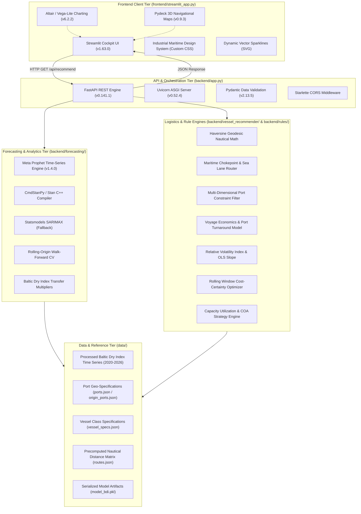

# Technology Stack & Algorithmic Architecture
**Project**: Maritime Freight Decision Support System (`SIH26006`)  
**Purpose**: Comprehensive classification of all programming languages, frameworks, libraries, mathematical formulations, nautical algorithms, and machine learning models used across the codebase.

---

## 1. System Architecture Overview

The system is engineered as a decoupled, asynchronous maritime intelligence platform composed of four core functional tiers:



---

## 2. Complete Classification: What Technology is Used Where

| Category | Component / Library | Version | Project Placement | Exact Role & Implementation Purpose |
|---|---|---|---|---|
| **Frontend UI** | **Streamlit** | `1.63.0` | `frontend/streamlit_app.py` | Web dashboard rendering, reactive parameter sidebar (`st.sidebar`), session state management (`st.session_state`), and 3-tab decision narrative (`st.tabs`). |
| **Frontend Visuals** | **Altair** | `6.2.2` | `frontend/streamlit_app.py` | Declarative statistical data visualization (Vega-Lite engine) for composite BDI forecast curves, 85% confidence interval ribbons, entry window highlight rectangles, and volatility threshold benchmarks. |
| **Frontend Geospatial** | **Pydeck (Deck.gl)** | `0.9.3` | `frontend/streamlit_app.py` | WebGL-powered interactive 3D map cartography using `PathLayer` for international sea lanes and `ScatterplotLayer` for port pins and navigational chokepoints. |
| **Frontend Styling** | **Vanilla CSS3** | Custom | `frontend/streamlit_app.py` | Industrial maritime aesthetic: sharp 0px square corners, sticky tab bar, high-contrast `#0F172A`/`#0D9488` palette, custom verdict badges, callout cards, and metric boxes. |
| **Frontend Micro-Visuals** | **Inline SVG** | Native | `frontend/streamlit_app.py` | Lightweight vector sparkline generator (`make_sparkline_svg`) rendering mini trajectory trendlines inside executive verdict banners without DOM bloat. |
| **Backend API Framework** | **FastAPI** | `0.141.1` | `backend/app.py` | High-performance asynchronous REST API routing, OpenAPI/Swagger documentation generation, query parameter type enforcement, and modular router orchestration. |
| **Backend Web Server** | **Uvicorn** | `0.52.4` | `backend/app.py` | Lightning-fast ASGI (Asynchronous Server Gateway Interface) web server implementation running the Python async event loop. |
| **Backend Middleware** | **Starlette** | `1.6.0` | `backend/app.py` | Core ASGI toolkit providing HTTP request/response primitives, exception handling, and `CORSMiddleware` for client-server decoupling. |
| **Data Validation** | **Pydantic** | `2.13.5` | `backend/app.py` | Strict data validation, type checking, runtime type coercion, and schema definition for REST parameters and endpoints. |
| **HTTP Client** | **Requests** | `2.34.2` | `frontend/streamlit_app.py` | Synchronous HTTP communication connecting the Streamlit frontend to the FastAPI backend service endpoints (`/api/recommend`, `/api/ports`, etc.). |
| **Time-Series ML** | **Meta Prophet** | `1.4.0` | `backend/forecasting/` | Primary forecasting algorithm: Generalized Additive Model (GAM) decomposing market trend, annual/weekly seasonality, and 85% uncertainty intervals on BDI series. |
| **Stan Compiler** | **CmdStanPy / StanIO** | `1.3.0` / `0.5.1` | `backend/forecasting/` | C++ Stan probabilistic programming interface compiling Prophet's Bayesian statistical model and executing MCMC / L-BFGS sampling. |
| **Statistical Fallback** | **Statsmodels (SARIMAX)** | Built-in | `backend/forecasting/train_model.py` | Seasonal Autoregressive Integrated Moving Average with Exogenous Regressors $(1,1,1)\times(1,1,0)_7$ acting as an automated fallback if Prophet is unavailable. |
| **Numerical Computing** | **NumPy** | `2.5.2` | Throughout backend & rules | High-speed vectorized array operations, trigonometry for geodesic navigation, OLS matrix math, and variance calculations. |
| **Data Manipulation** | **Pandas** | `3.0.5` | Throughout repository | Tabular data processing, datetime parsing (`%d-%m-%Y`), time-series daily resampling, forward-fill gap handling, and DataFrame transforms. |
| **Model Serialization** | **Pickle** | Standard Lib | `backend/forecasting/` | Binary persistence and retrieval of trained forecasting models and training metadata (`model_bdi.pkl`). |
| **Geodesic Math** | **Python `math`** | Standard Lib | `backend/vessel_recommender/`, `data/` | Great-circle trigonometry functions (`sin`, `cos`, `atan2`, `sqrt`, `radians`) computing Haversine nautical mile distances. |
| **Data Schemas** | **JSON** | Standard Lib | `data/reference/` | Lightweight structured data interchange format storing port dimensions, vessel engineering specifications, and route distance matrices. |

---

## 3. Algorithmic Architecture & Mathematical Formulations

### A. Geodesic Navigation & Voyage Distance Algorithm
Located in: [`backend/vessel_recommender/recommend.py`](file:///c:/Users/anam/Downloads/Daersk/sih26006/backend/vessel_recommender/recommend.py) and [`data/generate_routes.py`](file:///c:/Users/anam/Downloads/Daersk/sih26006/data/generate_routes.py)

1. **Haversine Great-Circle Formulation**:
   Calculates the shortest distance between origin $(lat_1, lon_1)$ and destination $(lat_2, lon_2)$ over the Earth's curved surface ($R = 6,371.0\text{ km}$):
   $$\Delta lat = lat_2 - lat_1, \quad \Delta lon = lon_2 - lon_1$$
   $$a = \sin^2\left(\frac{\Delta lat}{2}\right) + \cos(lat_1)\cos(lat_2)\sin^2\left(\frac{\Delta lon}{2}\right)$$
   $$c = 2 \cdot \text{atan2}\left(\sqrt{a}, \sqrt{1-a}\right)$$
   $$D_{\text{raw}} = \frac{R \cdot c}{1.852} \quad (\text{Nautical Miles})$$

2. **Real-Route Nautical Impedance Factor**:
   Because commercial ships cannot sail directly over land or through uncharted shoals, an empirical maritime impedance coefficient ($1.10\times$) is applied:
   $$D_{\text{adj}} = \text{round}\left(D_{\text{raw}} \times 1.10\right)$$

3. **Waypoint Sea-Lane Routing Engine** ([`frontend/streamlit_app.py`](file:///c:/Users/anam/Downloads/Daersk/sih26006/frontend/streamlit_app.py)):
   Renders polyline corridors bending around landmasses through international straits:
   - **Australia (Newcastle)**: South through **Bass Strait** $\rightarrow$ **Cape Leeuwin** $\rightarrow$ Southern Indian Ocean $\rightarrow$ **Dondra Head (Sri Lanka)**.
   - **Indonesia (Tanjung Bara)**: **Makassar Strait** $\rightarrow$ Java Sea $\rightarrow$ **Sunda Strait** $\rightarrow$ **Six Degree Channel** $\rightarrow$ Bay of Bengal.
   - **Russia (Vostochny)**: Sea of Japan $\rightarrow$ **Tsushima Strait** $\rightarrow$ East China Sea $\rightarrow$ **Singapore Strait** $\rightarrow$ **Malacca Strait** $\rightarrow$ Bay of Bengal.
   - **USA (Hampton Roads)**: North Atlantic $\rightarrow$ **Strait of Gibraltar** $\rightarrow$ Mediterranean $\rightarrow$ **Suez Canal** $\rightarrow$ **Red Sea** $\rightarrow$ **Bab-el-Mandeb** $\rightarrow$ Bay of Bengal.
   - **Mozambique (Nacala)**: **Mozambique Channel** $\rightarrow$ Equatorial Indian Ocean $\rightarrow$ Dondra Head $\rightarrow$ Bay of Bengal.

---

### B. Voyage Logistics & Commercial Turnaround Formulation
Located in: [`backend/vessel_recommender/recommend.py`](file:///c:/Users/anam/Downloads/Daersk/sih26006/backend/vessel_recommender/recommend.py)

1. **Laden Sea Transit Days**:
   $$T_{\text{sea}} = \frac{D_{\text{adj}}}{\text{Service Speed (13.0 knots)} \times 24\text{ hours/day}}$$

2. **Port Berth Handling Days**:
   Models loading time at origin and discharge time at destination based on terminal handling rates ($R_{\text{load}}$ and $R_{\text{discharge}}$ in metric tonnes per day):
   $$T_{\text{berth}} = \frac{Q_{\text{cargo}}}{R_{\text{load}}} + \frac{Q_{\text{cargo}}}{R_{\text{discharge}}}$$

3. **Total Turnaround Duration**:
   Incorporates demonstration port congestion queue estimates ($T_{\text{queue}}$) based on port infrastructure:
   $$T_{\text{turnaround}} = T_{\text{sea}} + T_{\text{berth}} + T_{\text{queue}}$$

4. **Voyage Economics & Vessel Costing**:
   - **Freight Rate per Tonne**: Multiplier transfer function applied to forward BDI:
     $$\text{Rate}_{\text{class}} (\$/t) = \text{BDI}_{\text{forecast}} \times \text{Multiplier}_{\text{class}} \times 0.01$$
   - **Total Voyage Cost**:
     $$\text{Total Cost} = Q_{\text{cargo}} \times \text{Rate}_{\text{class}} (\$/t)$$
   - **Time Charter Equivalent (TCE) Daily Rate**:
     $$\text{Charter Rate (\$/day)} = \frac{\text{Total Cost}}{T_{\text{turnaround}}}$$

---

### C. Multi-Dimensional Port & Vessel Feasibility Filter
Located in: [`backend/vessel_recommender/recommend.py`](file:///c:/Users/anam/Downloads/Daersk/sih26006/backend/vessel_recommender/recommend.py#L62-L185)

The decision engine applies deterministic multi-criteria constraints across 4 physical and regulatory boundaries simultaneously:

$$\text{Feasible} = \begin{cases} 
\text{True}, & \text{if } \text{Draft}_{\text{vessel}} \le \min(Draft_{\text{orig}}, Draft_{\text{dest}}) \\
             & \land \quad \text{LOA}_{\text{vessel}} \le \min(LOA_{\text{orig}}, LOA_{\text{dest}}) \\
             & \land \quad \text{Beam}_{\text{vessel}} \le \min(Beam_{\text{orig}}, Beam_{\text{dest}}) \\
             & \land \quad DWT_{\text{min}} \le Q_{\text{cargo}} \le DWT_{\text{max}} \\
             & \land \quad Q_{\text{cargo}} \le \min(Ceiling_{\text{orig}}, Ceiling_{\text{dest}}) \\
\text{False}, & \text{otherwise (annotating exact violation strings)}
\end{cases}$$

---

### D. Time-Series Freight Forecasting (Meta Prophet & SARIMAX)
Located in: [`backend/forecasting/train_model.py`](file:///c:/Users/anam/Downloads/Daersk/sih26006/backend/forecasting/train_model.py) and [`backend/forecasting/forecast.py`](file:///c:/Users/anam/Downloads/Daersk/sih26006/backend/forecasting/forecast.py)

1. **Prophet Decomposed Model**:
   $$y(t) = g(t) + s(t) + h(t) + \epsilon_t$$
   - **Trend $g(t)$**: Piecewise linear growth with automatic changepoint selection. Uses a regularized Laplace prior $\tau = 0.10$ (`changepoint_prior_scale=0.1`) to prevent over-reacting to short-term dry bulk rate spikes.
   - **Seasonality $s(t)$**: Modeled via standard Fourier series expansions:
     $$s(t) = \sum_{n=1}^{N} \left( a_n \cos\left(\frac{2\pi n t}{P}\right) + b_n \sin\left(\frac{2\pi n t}{P}\right) \right)$$
     - Annual Seasonality: $P = 365.25\text{ days}, N = 10$ (captures monsoon patterns, grain harvest exports, and Chinese New Year industrial shutdowns).
     - Weekly Seasonality: $P = 7\text{ days}, N = 3$ (captures weekend London Baltic Exchange fixture pauses).
   - **Uncertainty Interval $\epsilon_t$**: Generated via Monte Carlo simulation of future trend changes using `interval_width=0.85` (85% confidence interval $[\hat{y}_{\text{lower}}, \hat{y}_{\text{upper}}]$).

2. **Cross-Validation & Error Evaluation** ([`backend/forecasting/validate.py`](file:///c:/Users/anam/Downloads/Daersk/sih26006/backend/forecasting/validate.py)):
   - **Rolling-Origin Cross Validation (Walk-Forward)**:
     - `initial = "365 days"` (historical training seed)
     - `period = "30 days"` (cutoff advance interval)
     - `horizon = "14 days"` (forward evaluation span)
   - **Mean Absolute Percentage Error (MAPE)**:
     $$\text{MAPE} = \frac{100\%}{n} \sum_{t=1}^{n} \left| \frac{y_t - \hat{y}_t}{y_t} \right|$$
   - **Root Mean Squared Error (RMSE)**:
     $$\text{RMSE} = \sqrt{\frac{1}{n} \sum_{t=1}^{n} (y_t - \hat{y}_t)^2}$$

3. **Vessel Class Multiplier Transfer Function**:
   Since the Baltic Dry Index (BDI) is a composite index of 4 sub-indices, empirically documented fleet multipliers transfer the forward forecast curve into individual vessel rates:
   $$\text{Capesize (BCI)}: 1.25\times \quad | \quad \text{Panamax (BPI)}: 1.05\times \quad | \quad \text{Supramax (BSI)}: 0.95\times \quad | \quad \text{Handysize (BHSI)}: 0.85\times$$

---

### E. Risk Analytics & Volatility Evaluation Engine
Located in: [`backend/rules/risk_flags.py`](file:///c:/Users/anam/Downloads/Daersk/sih26006/backend/rules/risk_flags.py)

1. **Relative Volatility Index Formula**:
   Measures the relative uncertainty spread normalized by the expected freight rate:
   $$\text{Volatility Spread } (\%) = \frac{\hat{y}_{\text{upper}} - \hat{y}_{\text{lower}}}{\hat{y}} \times 100$$
   *(Safety normalization: If $\hat{y} < 100\text{ BDI}$, normalized against baseline to prevent division by near-zero).*

2. **Discrete Risk Tier Benchmarks**:
   - **Low Risk**: $< 15.0\%$ spread (stable market; spot contracting recommended)
   - **Moderate Risk**: $15.0\% \le \text{Spread} < 20.0\%$ (elevated variance; index-linking advised)
   - **High Risk**: $20.0\% \le \text{Spread} < 25.0\%$ (wide volatility cone; advance hedging advised)
   - **Severe Risk**: $\ge 25.0\%$ spread (extreme uncertainty; strict forward fixing or COA recommended)

3. **Ordinary Least Squares (OLS) Trend Classification**:
   Fits a linear regression through daily volatility values $y$ over time step $x = 0, 1, \dots, n-1$:
   $$\text{Slope } \beta = \frac{\sum (x_i - \bar{x})(y_i - \bar{y})}{\sum (x_i - \bar{x})^2}$$
   $$\text{Total Change} = \beta \cdot n$$
   - $\text{Total Change} > +2.0\% \implies$ **INCREASING** (Risk expanding over horizon)
   - $\text{Total Change} < -2.0\% \implies$ **DECREASING** (Risk contracting over horizon)
   - Otherwise $\implies$ **STABLE**

---

### F. Market Timing & Entry Window Optimization
Located in: [`backend/rules/market_timing.py`](file:///c:/Users/anam/Downloads/Daersk/sih26006/backend/rules/market_timing.py)

Determines the optimal 7-day chartering commitment window across the forecast horizon:

1. **Sliding Window Aggregation**:
   Slides a window of size $W = 7\text{ days}$ across the forecast:
   $$\bar{y}_w = \frac{1}{W} \sum_{i \in w} \hat{y}_i, \quad \text{Vol}_w = \frac{1}{W} \sum_{i \in w} \left( \frac{\hat{y}_{\text{upper}, i} - \hat{y}_{\text{lower}, i}}{\hat{y}_i} \times 100 \right)$$

2. **Cost-Certainty Pareto Selection**:
   - Finds minimum average rate: $y_{\text{min}} = \min_w(\bar{y}_w)$
   - Gathers all candidate windows within $5\%$ of minimum rate: $C = \{w \mid \bar{y}_w \le 1.05 \cdot y_{\text{min}}\}$
   - From candidates $C$, selects the window with the **lowest volatility** $\min_{w \in C}(\text{Vol}_w)$, balancing price savings against forecast certainty.

3. **Actionable Charter Verdict Heuristic**:
   - If current window (Day 1 to 7) is within $5\%$ of optimal future window, recommends **`CHARTER NOW`** (prioritizes immediate operational certainty over trivial future theoretical gains).
   - If a future window provides $> 5\%$ cost savings with acceptable uncertainty, recommends **`WAIT FOR WINDOW`**.
   - If market trend is volatile or ambiguous, recommends **`MONITOR`**.

---

### G. Fleet Utilization & Idle-Time Protection Rules
Located in: [`backend/rules/idle_time.py`](file:///c:/Users/anam/Downloads/Daersk/sih26006/backend/rules/idle_time.py)

1. **Capacity Under-Utilization Rule**:
   $$\text{Utilization} = \frac{Q_{\text{cargo}}}{DWT_{\text{max}}}$$
   If $\text{Utilization} < 80\%$, triggers a `Capacity Under-Utilization` advisory warning charterers of deadfreight penalties and recommending smaller vessel classes or parcel consolidation.

2. **Market Momentum & Contracting Strategy Rule**:
   Splits the forecast horizon into two equal halves $H_1$ and $H_2$:
   $$\Delta_{\text{momentum}} = \frac{\bar{y}_{H1} - \bar{y}_{H2}}{\bar{y}_{H1}} \times 100$$
   - If $\Delta_{\text{momentum}} > +5\% \implies$ **Declining Market**: Recommends multi-voyage Contract of Affreightment (COA) or short-term spot fixtures to take advantage of falling rates.
   - If $\Delta_{\text{momentum}} < -5\% \implies$ **Rising Market**: Recommends locking in long-term period charter commitments immediately before rate escalations.

---

## 4. Technology Directory Mapping

```
sih26006/
│
├── frontend/
│   └── streamlit_app.py           # [Streamlit, Altair, Pydeck, SVG, Vanilla CSS]
│                                  # Full decision cockpit UI, high-contrast tab bar,
│                                  # interactive maps, statistical forecast charts.
│
├── backend/
│   ├── app.py                     # [FastAPI, Uvicorn, Starlette, Pydantic]
│   │                              # Async REST API orchestrator, CORS middleware.
│   │
│   ├── forecasting/
│   │   ├── train_model.py         # [Prophet, CmdStanPy, Statsmodels SARIMAX, Pandas]
│   │   │                          # Model training on BDI time series (2020-2026).
│   │   ├── forecast.py            # [Prophet, Pickle, NumPy, Pandas]
│   │   │                          # Generates forward curve & class multiplier scaling.
│   │   ├── validate.py            # [Prophet Diagnostics, NumPy]
│   │   │                          # Walk-forward cross validation, MAPE/RMSE/MAE metrics.
│   │   └── model_bdi.pkl          # [Pickle Serialization]
│   │                              # Pre-compiled, serialized trained Prophet model.
│   │
│   ├── vessel_recommender/
│   │   └── recommend.py           # [Python Math, Haversine, Geodesic Trigonometry]
│   │                              # Multi-constraint filter, turnaround & voyage costing.
│   │
│   └── rules/
│       ├── risk_flags.py          # [NumPy, OLS Linear Regression, Statistics]
│       │                          # Volatility band-width evaluation & trend slopes.
│       ├── market_timing.py       # [Sliding Window Optimizer, Python Typing]
│       │                          # Rolling cost-certainty window selection.
│       └── idle_time.py           # [Heuristic Rule Engines]
│                                  # Capacity utilization checks & COA advisories.
│
├── data/
│   ├── clean.py                   # [Pandas, Datetime, String Normalization]
│   │                              # Cleans raw BDI CSV, forward-fills gaps, sorts.
│   ├── generate_routes.py         # [Haversine Math, JSON Engine]
│   │                              # Programmatically computes origin-destination distances.
│   ├── generate_synthetic.py      # [NumPy, Sinusoidal Generators]
│   │                              # Synthetic generator used for fallback test fixtures.
│   │
│   ├── raw/
│   │   └── Baltic_Dry_Index_Historical_Data.csv # Authentic BDI daily market prices.
│   ├── processed/
│   │   └── bdi_clean.csv          # Cleaned, continuous daily time series for ML training.
│   │
│   └── reference/
│       ├── origin_ports.json      # Overseas loading ports specs (draft, LOA, beam, lat/lon).
│       ├── ports.json             # Indian East Coast discharge ports specs & DWT ceilings.
│       ├── vessel_specs.json      # Engineering dimensions & DWT classes (Handy to Cape).
│       └── routes.json            # Precomputed distance and voyage duration matrix.
│
├── test_integration.py            # [Python UnitTest / Pytest Paradigms]
│                                  # 7 operational integration test scenarios.
├── test_api.py                    # [Python Urllib, JSON]
│                                  # Live backend REST API health and recommendation tests.
└── requirements.txt               # [Pip Dependency Manifest]
                                   # Exact pinned versions of all 56 installed libraries.
```

---

## 5. Summary Matrix by Engineering Domain

| Domain | Primary Technology | Secondary / Support | Key Output / Deliverable |
|---|---|---|---|
| **Presentation Tier** | `Streamlit 1.63` | `Vanilla CSS3`, `SVG` | Real-time decision cockpit dashboard. |
| **Interactive Cartography** | `Pydeck 0.9` (Deck.gl) | GeoJSON Waypoints | Navigational transit track bypassing landmasses. |
| **Statistical Visuals** | `Altair 6.2` (Vega-Lite) | Pandas DataFrames | Forecast curves, 85% confidence bands, threshold lines. |
| **Application Server** | `FastAPI 0.141` | `Uvicorn 0.52`, `Starlette` | Asynchronous RESTful microservice API. |
| **Data Schema & Types** | `Pydantic 2.13` | Python Type Hints | Request payload validation and API docstrings. |
| **Machine Learning** | `Meta Prophet 1.4` | `CmdStanPy 1.3`, `StanIO` | Decomposed forward freight rate projections. |
| **Time Series Fallback** | `SARIMAX` | `Statsmodels`, `NumPy` | Classical econometric ARMA forecasting fallback. |
| **Geodesic Navigation** | `Haversine Formula` | Spherical Trigonometry | Authentic nautical distances ($nm$) and sea transit days. |
| **Operations Research** | Deterministic Filtering | Combinatorial Rules | Multi-constraint physical port feasibility matching. |
| **Market Risk Engine** | Relative Volatility Ratio | Ordinary Least Squares | Volatility spread (%) and directional trend trajectories. |
| **Strategic Decision** | Rolling Window Optimizer | Financial Multipliers | Optimal market entry windows (`CHARTER NOW` / `WAIT`). |
| **Data Ingestion & ETL** | `Pandas 3.0` | `NumPy 2.5` | BDI historical parsing, forward-fill interpolation. |
| **Model Persistence** | Python `pickle` | File System | Zero-latency model reload for instant API serving. |
